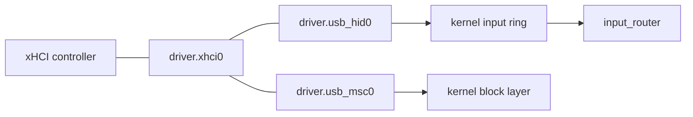

# USB and the xHCI host controller

How NONOS drives USB: one xHCI capsule owns every USB controller, and class capsules above it bind keyboards, mice and disks.

## What is supported

| Hardware | Matched by | Capsule | State in 0.9.2 |
|---|---|---|---|
| xHCI host controller, USB 2 and USB 3 ports | PCI class 0Ch, subclass 03h, prog-if 30h | `driver.xhci0` | Served |
| Intel Thunderbolt and USB4 xHCI controllers | 15 Intel device ids | `driver.xhci0` | Served after the chipset's controller, best effort |
| EHCI, OHCI and UHCI host controllers | prog-if 20h, 10h and 00h | none | Not supported: no driver |
| Keyboards and mice in boot protocol | interface class 03h | `driver.usb_hid0` | Served. See [USB keyboards and mice](hid.md). |
| USB sticks and disks, Bulk-Only | interface class 08h | `driver.usb_msc0` | Served. See [USB mass storage](../storage/usb-mass-storage.md). |
| Hubs | interface class 09h | `driver.usb_hid0` | The hub comes up; devices behind it are not reached. See [USB hubs](hubs.md). |
| USB network adapters | per adapter | none in the image | Not in the image. See [USB network adapters](../ethernet/usb-net.md). |
| Audio devices, cameras | | none | Not supported: no isochronous transfers |

## How the pieces fit

`driver.xhci0` owns the xHCI controllers: their registers, rings and DMA. It knows nothing of keyboards or disks. The class [capsules](../../overview/glossary.md#capsule) `driver.usb_hid0` and `driver.usb_msc0` read descriptors and run transfers through it. The kernel lets only those two send to it, because the controller carries raw transfers to every device behind it (`src/services/registry/held_table.rs:30-32`, `driver.xhci0`). Keyboard and mouse events go to the kernel input ring and from there to `input_router`; disk sectors go to the kernel block layer.

## Finding controllers

`driver.xhci0` takes every PCI function of class 0Ch, subclass 03h, prog-if 30h with a memory BAR0 (`userland/capsule_driver_xhci/src/discover.rs:59-77`, `raw_xhci`). The chipset's controller comes first, ahead of the 15 Intel Thunderbolt and USB4 controllers, whose ports are the Type-C ones only (`userland/capsule_driver_xhci/src/discover.rs:30-37`, `INTEL_THUNDERBOLT_XHCI`). Discovery reads at most 64 device records (`userland/capsule_driver_xhci/src/discover.rs:25`, `MAX_DEVICES`).

The kernel starts `driver.xhci0` at every boot (`src/userspace/init/spawn_plan/drivers_usb.rs:23-32`, `spawn_xhci`). Without a controller it exits with code 2. The first controller must come up, on the shared bring-up schedule of 7 tries; the others are best effort, so a Thunderbolt controller that is powered down leaves the chipset's ports served (`userland/capsule_driver_xhci/src/main.rs:49-63`, `start_driver`). All controllers sit behind the one endpoint `driver.xhci0`: root ports are numbered across them, the first controller's from 1, and slot ids are the capsule's own (`userland/capsule_driver_xhci/src/server/mux.rs:17-26`, `driver.xhci0`).
