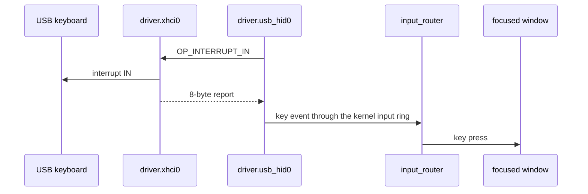

# USB keyboards and mice

What `driver.usb_hid0` binds, how it reads USB keyboards and mice, and where their events go.

## What it binds

`driver.usb_hid0` reads each device's configuration and binds its HID interfaces, class 03h, through an interrupt IN endpoint other than endpoint 0 (`userland/capsule_driver_usb_hid/src/descriptors/binding.rs:32-66`, `from_pair`):

| Interface | Bound as |
|---|---|
| boot subclass 01h, protocol 01h | keyboard |
| boot subclass 01h, protocol 02h | mouse |
| a HID interface outside the boot subclass, on a device with no boot keyboard or mouse | absolute pointer |

A device with a boot keyboard or boot mouse interface keeps only those. Its other HID interfaces, such as media and system controls, are not read (`userland/capsule_driver_usb_hid/src/descriptors/parse.rs:52-62`, `keep_boot_interfaces`). Up to 8 interfaces are bound per device (`userland/capsule_driver_usb_hid/src/protocol/limits.rs:21`, `MAX_HID_BINDINGS`), and the endpoint's packet must hold a whole report (`userland/capsule_driver_usb_hid/src/descriptors/packet_size.rs:23-37`, `holds_a_report`).

## Boot protocol only

The driver puts keyboards and mice in the boot protocol with SET_PROTOCOL, and asks keyboards with SET_IDLE(0) to report only on change (`userland/capsule_driver_usb_hid/src/orchestrator/binding.rs:24-47`, `SET_PROTOCOL`). It does not read HID report descriptors. The reports it decodes have fixed layouts:

- Keyboard: exactly 8 bytes, the modifiers, a reserved byte and six key slots. A report of any other length changes nothing (`userland/capsule_driver_usb_hid/src/hid/keyboard/boot_report.rs:29-40`, `BootReport::parse`).
- Mouse: at least 3 bytes, five buttons, X and Y motion, and the wheel in a fourth byte when there is one; bytes past it are not read (`userland/capsule_driver_usb_hid/src/hid/mouse_report.rs:24-46`, `mouse_event`).
- Absolute pointer: at least 5 bytes, three buttons, then X and Y as 16-bit positions from 0 to 0x7FFF, then an optional wheel, the layout QEMU's `usb-tablet` sends (`userland/capsule_driver_usb_hid/src/hid/tablet_report.rs:17-52`, `tablet_report`).

So every absolute pointer, a touch screen or a pen tablet among them, is decoded in the `usb-tablet` layout whatever layout it really sends, and media keys sent on a separate consumer-control interface are not read (`userland/capsule_driver_usb_hid/src/hid/usage_keycode/map.rs:58-61`, `KEYCODE_MUTE`). A keyboard or mouse that refuses SET_PROTOCOL is still bound, and its reports are read as boot reports whatever their layout.

## Keys

- Letters, digits and symbols resolve through the shared layout tables in `nonos_keymap`, so a USB and a PS/2 keyboard agree on every layout (`userland/capsule_driver_usb_hid/src/hid/keymap/mod.rs:17-20`, `nonos_keymap`).
- The layout follows the keyboard layout the policy store holds, read at most once a second on a key press (`userland/capsule_driver_usb_hid/src/hid/active.rs:30-31`, `POLICY`). Ctrl with the left Alt and Space cycles it inside the driver, and that chord never reaches an app (`userland/capsule_driver_usb_hid/src/hid/keyboard/push_key.rs:26-34`, `cycle`).
- Mute, Volume Down, Volume Up and Power from the keyboard usage page post the system key codes 0x1301 to 0x1304 (`userland/capsule_driver_usb_hid/src/hid/usage_keycode/map.rs:57-63`, `KEYCODE_MUTE`). The input router hands them to the desktop shell whatever window has focus (`userland/capsule_input_router/src/route/shell_keys.rs:17-33`, `is_shell_key`).
- A held key repeats after 500 ms, about 30 times a second, and stops by itself after 30 s, because a boot keyboard pulled out with a key down sends no release (`userland/capsule_driver_usb_hid/src/hid/keyboard/repeat/timing.rs:19-26`, `LIMIT_MS`).

## Where events go

`driver.usb_hid0` polls each bound endpoint through `driver.xhci0` and posts every key and pointer event to the kernel input ring with `mk_input_event_post` (`userland/capsule_driver_usb_hid/src/hid/post_wire.rs:19-28`, `mk_input_event_post`). The `input_router` [capsule](../../overview/glossary.md#capsule) drains the ring in batches of up to 32 (`userland/capsule_input_router/src/sources/kernel_ring.rs:19-38`, `MAX_BATCH`). It sends a key press to the focused window, asking the window manager which one that is, and sends the release wherever its press went (`userland/capsule_input_router/src/route/keyboard.rs:25-56`, `route_keyboard`).

The router holds the [capabilities](../../overview/glossary.md#capability) IPC, Memory and InputSource, the word 0x200018 (`userland/capsule_input_router/Capsule.mk:14-16`, `CAPSULE_REQUIRED_CAPS`). `driver.usb_hid0` holds the same word (`userland/capsule_driver_usb_hid/Capsule.mk:15`, `CAPSULE_REQUIRED_CAPS`). No capsule may send to `driver.usb_hid0`: the kernel holds its endpoint to itself (`src/services/registry/held_table.rs:27-29`, `driver.usb_hid0`).

## Finding devices

The driver looks up `driver.xhci0` for about 2 s, 100 tries 20 ms apart, and exits with code 2 when there is no controller (`userland/capsule_driver_usb_hid/src/orchestrator/run.rs:22-40`, `LOOKUP_ATTEMPTS`). It then addresses every free root port with a device on it, three tries per port (`userland/capsule_driver_usb_hid/src/orchestrator/enumerate/run.rs:25-50`, `enumerate`). It looks at the ports again whenever the bound devices have been quiet for 64 polls, so a keyboard plugged in later is bound too (`userland/capsule_driver_usb_hid/src/orchestrator/poll/run.rs:51-60`, `RESCAN_INTERVAL`). A device that is neither HID nor a hub is left alone. A keyboard or mouse behind a hub is not reached in this release; see [USB hubs](hubs.md).

The driver's own lines, such as `[USB-HID-ENUM] HID device bound`, are written with `mk_debug` (`userland/capsule_driver_usb_hid/src/orchestrator/poll/run.rs:37-40`, `mk_debug`). The kernel grants `driver.usb_hid0` no Debug capability (`src/userspace/capsule_driver_usb_hid/spawn.rs:51-53`, `requested_caps`), so they do not reach the console in this release.
