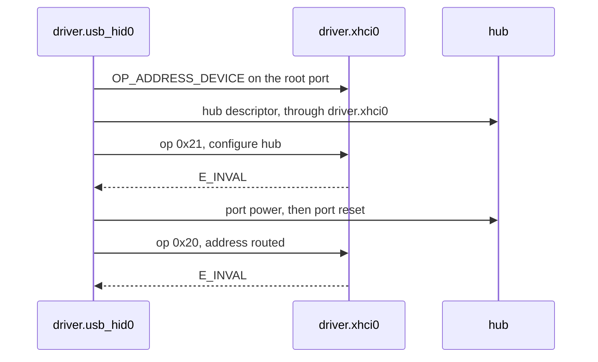

# USB hubs

What NONOS does with a USB hub in this release: the hub comes up, but the devices plugged into it are not reached yet.

## In short

Plug keyboards, mice and USB sticks straight into a port of the machine. A device behind an external USB hub does not work in NONOS 0.9.2. The hub itself is brought up and its ports are read, but the xHCI driver cannot yet address a device below a hub.

## What happens with a hub

Hubs are handled by the USB HID [capsule](../../overview/glossary.md#capsule), `driver.usb_hid0`:

1. It addresses the hub on its root port like any device and reads its configuration. An interface of class 09h marks a hub (`userland/capsule_driver_usb_hid/src/descriptors/config.rs:40-56`, `is_hub`).
2. It reads the hub descriptor and sets the hub depth on a SuperSpeed hub (`userland/capsule_driver_usb_hid/src/hub/attach.rs:32-37`, `attach`).
3. It asks `driver.xhci0` with op 0x21 to mark the slot as a hub. The xHCI driver does not know that op and answers `E_INVAL` (`userland/capsule_driver_xhci/src/server/dispatch.rs:26-46`, `E_INVAL`). The HID driver carries on, sets up the hub's status endpoint and powers the hub's ports (`userland/capsule_driver_usb_hid/src/hub/attach.rs:38-45`, `power_ports`).
4. For each hub port with a device on it, it waits 100 ms, resets the port through the hub and gives the reset up to 800 ms (`userland/capsule_driver_usb_hid/src/orchestrator/enumerate/attach_child.rs:29-62`, `attach_child`; `userland/capsule_driver_usb_hid/src/hub/reset.rs:30-31`, `RESET_TIMEOUT_MS`).
5. It asks `driver.xhci0` with op 0x20 to address the device through its route (`userland/capsule_driver_usb_hid/src/xhci/wire/constants.rs:22-25`, `OP_ADDRESS_ROUTED`). The answer is `E_INVAL` again, and the slot is given back (`userland/capsule_driver_usb_hid/src/orchestrator/enumerate/attach_child.rs:51-55`, `disable_slot`).
6. Each port is tried three times, then left alone until its device is unplugged (`userland/capsule_driver_usb_hid/src/orchestrator/enumerate/scan_hub.rs:42-48`, `TRIES`).

The driver has words for both refusals: `the controller driver was not told this is a hub (op 0x21 refused); low and full speed devices below it will not work` and `the controller driver cannot address a device behind a hub yet (op 0x20 refused)` (`userland/capsule_driver_usb_hid/src/hub/error.rs:51-53`, `E_INVAL`). It writes them as `[usb-hub]` lines with `mk_debug` (`userland/capsule_driver_usb_hid/src/hub/say.rs:57-60`, `say`). The kernel grants `driver.usb_hid0` only IPC, Memory and InputSource, no Debug (`src/userspace/capsule_driver_usb_hid/spawn.rs:51-53`, `requested_caps`), so these lines do not reach the console in this release, and a hub with a device behind it fails silently.
