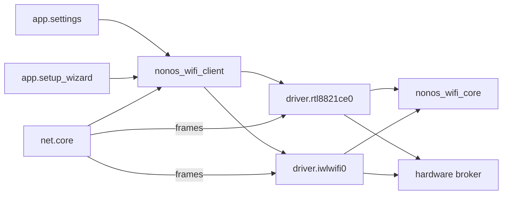

# Wi-Fi drivers

NONOS has two ring 3 Wi-Fi driver [capsules](../../overview/glossary.md#capsule), one for the Realtek RTL8821CE and one for Intel cards; this page lists the chips, follows a scan and a join from the Settings panel to the radio, and states what is refused.

## Chips at a glance

Each Wi-Fi driver is a capsule: a signed ring 3 program that reaches its card only through grants from the [hardware broker](../../overview/glossary.md#hardware-broker).

| Chip | PCI vendor:device | Capsule | State in 0.9.2 | Page |
|---|---|---|---|---|
| Realtek RTL8821CE | 10ec:c821 | `driver.rtl8821ce0` | Works: see the hardware report below the table | [rtl8821ce.md](rtl8821ce.md) |
| Intel AX211, and AX201 modules on the same platforms | 8086:51f0, 51f1, 54f0, 7a70, 7af0, 7f70 | `driver.iwlwifi0` | Partial: boots, scans and joins against a modelled device only | [iwlwifi.md](iwlwifi.md) |
| Intel AX210 discrete, Intel Meteor Lake Wi-Fi | 8086:2725, 2729, 7e40 | `driver.iwlwifi0` | Refused: firmware file not in the tree | [iwlwifi.md](iwlwifi.md) |
| Intel 7260 to 9560, AX200, AX201 on Qu and QuZ platforms, two AX210 family ids without transport values | listed on the iwlwifi page | `driver.iwlwifi0` | Refused: no firmware boot path in this driver | [iwlwifi.md](iwlwifi.md) |
| MediaTek, Qualcomm, Broadcom, other Realtek Wi-Fi | none | none | Not supported | [not-supported.md](not-supported.md) |

Wi-Fi on Realtek RTL8821CE (scan, join, DHCP, DNS, browser traffic). Works on an x86_64 laptop (Intel Gemini Lake, 8 GB), maintainer hardware report, 6 October 2026; the image commit was not recorded.

That is the only hardware report for Wi-Fi in this release. Every other statement on these pages comes from the code and from host tests in [proof crates](../../overview/glossary.md#proof-crate).

## How a scan and a join travel

The Settings Wi-Fi panel (`app.settings`), the first-boot setup wizard (`app.setup_wizard`) and `net.core` all reach a driver through one library, `nonos_wifi_client`. Its `find` asks for `driver.rtl8821ce0` first and `driver.iwlwifi0` second, so a machine with both cards keeps the RTL8821CE (`userland/nonos_wifi_client/src/driver/services.rs:27-35`, `SERVICES`).

The kernel holds both driver endpoints: only `net.core`, the three Settings windows and the setup wizard may send to them (`src/services/registry/held_table.rs:46-50`, `WIFI_STACK`). Read more under [held endpoint](../../overview/glossary.md#held-endpoint).

The kernel starts a Wi-Fi driver only when the boot PCI scan found its chip: `spawn_iwlwifi` for any Intel network controller of subclass 0x80, and `spawn_rtl8821ce` for 10ec:c821 (`src/userspace/init/spawn_plan/drivers_wifi.rs:33-62`). The family comes from `classify_network` (`src/hardware/inventory/classify_network.rs:19-28`).

The 802.11 frames, the WPA3 SAE exchange, the WPA2 four-way and group key handshakes, CCMP and the receive checks run in the shared crate `nonos_wifi_core`; each driver implements its `LinkPort` and `KeyStore` traits over its own rings (`userland/nonos_wifi_core/src/lib.rs:17-25`). IP, DHCP and DNS stay in `net.core`, which binds an up Wi-Fi link before any wired one (`userland/capsule_net_core/src/setup/candidates.rs:19-24`, `WIFI_NICS`).
