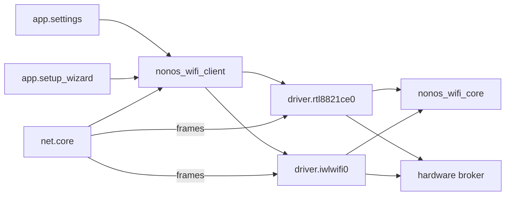

# Wi-Fi drivers

NONOS has two ring 3 Wi-Fi driver [capsules](../../overview/glossary.md#capsule), one for the Realtek RTL8821CE and one for Intel cards; this page lists the chips, follows a scan and a join from the Settings panel to the radio, and states what is refused.

## Chips at a glance

Each Wi-Fi driver is a capsule: a signed ring 3 program that reaches its card only through grants from the [hardware broker](../../overview/glossary.md#hardware-broker).

| Chip | PCI vendor:device | Capsule | State in 0.9.2 | Page |
|---|---|---|---|---|
| Realtek RTL8821CE | 10ec:c821 | `driver.rtl8821ce0` | Works: see the hardware report below the table | [rtl8821ce.md](rtl8821ce.md) |
| Intel AX211, and AX201 modules on the same platforms | 8086:51f0, 51f1, 54f0, 7a70, 7af0, 7f70 | `driver.iwlwifi0` | Partial: boots, scans and joins against a modelled device only | [iwlwifi.md](iwlwifi.md) |
| Intel AX210 discrete, Intel Meteor Lake Wi-Fi | 8086:2725, 2729, 7e40 | `driver.iwlwifi0` | Refused: firmware file not in the tree | [iwlwifi.md](iwlwifi.md) |
| Intel 7260 to 9560, AX200, AX201 on Qu and QuZ platforms, two AX210 family ids without transport values | listed on the iwlwifi page | `driver.iwlwifi0` | Refused: no firmware boot path in this driver | [iwlwifi.md](iwlwifi.md) |
| MediaTek, Qualcomm, Broadcom, other Realtek Wi-Fi | none | none | Not supported | [not-supported.md](not-supported.md) |

Wi-Fi on Realtek RTL8821CE (scan, join, DHCP, DNS, browser traffic). Works on an x86_64 laptop (Intel Gemini Lake, 8 GB), maintainer hardware report, 6 October 2026; the image commit was not recorded.

That is the only hardware report for Wi-Fi in this release. Every other statement on these pages comes from the code and from host tests in [proof crates](../../overview/glossary.md#proof-crate).

## How a scan and a join travel



The Settings Wi-Fi panel (`app.settings`), the first-boot setup wizard (`app.setup_wizard`) and `net.core` all reach a driver through one library, `nonos_wifi_client`. Its `find` asks for `driver.rtl8821ce0` first and `driver.iwlwifi0` second, so a machine with both cards keeps the RTL8821CE (`userland/nonos_wifi_client/src/driver/services.rs:27-35`, `SERVICES`).

The kernel holds both driver endpoints: only `net.core`, the three Settings windows and the setup wizard may send to them (`src/services/registry/held_table.rs:46-50`, `WIFI_STACK`). Read more under [held endpoint](../../overview/glossary.md#held-endpoint).

The kernel starts a Wi-Fi driver only when the boot PCI scan found its chip: `spawn_iwlwifi` for any Intel network controller of subclass 0x80, and `spawn_rtl8821ce` for 10ec:c821 (`src/userspace/init/spawn_plan/drivers_wifi.rs:33-62`). The family comes from `classify_network` (`src/hardware/inventory/classify_network.rs:19-28`).

The 802.11 frames, the WPA3 SAE exchange, the WPA2 four-way and group key handshakes, CCMP and the receive checks run in the shared crate `nonos_wifi_core`; each driver implements its `LinkPort` and `KeyStore` traits over its own rings (`userland/nonos_wifi_core/src/lib.rs:17-25`). IP, DHCP and DNS stay in `net.core`, which binds an up Wi-Fi link before any wired one (`userland/capsule_net_core/src/setup/candidates.rs:19-24`, `WIFI_NICS`).

## The control protocol

Every request starts with a 10-byte header: the tag `0x57494649`, an operation and a request id (`userland/nonos_wifi_client/src/driver/call.rs:18-26`, `WIFI_MAGIC`).

| Operation | Number | How long the client waits |
|---|---|---|
| connect | 1 | 30 s, `CONNECT_TIMEOUT_MS` (`userland/nonos_wifi_client/src/driver/connect.rs:24`) |
| disconnect | 2 | 2 s, `DISCONNECT_TIMEOUT_MS` (`userland/nonos_wifi_client/src/driver/link.rs:20`) |
| scan | 3 | 15 s, `SCAN_TIMEOUT_MS` (`userland/nonos_wifi_client/src/driver/scan.rs:18`) |
| status | 4 | 500 ms, `STATUS_TIMEOUT_MS` (`userland/nonos_wifi_client/src/driver/stage.rs:12`) |
| link | 5 | 500 ms, `LINK_TIMEOUT_MS` (`userland/nonos_wifi_client/src/driver/link.rs:19`) |

A join body is `[ssid_len][ssid][pass_len][pass][flags]`. Flag bit 0 says the network was saved as WPA3, so the driver joins it with SAE or not at all; bit 1 says it is hidden (`userland/nonos_wifi_client/src/join_wire.rs:47-48`, `FLAG_WPA3_ONLY`, `FLAG_HIDDEN`). The request buffer that carried the passphrase is wiped before the call returns (`userland/nonos_wifi_client/src/driver/call.rs:55`, `wipe`).

Both drivers answer a scan at once from the list their background scan keeps. That list holds at most 16 networks and drops one unheard for 3 sweeps (`userland/nonos_wifi_core/src/scan_list.rs:34-37`, `MAX_RESULTS`, `MAX_AGE`).

## Security a join accepts

The choice is made by `select` from the access point's RSN element and the flags (`userland/nonos_wifi_core/src/rsn/select.rs:87-134`).

- WPA3-Personal (SAE) whenever the access point offers it and can protect management frames (`userland/nonos_wifi_core/src/rsn/select.rs:100-105`, `Akm::Sae`).
- SAE runs over group 19 only, NIST P-256 (`userland/nonos_wifi_core/src/sae/group.rs:32`, `GROUP_19`), with the password element from hash-to-element or from hunting and pecking (`userland/nonos_wifi_core/src/sae/mod.rs:17-25`, `h2e`, `hnp`).
- WPA2-Personal otherwise: PSK-SHA256 when the access point offers it and can protect management frames, plain PSK if not (`userland/nonos_wifi_core/src/rsn/select.rs:117-132`, `PskSha256`).
- A network saved as WPA3 that now offers only WPA2 is refused as a downgrade (`userland/nonos_wifi_core/src/rsn/select.rs:106-116`, `Downgrade`).
- The pairwise and group cipher must be CCMP-128; TKIP is refused (`userland/nonos_wifi_core/src/rsn/select.rs:88-90`, `UnsupportedCipher`).
- Enterprise (802.1X), fast transition and OWE have no AKM here (`userland/nonos_wifi_core/src/rsn/select.rs:76-77`, `UnsupportedAkm`).
- Open networks and access points that admit only 802.11n stations are refused (`userland/nonos_wifi_core/src/mlme/failure.rs:26-37`, `OpenNetwork`, `NeedsHt`).

On a joined link a received frame reaches the stack only from the access point, protected and above the replay counter; fragments and A-MSDUs are dropped (`userland/nonos_wifi_core/src/station/receive.rs:47-61`, `RxDrop`).

## What a join answers

The panel turns the driver's code into one line with `join_text` (`userland/nonos_wifi_client/src/driver/join_text.rs:15-36`).

| Code | Panel text |
|---|---|
| 0 | `Joined` |
| -1 | `The radio is down or the request was malformed` |
| -2 | `The network was not heard on any channel` |
| -3, -4 | `The keys could not be installed in the card` |
| -5 | `The access point refused the association` |
| -6 | `The handshake did not finish; check the passphrase` |
| -7 | `Saved as WPA3, but the network now offers only WPA2; not joined` |
| -8 | `The network's security is not supported (open, TKIP or Enterprise)` |
| -9 | `A passphrase is 8 to 63 characters, or 64 hex digits` |
| -10 | `WPA3: the access point did not accept the password` |
| -11 | `The handshake did not match the network's beacon; not joined` |
| -12 | `No randomness for the handshake; not joined` |
| -38 | `This driver cannot join networks yet`, the code `CANNOT_JOIN` |
| -101 | `The driver did not answer`, the code `NO_REPLY` |
| any other | `The join failed` |

The client answers -38 itself, and sends no passphrase, for a driver its table marks as unable to join (`userland/nonos_wifi_client/src/driver/connect.rs:60-64`, `joins`). Both drivers are marked as able to join in 0.9.2 (`userland/nonos_wifi_client/src/driver/services.rs:32-35`, `SERVICES`), so every join reaches the driver, and the iwlwifi driver answers -38 itself when its radio cannot join.

## Bring-up stages

The status operation returns a stage byte, and the panel shows its text (`userland/nonos_wifi_client/src/driver/stage.rs:49-63`, `DriverStage`).

| Stage | Code | Panel text |
|---|---|---|
| `Ready` | 0 | `Ready` |
| `NotClaimed` | 1 | `The card could not be claimed` |
| `PowerFailed` | 2 | `The card did not power on` |
| `DeadMmio` | 3 | `The card's registers read back dead` |
| `FirmwareFailed` | 4 | `The card's firmware did not load` |
| `NoDma` | 5 | `No DMA memory for the radio` |
| `EfuseFailed` | 6 | `The card's calibration did not read` |
| `NoStationAddress` | 7 | `No random address could be drawn` |
| `NoAirPath` | 8 | `card not supported yet; use Ethernet or USB Wi-Fi` |

NONOS 0.9.2 has no driver for a USB Wi-Fi adapter, so the second suggestion in the last line does not apply to this release; see [not-supported.md](not-supported.md).

When no Wi-Fi driver answers at all, the panel names the chip by its PCI ids and says whether this build has a driver for it (`userland/capsule_settings/src/settings/ui/live_wifi.rs:115-130`, `no_driver`).

## Saved networks

- The list holds at most 4 networks, each passphrase at most 64 bytes (`userland/nonos_wifi_client/src/saved/list.rs:19-21`, `SLOTS`, `PASS_MAX`).
- It is one file, `/nonos/wifi/saved`, sealed with an AEAD (`userland/nonos_wifi_client/src/saved/file.rs:20-21`, `PATH`).
- The key comes from `machine_key` under the label `wifi/saved-networks` and is wiped after each use (`userland/nonos_wifi_client/src/saved/key.rs:18-29`, `with_key`).
- With no TPM, or after the boot state changed, the list cannot be opened (`userland/nonos_wifi_client/src/saved/key.rs:22-26`, `NoTpm`, `BootChanged`).
- A network is written only on a boot that keeps state (`userland/nonos_wifi_client/src/saved/write.rs:21-24`, `keeps_state`).
- A network joined with SAE is saved as WPA3, so no later join accepts WPA2 for it (`userland/nonos_wifi_client/src/saved/store.rs:38-41`, `remember`).

## Autojoin and losing the link

At boot `net.core` tries the saved networks it hears. Each one is tried at most once per boot, so a wrong passphrase is not replayed at the access point (`userland/capsule_net_core/src/autojoin/machine.rs:122-136`, `tried`). With none in range it scans again after 15 s and gives up after 8 empty passes (`userland/capsule_net_core/src/autojoin/machine.rs:36-41`, `RESCAN_MS`, `EMPTY_PASSES_MAX`). A join handed to a driver is watched for 25 s (`userland/capsule_net_core/src/autojoin/machine.rs:42-45`, `JOIN_WATCH_MS`).

After one join succeeds, autojoin is done for that boot (`userland/capsule_net_core/src/autojoin/machine.rs:154-158`, `after_watch`). An association the access point ends is not joined again by itself: join it again from Settings. When the bound link goes down and comes back, `net.core` asks DHCP for the lease again (`userland/capsule_net_core/src/iface/relink.rs:40-47`, `Change::Returned`).

## Which images carry them

The full image, the one `make` builds, adds both Wi-Fi drivers to the desktop (`Cargo.toml:627-638`, `microkernel-full-gui`). The `qemu` profile builds the desktop without them (`tools/nix/config.nix:94-98`, `qemu`), and the air-gapped profile drops every network driver (`tools/nix/config.nix:86-93`, `networkFeatures`). The hardened profile keeps them but drops the serial console for capsules, so neither driver writes a log line there (`tools/nix/config.nix:78-85`, `debugFeatures`).

## Firmware and its licence

Both drivers link their firmware into the capsule with `include_bytes!`, so no filesystem access is needed at boot (`userland/capsule_driver_rtl8821ce/src/fwload.rs:38`, `include_bytes`). The files sit in [nonos-bootloader/firmware/realtek/](../../../nonos-bootloader/firmware/realtek/) and [nonos-bootloader/firmware/intel/](../../../nonos-bootloader/firmware/intel/). They are vendor binaries from the linux-firmware project, not AGPL code. Their licences allow binary redistribution without modification, with the notice kept, and forbid reverse engineering: read [the Realtek licence](../../../nonos-bootloader/firmware/realtek/LICENSE) and [the Intel licence](../../../nonos-bootloader/firmware/intel/LICENSE).

## Tests on this commit

The flake runs each proof crate with `cargo test --release`, overflow checks on, and then clippy with warnings denied (`tools/nix/checks.nix:85-94`, `testArgs`, `clippy`). On this commit:

| Check | Result | What it covers |
|---|---|---|
| `proofs-rtl8821ce_proofs` | passed, 171 tests | the RTL8821CE driver against a modelled register file |
| `proofs-iwlwifi_proofs` | passed, 205 tests | the iwlwifi driver against a modelled device |
| `proofs-nonos_wifi_core_proofs` | passed, 70 tests | RSN, SAE vectors, handshakes against a simulated access point, receive checks |
| `proofs-wifi_panel_proofs` | passed, 23 tests | the panel flow, the join wire format, the saved list |
| `proofs-net_core_proofs` | passed, 31 tests | autojoin timing, the link watch, the DHCP lease wait |

To run one yourself:

```sh
cd userland/nonos_wifi_core_proofs && cargo test --release --config profile.release.overflow-checks=true
```

Not tested in this release.

## What no Wi-Fi driver does

- No 6 GHz. The RTL8821CE scans 2.4 GHz channels 1 to 13 only; the iwlwifi path keeps 2.4 and 5 GHz channels (`userland/capsule_driver_iwlwifi/src/firmware/gen3/nvm.rs:38-40`, `NVM_CHANNELS`).
- No open, TKIP or Enterprise networks.
- No access point, mesh or monitor mode, no roaming and no power save.
- No USB Wi-Fi adapters.
