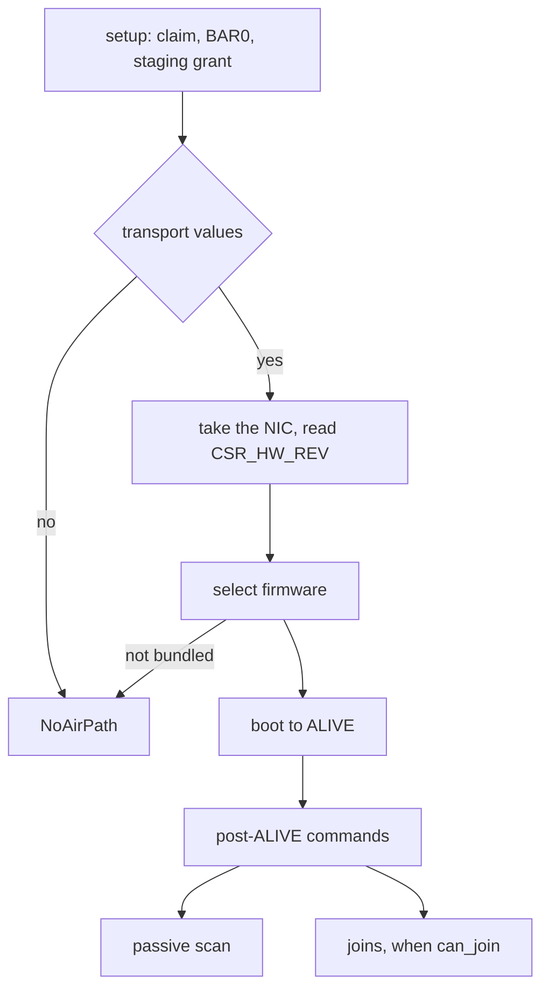

# Intel Wi-Fi (iwlwifi)

The iwlwifi driver [capsule](../../overview/glossary.md#capsule) finds Intel Wi-Fi cards from the 7260 to the AX210 family; in 0.9.2 it boots firmware, scans and joins only on the SO platforms (AX211, and AX201 modules on those platforms), and that path has run only against a modelled device.

## State in this release

No Intel Wi-Fi card has a hardware report for 0.9.2. The SO path is complete in code and passes host tests against a model of the device and its firmware (`iwlwifi_proofs`). Every other Intel card the driver takes ends at the stage `NoAirPath`, which the Settings panel shows as `card not supported yet; use Ethernet or USB Wi-Fi`; the status reply carries the exact reason as a step and a detail word. Until a hardware report exists, do not count on Wi-Fi from an Intel card in this release; the alternatives are listed under [Wi-Fi chips with no driver](not-supported.md#what-to-use-instead).

## Which cards do what

The driver takes an Intel PCI function of class 0x02, subclass 0x80, with a memory BAR0, whose device id is in `family_for_device` (`userland/capsule_driver_iwlwifi/src/pci_match.rs:47-59`, `is_supported_adapter`; `userland/capsule_driver_iwlwifi/src/firmware/family.rs:19-39`, `family_for_device`). The card names come from `name` (`userland/capsule_driver_iwlwifi/src/firmware/generation.rs:32-65`).

| Cards | PCI device ids (vendor 8086) | State |
|---|---|---|
| 7260, 3160, 7265, 3165, 3168 | 08b1 to 08b4, 095a, 095b, 3165, 3166, 24fb | Refused: no boot path, stage `NoAirPath` |
| 8260, 4165, 8265, 8275 | 24f3 to 24f6, 24fd | Refused: no boot path, stage `NoAirPath` |
| 9260, 9162, 9461, 9462, 9560 | 2526, 271b, 271c, 30dc, 31dc, 9df0, a370 | Refused: no boot path, stage `NoAirPath` |
| AX200 | 2723 | Refused: no boot path, stage `NoAirPath` |
| AX201 or 9560 on Qu and QuZ platforms | 02f0, 06f0, 34f0, 3df0, 43f0, 4df0, a0f0 | Refused: no boot path, stage `NoAirPath` |
| AX211, AX201 module on SO platforms | 51f0, 51f1, 54f0, 7a70, 7af0, 7f70 | Partial: boot, scan and join pass against the model |
| AX210 discrete (TY) | 2725 | Refused: its firmware file is not in the tree |
| Meteor Lake (MA) | 2729, 7e40 | Refused: its firmware file is not in the tree, and a MAC step other than B is refused before that |
| AX210 family ids with no transport values | a74f, 272f | Refused: not an SO platform |
| BE200, BE201 | 272b, a840 | Not supported: not in the id table, the driver never takes them |

Only the AX210 family ids that carry transport values go past the first step, and only the SO ones among them have a bundled firmware; `bring_up` leaves every other card as setup left it and refuses it with `NotSoDevice` (`userland/capsule_driver_iwlwifi/src/server/radio/bring.rs:97-101`, `NotSoDevice`). The transport values are per PCI id (`userland/capsule_driver_iwlwifi/src/firmware/gen3/select.rs:119-130`, `transport`). The BE200 and BE201 ids are named but sit outside the id table (`userland/capsule_driver_iwlwifi/src/firmware/generation.rs:59-60`, `family_for_device`).

## Firmware choice on the SO platforms

`select` picks the image from the MAC type and step in CSR_HW_REV and the RF type in CSR_HW_RF_ID, as Linux names it (`userland/capsule_driver_iwlwifi/src/firmware/gen3/select.rs:151-185`, `select`). The MAC types are SO 0x37, SO-F 0x43, TY 0x42 and MA 0x44; the RF types are GF 0x10D and HR 0x10C or 0x10A (`userland/capsule_driver_iwlwifi/src/firmware/gen3/select.rs:76-85`, `MAC_SO`, `RF_GF`).

| MAC | RF | Image | In the tree |
|---|---|---|---|
| SO or SO-F | GF, single radio | `iwlwifi-so-a0-gf-a0-86.ucode` | yes |
| SO or SO-F | HR | `iwlwifi-so-a0-hr-b0-84.ucode` | yes |
| TY | GF | `iwlwifi-ty-a0-gf-a0` | no |
| MA, step B | GF | `iwlwifi-ma-b0-gf-a0` | no |
| any | GF dual radio (CDB), JF, blank | none | refused |

Only the two SO images are bundled (`userland/capsule_driver_iwlwifi/src/firmware/blob.rs:40-51`, `gen3_blob`). No platform NVM (PNVM) file is committed, so the firmware runs on its built-in defaults (`userland/capsule_driver_iwlwifi/src/firmware/blob.rs:53-62`, `gen3_pnvm`).

## Bring-up



1. Setup claims the function and maps BAR0. It binds INTx when firmware routed a line, else one MSI-X vector, else runs polled (`userland/capsule_driver_iwlwifi/src/setup/irq_plan.rs:17-25`, `ERRNO_STALE`). It maps a 64-page staging grant (`userland/capsule_driver_iwlwifi/src/constants/pci.rs:16-20`, `FW_STAGING_SIZE`).
2. The [hardware broker](../../overview/glossary.md#hardware-broker) gives a network-class device at most 64 pages per DMA grant (`src/hardware/broker/dma/limits.rs:31-37`, `dma_page_limit_for_class`), so the driver spreads its memory over several grants.
3. `bring_up` takes the NIC, reads CSR_HW_REV and CSR_HW_RF_ID, selects the image and maps the control, receive and firmware regions (`userland/capsule_driver_iwlwifi/src/server/radio/bring.rs:102-135`, `map_all`).
4. It boots the firmware to ALIVE, then runs the post-ALIVE commands (`userland/capsule_driver_iwlwifi/src/server/radio/bring.rs:149-196`, `boot`, `up`).
5. After ALIVE every device interrupt is masked and the driver polls; the cause registers still latch for the error checks (`userland/capsule_driver_iwlwifi/src/firmware/gen3/start.rs:138-146`, `mask_interrupts`). The interrupt bound at setup is acknowledged once there and never waited on.
6. It checks that the firmware runs every join command at the layout the driver encodes; if not, it only scans (`userland/capsule_driver_iwlwifi/src/server/radio/bring.rs:209-220`, `check_join_api`).

A failure after the firmware was told where its memory is stops the device and keeps the grants mapped, so nothing the device may still write to is handed back (`userland/capsule_driver_iwlwifi/src/server/radio/bring.rs:149-164`, `stop_device`). A firmware that fails while running is not restarted (`userland/capsule_driver_iwlwifi/src/firmware/gen3/outcome.rs:57-59`, `Lost`).

## Station address

Each boot draws a locally administered address from kernel randomness; the card's factory address is never used (`userland/capsule_driver_iwlwifi/src/server/radio/bring.rs:184-190`, `draw`). With no randomness the interface takes the fixed 02:00:00:00:00:01, only the passive scan runs and nothing is transmitted (`userland/capsule_driver_iwlwifi/src/firmware/gen3/up.rs:42`, `SCAN_IF_ADDR`). A join needs the radio up, a drawn address and the right command layouts (`userland/capsule_driver_iwlwifi/src/server/radio/join.rs:99-101`, `can_join`); otherwise connect, disconnect and link are answered with -38 (`userland/capsule_driver_iwlwifi/src/server/control.rs:94-109`, `route`).

## Scanning

- The scan is passive: the request sets the firmware's forced-passive flag with a 110 ms dwell (`userland/capsule_driver_iwlwifi/src/firmware/gen3/scan.rs:38-41`, `GEN_FLAGS_FORCE_PASSIVE`, `DWELL_PASSIVE`). No probe request is sent.
- The channels are the 2.4 and 5 GHz entries of the NVM; 6 GHz is not scanned (`userland/capsule_driver_iwlwifi/src/firmware/gen3/nvm.rs:38-40`, `NVM_CHANNELS`).
- A sweep may run 150 ms per channel plus 2 s before it counts as stalled (`userland/capsule_driver_iwlwifi/src/firmware/gen3/sweep.rs:42-50`, `budget_ms`), and the next starts 3 s after one ends (`userland/capsule_driver_iwlwifi/src/server/radio/mod.rs:54-55`, `REST_MS`).
- While a scan runs, the serving loop wakes every 50 ms to pump it (`userland/capsule_driver_iwlwifi/src/server/runner.rs:25-27`, `SCAN_TICK_MS`).

## Joining

- A network saved as hidden is refused with -2, because this driver sends no probe and a hidden network's beacon carries no name (`userland/capsule_driver_iwlwifi/src/server/radio/join.rs:122-126`, `CODE_NOT_FOUND`).
- The hunt for the network's beacon listens only (`userland/capsule_driver_iwlwifi/src/firmware/gen3/join/hunt.rs:21-30`, `parse_beacon`).
- The policy is WPA3-SAE when offered, WPA2 otherwise, and only SAE for a network saved as WPA3 (`userland/capsule_driver_iwlwifi/src/server/radio/join.rs:163`, `JoinPolicy::WPA3_ONLY`). Unlike the RTL8821CE, this driver does not retry a failed WPA3 join with WPA2.
- The firmware is asked for 900 ms of time on the channel for the join (`userland/capsule_driver_iwlwifi/src/firmware/gen3/station/session.rs:43`, `JOIN_SESSION_MS`).
- An unanswered frame is resent every 300 ms, at most 6 times in a row, and the whole exchange gets 7.5 s (`userland/capsule_driver_iwlwifi/src/firmware/gen3/join/exchange/limits.rs:11-18`, `RETX_MS`, `IDLE_TRIES`, `EXCHANGE_MS`).
- Management and EAPOL frames go at the lowest basic rate and data at the highest basic rate; no rate scaling runs (`userland/capsule_driver_iwlwifi/src/firmware/gen3/station/rates.rs:28-32`, `IWL_TX_FLAGS_CMD_RATE`).

A join returns the RTL8821CE's status codes, plus -3 and -4 when the pairwise or group key does not go into the card (`userland/capsule_driver_iwlwifi/src/server/join_wire.rs:54-75`, `CODE_GROUP_KEY`); the panel texts are on the [Wi-Fi overview](README.md#what-a-join-answers). A deauthentication or disassociation from the access point ends the link (`userland/capsule_driver_iwlwifi/src/firmware/gen3/join/link.rs:34-44`, `parse_leave`). Read from the code, nothing watches for lost beacons, so a link whose access point goes silent stays up until a disconnect.

## Authority

The [manifest](../../overview/glossary.md#manifest) asks for the [capability](../../overview/glossary.md#capability-word) mask 0xF8038: IPC, Memory, Crypto, Driver, DeviceEnum, Mmio, Irq and Dma (`userland/capsule_driver_iwlwifi/Capsule.mk:15-17`, `CAPSULE_REQUIRED_CAPS`). The service is `driver.iwlwifi0` on port 4228 (`userland/capsule_driver_iwlwifi/Capsule.mk:13`, `CAPSULE_SERVICE_ENDPOINT`). The kernel's spawn request holds no Debug in any build (`src/hardware/iwlwifi_capsule/spawn.rs:50-59`, `requested_caps`), so the driver's own console lines never reach the log. The Settings panel's stage line and the status reply are the record.

## Reading the status reply

The status reply carries the stage byte the panel shows, then the step bring-up stopped at, a detail word, CSR_HW_REV, CSR_HW_RF_ID and the scan counters (`userland/capsule_driver_iwlwifi/src/server/runner.rs:103-114`, `view`). Steps and details are set by `Failure` (`userland/capsule_driver_iwlwifi/src/firmware/gen3/outcome.rs:120-158`, `detail`).

| Step | Meaning | Stage | Detail |
|---|---|---|---|
| 1 | register window too small | `DeadMmio` | 0 |
| 2 | CSR_HW_REV reads all ones | `DeadMmio` | 0 |
| 3 | NIC not ready, MAC clock not ready, no NIC access | `PowerFailed` | 1, 2, 3 |
| 4 | no bundled firmware | `NoAirPath` | 0x1xxxx PCI id, 0x2xxxx MAC type, 0x3xxxx RF type, 0x40000 dual radio, 0x5000s MA step, 0x6000i image |
| 5 | bundled image did not parse | `FirmwareFailed` | 0 |
| 6 | the broker refused a DMA region | `NoDma` | 0 |
| 7 | boot to ALIVE failed | `FirmwareFailed`, or `PowerFailed` for 0x11 to 0x13 and 0x70 | 0x11 to 0x13 start, 0x21 to 0x23 layout, 0x30 no ALIVE, 0x41 to 0x43 no ALIVE notice, 0x5ssss ALIVE status, 0x61 to 0x63 PNVM, 0x70 |
| 8 | a post-ALIVE command failed | `FirmwareFailed` | 0x01ggcc0w for a command (group, command, wait result), 0x0200000w for INIT_COMPLETE, 0x03000000 NVM, 0x04000000 MCC, 0x05000000 unsupported API |
| 9 | the firmware raised its error cause while running | `FirmwareFailed` | 0 |

In 0x6000i, the image number is 0 for so-a0-gf-a0, 1 for so-a0-hr-b0, 2 for ty-a0-gf-a0 and 3 for ma-b0-gf-a0 (`userland/capsule_driver_iwlwifi/src/firmware/gen3/select.rs:32-44`, `Image`).

## The older driver protocol

The capsule also answers its own NIWF protocol, which carries the legacy firmware load path for the 7265, 8265, 9260 and AX200 families. Nothing drives that path at startup, and no other capsule in the tree sends this protocol. Once the SO radio owns the card, the three operations that write it are refused with `E_BUSY` (`userland/capsule_driver_iwlwifi/src/server/guard.rs:29-32`, `drives_card`).

## Firmware

The capsule links six files from `nonos-bootloader/firmware/intel/` with `include_bytes!`: 7265D-29, 8265-36, 9260-th-b0-jf-b0-46, cc-a0-77, so-a0-gf-a0-86 and so-a0-hr-b0-84 (`userland/capsule_driver_iwlwifi/src/firmware/blob.rs:17-28`, `include_bytes`). Only the last two are booted. They are Intel binaries from linux-firmware, under [the Intel licence](../../../nonos-bootloader/firmware/intel/LICENSE), not AGPL code. Adding the TY or MA image to the tree and to `gen3_blob` is what those two cards lack.

## Tests

`iwlwifi_proofs` compiles the driver's source with `#[path]` and runs the SO boot to ALIVE, the passive scan, and WPA2 and WPA3-SAE joins with data both ways against `gen3_model` and a scripted access point. The flake check `proofs-iwlwifi_proofs` passed with 205 tests on this commit. These tests do not show that a real card's firmware accepts the commands.

```sh
cd userland/iwlwifi_proofs && cargo test --release --config profile.release.overflow-checks=true
```

Not tested in this release.

## Not supported

- Hidden networks, open, TKIP and Enterprise networks.
- 6 GHz, HT, VHT and HE rates, rate scaling, QoS, aggregation and power save.
- Interrupt-driven operation, firmware restart, roaming, access point and monitor mode.
