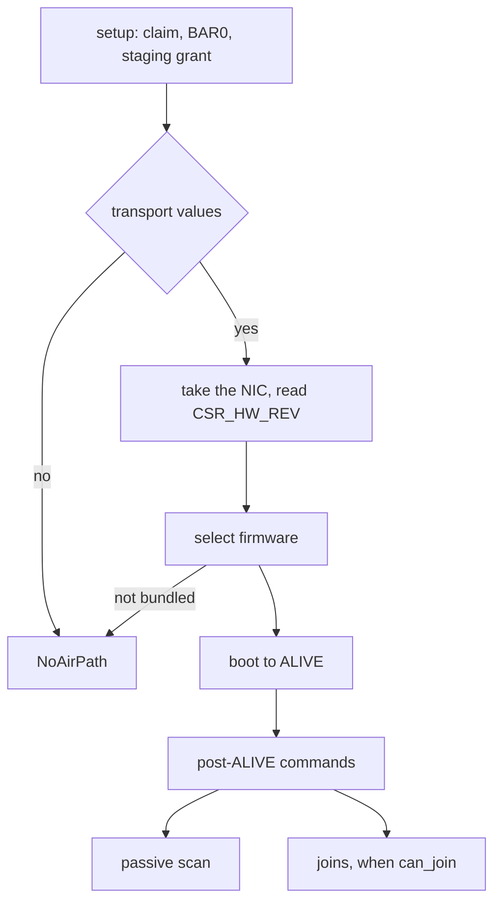

# Intel Wi-Fi (iwlwifi)

The iwlwifi driver [capsule](../../overview/glossary.md#capsule) finds Intel Wi-Fi cards from the 7260 to the AX210 family; in 0.9.2 it boots firmware, scans and joins only on the SO platforms (AX211, and AX201 modules on those platforms), and that path has run only against a modelled device.

## State in this release

No Intel Wi-Fi card has a hardware report for 0.9.2. The SO path is complete in code and passes host tests against a model of the device and its firmware (`iwlwifi_proofs`). Every other Intel card the driver takes ends at the stage `NoAirPath`, which the Settings panel shows as `card not supported yet; use Ethernet or USB Wi-Fi`; the status reply carries the exact reason as a step and a detail word. Until a hardware report exists, do not count on Wi-Fi from an Intel card in this release; the alternatives are listed under [Wi-Fi chips with no driver](not-supported.md#what-to-use-instead).

## Which cards do what

The driver takes an Intel PCI function of class 0x02, subclass 0x80, with a memory BAR0, whose device id is in `family_for_device` (`userland/capsule_driver_iwlwifi/src/pci_match.rs:47-59`, `is_supported_adapter`; `userland/capsule_driver_iwlwifi/src/firmware/family.rs:19-39`, `family_for_device`). The card names come from `name` (`userland/capsule_driver_iwlwifi/src/firmware/generation.rs:32-65`).

| Cards | PCI device ids (vendor 8086) | State |
|---|---|---|
| 7260, 3160, 7265, 3165, 3168 | 08b1 to 08b4, 095a, 095b, 3165, 3166, 24fb | Refused: no boot path, stage `NoAirPath` |
| 8260, 4165, 8265, 8275 | 24f3 to 24f6, 24fd | Refused: no boot path, stage `NoAirPath` |
| 9260, 9162, 9461, 9462, 9560 | 2526, 271b, 271c, 30dc, 31dc, 9df0, a370 | Refused: no boot path, stage `NoAirPath` |
| AX200 | 2723 | Refused: no boot path, stage `NoAirPath` |
| AX201 or 9560 on Qu and QuZ platforms | 02f0, 06f0, 34f0, 3df0, 43f0, 4df0, a0f0 | Refused: no boot path, stage `NoAirPath` |
| AX211, AX201 module on SO platforms | 51f0, 51f1, 54f0, 7a70, 7af0, 7f70 | Partial: boot, scan and join pass against the model |
| AX210 discrete (TY) | 2725 | Refused: its firmware file is not in the tree |
| Meteor Lake (MA) | 2729, 7e40 | Refused: its firmware file is not in the tree, and a MAC step other than B is refused before that |
| AX210 family ids with no transport values | a74f, 272f | Refused: not an SO platform |
| BE200, BE201 | 272b, a840 | Not supported: not in the id table, the driver never takes them |

Only the AX210 family ids that carry transport values go past the first step, and only the SO ones among them have a bundled firmware; `bring_up` leaves every other card as setup left it and refuses it with `NotSoDevice` (`userland/capsule_driver_iwlwifi/src/server/radio/bring.rs:97-101`, `NotSoDevice`). The transport values are per PCI id (`userland/capsule_driver_iwlwifi/src/firmware/gen3/select.rs:119-130`, `transport`). The BE200 and BE201 ids are named but sit outside the id table (`userland/capsule_driver_iwlwifi/src/firmware/generation.rs:59-60`, `family_for_device`).

## Firmware choice on the SO platforms

`select` picks the image from the MAC type and step in CSR_HW_REV and the RF type in CSR_HW_RF_ID, as Linux names it (`userland/capsule_driver_iwlwifi/src/firmware/gen3/select.rs:151-185`, `select`). The MAC types are SO 0x37, SO-F 0x43, TY 0x42 and MA 0x44; the RF types are GF 0x10D and HR 0x10C or 0x10A (`userland/capsule_driver_iwlwifi/src/firmware/gen3/select.rs:76-85`, `MAC_SO`, `RF_GF`).

| MAC | RF | Image | In the tree |
|---|---|---|---|
| SO or SO-F | GF, single radio | `iwlwifi-so-a0-gf-a0-86.ucode` | yes |
| SO or SO-F | HR | `iwlwifi-so-a0-hr-b0-84.ucode` | yes |
| TY | GF | `iwlwifi-ty-a0-gf-a0` | no |
| MA, step B | GF | `iwlwifi-ma-b0-gf-a0` | no |
| any | GF dual radio (CDB), JF, blank | none | refused |

Only the two SO images are bundled (`userland/capsule_driver_iwlwifi/src/firmware/blob.rs:40-51`, `gen3_blob`). No platform NVM (PNVM) file is committed, so the firmware runs on its built-in defaults (`userland/capsule_driver_iwlwifi/src/firmware/blob.rs:53-62`, `gen3_pnvm`).

## Bring-up

1. Setup claims the function and maps BAR0. It binds INTx when firmware routed a line, else one MSI-X vector, else runs polled (`userland/capsule_driver_iwlwifi/src/setup/irq_plan.rs:17-25`, `ERRNO_STALE`). It maps a 64-page staging grant (`userland/capsule_driver_iwlwifi/src/constants/pci.rs:16-20`, `FW_STAGING_SIZE`).
2. The [hardware broker](../../overview/glossary.md#hardware-broker) gives a network-class device at most 64 pages per DMA grant (`src/hardware/broker/dma/limits.rs:31-37`, `dma_page_limit_for_class`), so the driver spreads its memory over several grants.
3. `bring_up` takes the NIC, reads CSR_HW_REV and CSR_HW_RF_ID, selects the image and maps the control, receive and firmware regions (`userland/capsule_driver_iwlwifi/src/server/radio/bring.rs:102-135`, `map_all`).
4. It boots the firmware to ALIVE, then runs the post-ALIVE commands (`userland/capsule_driver_iwlwifi/src/server/radio/bring.rs:149-196`, `boot`, `up`).
5. After ALIVE every device interrupt is masked and the driver polls; the cause registers still latch for the error checks (`userland/capsule_driver_iwlwifi/src/firmware/gen3/start.rs:138-146`, `mask_interrupts`). The interrupt bound at setup is acknowledged once there and never waited on.
6. It checks that the firmware runs every join command at the layout the driver encodes; if not, it only scans (`userland/capsule_driver_iwlwifi/src/server/radio/bring.rs:209-220`, `check_join_api`).

A failure after the firmware was told where its memory is stops the device and keeps the grants mapped, so nothing the device may still write to is handed back (`userland/capsule_driver_iwlwifi/src/server/radio/bring.rs:149-164`, `stop_device`). A firmware that fails while running is not restarted (`userland/capsule_driver_iwlwifi/src/firmware/gen3/outcome.rs:57-59`, `Lost`).

## Station address

Each boot draws a locally administered address from kernel randomness; the card's factory address is never used (`userland/capsule_driver_iwlwifi/src/server/radio/bring.rs:184-190`, `draw`). With no randomness the interface takes the fixed 02:00:00:00:00:01, only the passive scan runs and nothing is transmitted (`userland/capsule_driver_iwlwifi/src/firmware/gen3/up.rs:42`, `SCAN_IF_ADDR`). A join needs the radio up, a drawn address and the right command layouts (`userland/capsule_driver_iwlwifi/src/server/radio/join.rs:99-101`, `can_join`); otherwise connect, disconnect and link are answered with -38 (`userland/capsule_driver_iwlwifi/src/server/control.rs:94-109`, `route`).
