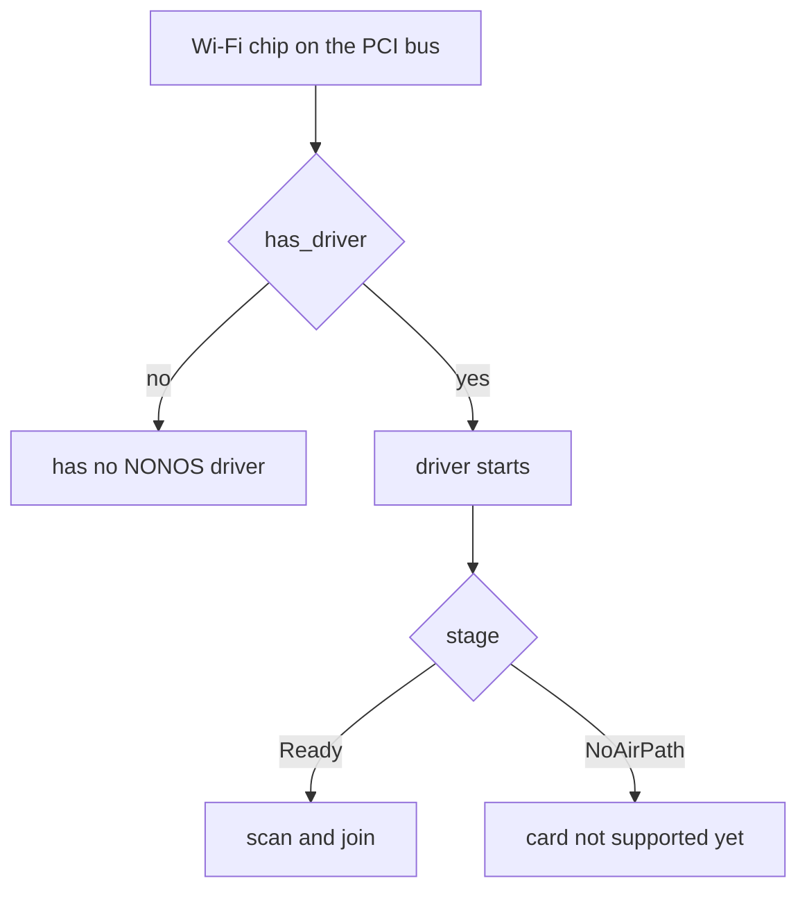

# Wi-Fi chips with no driver

NONOS 0.9.2 has two Wi-Fi drivers, one for the Realtek RTL8821CE and one for Intel cards; this page shows how to tell whether your chip has a driver, names the chips the code knows have none, and lists what to use instead.

## How to tell

Open Settings and look at the Wi-Fi row. When no Wi-Fi driver answers, the panel looks at the first Wi-Fi chip on the PCI bus and asks `has_driver` whether this build carries a driver for it (`userland/capsule_settings/src/settings/ui/live_wifi.rs:109-130`, `no_driver`). For a chip with none, the row starts with `Wi-Fi chip`, gives the vendor and device ids, and ends with `has no NONOS driver; use Ethernet or USB Wi-Fi`. No wait or reboot changes that answer.

`has_driver` is true for one Realtek id, 10ec:c821, and for the Intel ids the iwlwifi driver takes; every other vendor and every other Realtek id is false (`userland/capsule_settings/src/wifi/interface.rs:70-120`, `has_driver`). A card whose driver reaches the stage `Ready` can scan and join. An Intel card the driver takes but cannot run reaches the stage `NoAirPath`, whose text is `card not supported yet; use Ethernet or USB Wi-Fi`; the cards that end there are listed on the [iwlwifi page](iwlwifi.md#which-cards-do-what).

NONOS 0.9.2 has no driver for any USB Wi-Fi adapter. The `USB Wi-Fi` suggestion in both texts does not apply to this release.

## Chips the code names

The Settings tests hold these ids to `has_driver` returning false (`userland/capsule_settings_proofs/src/interface_tests.rs:115-126`, `has_driver`). The chip names follow the comment above them in that test, in its order:

| Chip | PCI vendor:device | Driver in 0.9.2 |
|---|---|---|
| MediaTek MT7921 | 14c3:7961 | none |
| MediaTek MT7922 | 14c3:0616 | none |
| Broadcom | 14e4:43a0 | none |
| Qualcomm, ath10k family | 168c:003e | none |
| Qualcomm, ath11k family | 17cb:1103 | none |
| Realtek RTL8822CE | 10ec:c822 | none |
| Realtek RTL8822BE | 10ec:b822 | none |

The same Realtek rule covers every other Realtek Wi-Fi chip, the RTL8852 family included: for vendor 10ec, only device c821 has a driver. Intel BE200 and BE201 (8086:272b and 8086:a840) are named by the iwlwifi driver but are not in its id table, so it never takes them (`userland/capsule_driver_iwlwifi/src/firmware/generation.rs:59-60`, `family_for_device`).

No driver [capsule](../../overview/glossary.md#capsule) for any of these chips exists in the tree.

## Firmware files are not drivers

The tree carries vendor firmware for several of these chips, and their presence does not mean support.

- The bootloader embeds firmware for the RTL8822B, RTL8822C, RTL8723D, RTL8851B and RTL8852A, B and C, and hands it to the kernel (`nonos-bootloader/src/firmware/loader.rs:33-47`, `FIRMWARE_TABLE`).
- The kernel's lookup for Realtek Wi-Fi firmware has no caller, and no capsule reads those files (`src/boot/firmware.rs:85-104`, `get_realtek_wifi_firmware`).
- The only Realtek file a driver links is `rtw8821c_fw.bin` (`userland/capsule_driver_rtl8821ce/src/fwload.rs:38`, `include_bytes`).
- `nonos-bootloader/firmware/mediatek/mt7921e_fw.bin` and `mt7922_fw.bin` are empty files, and `nonos-bootloader/firmware/qualcomm/qca6174a-wifi.bin` is 57 bytes. No code reads any of them.

## What to use instead

On real hardware, 0.9.2 offers little here.

1. If the Wi-Fi card is a replaceable module, a Realtek RTL8821CE card (10ec:c821). It is the only Wi-Fi chip with a hardware report for 0.9.2; read its [page](rtl8821ce.md) first.
2. In a virtual machine, the virtio network device, which the QEMU run targets attach; see [Ethernet drivers](../ethernet/README.md#virtio-net-in-a-virtual-machine).

Three routes that look possible are not available in 0.9.2:

- A wired port on the Intel 8254x, Realtek RTL8139 or Realtek RTL8169 family. Their drivers are in the image, but read from the code, `net.core` takes no received frame from them; see [the receive fault](../ethernet/README.md#the-receive-fault). The Intel I217, I218, I219, I225 and I226 drivers are in no image ([Intel Ethernet](../ethernet/intel.md)).
- USB tethering from a phone and USB Ethernet adapters. Capsules for CDC-ECM, CDC-NCM, RNDIS, the ASIX AX88179 and the Realtek RTL8153 exist in the tree, but no image includes them and the USB host driver does not serve the bulk transfer they need. The reasons are on the [USB networking page](../ethernet/usb-net.md).
- USB Wi-Fi adapters: no driver.

## Reporting your chip

If your machine has a Wi-Fi chip that is not on this page, send its PCI vendor and device ids with a hardware report; see [how to report a machine](../../hardware/report.md).

## See also

- [Wi-Fi drivers](README.md)
- [Intel iwlwifi](iwlwifi.md)
- [Ethernet drivers](../ethernet/README.md)
- [Hardware support matrix](../../hardware/MATRIX.md)
- [Report a machine](../../hardware/report.md)
- [Wi-Fi and networking for users](../../using/wifi-and-networking.md)
