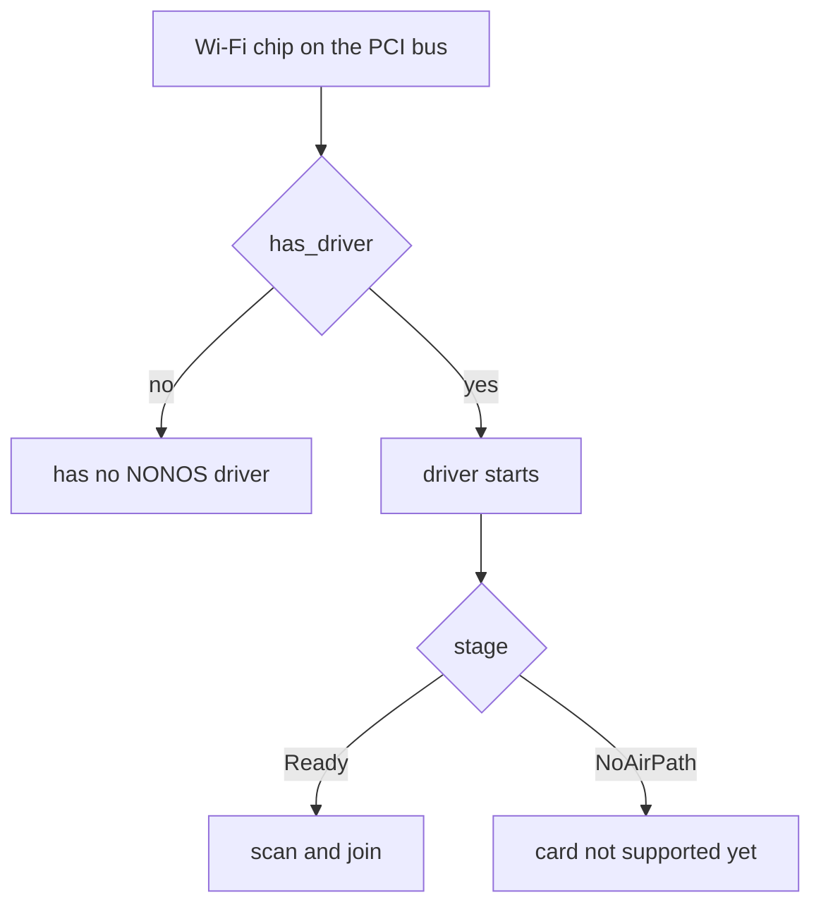

# Wi-Fi chips with no driver

NONOS 0.9.2 has two Wi-Fi drivers, one for the Realtek RTL8821CE and one for Intel cards; this page shows how to tell whether your chip has a driver, names the chips the code knows have none, and lists what to use instead.

## How to tell

Open Settings and look at the Wi-Fi row. When no Wi-Fi driver answers, the panel looks at the first Wi-Fi chip on the PCI bus and asks `has_driver` whether this build carries a driver for it (`userland/capsule_settings/src/settings/ui/live_wifi.rs:109-130`, `no_driver`). For a chip with none, the row starts with `Wi-Fi chip`, gives the vendor and device ids, and ends with `has no NONOS driver; use Ethernet or USB Wi-Fi`. No wait or reboot changes that answer.

`has_driver` is true for one Realtek id, 10ec:c821, and for the Intel ids the iwlwifi driver takes; every other vendor and every other Realtek id is false (`userland/capsule_settings/src/wifi/interface.rs:70-120`, `has_driver`). A card whose driver reaches the stage `Ready` can scan and join. An Intel card the driver takes but cannot run reaches the stage `NoAirPath`, whose text is `card not supported yet; use Ethernet or USB Wi-Fi`; the cards that end there are listed on the [iwlwifi page](iwlwifi.md#which-cards-do-what).

NONOS 0.9.2 has no driver for any USB Wi-Fi adapter. The `USB Wi-Fi` suggestion in both texts does not apply to this release.
