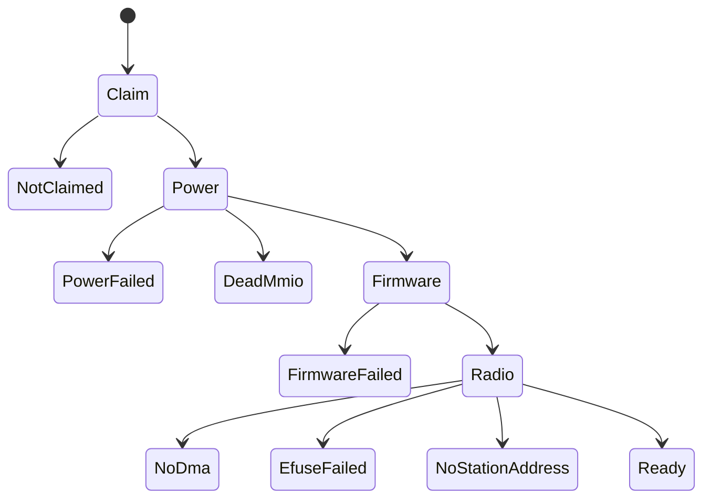

# Realtek RTL8821CE

The RTL8821CE driver [capsule](../../overview/glossary.md#capsule) runs the Wi-Fi function of the Realtek RTL8821CE PCIe card on 2.4 GHz: it scans, joins WPA2 and WPA3 networks and carries traffic for `net.core`.

## What works

Wi-Fi on Realtek RTL8821CE (scan, join, DHCP, DNS, browser traffic). Works on an x86_64 laptop (Intel Gemini Lake, 8 GB), maintainer hardware report, 6 October 2026; the image commit was not recorded.

The rest of this page is read from the code and from the host tests in `rtl8821ce_proofs` and `nonos_wifi_core_proofs`. Those cover WPA3-SAE, PSK-SHA256, group rekeys, deauthentication and the hidden-network probe. The hardware report does not say which security its join used.

## Identity

The driver takes one PCI function: vendor 0x10EC, device 0xC821 (`userland/capsule_driver_rtl8821ce/src/constants/mod.rs:24-26`, `PCI_DEVICE_RTL8821CE`). Its registers sit in the first memory BAR with a non-zero size, which on this chip is not BAR0, so `find` looks for it (`userland/capsule_driver_rtl8821ce/src/discover.rs:38-65`).

The kernel starts the capsule only when the boot PCI scan found 10ec:c821 (`src/userspace/init/spawn_plan/drivers_wifi.rs:50-62`, `spawn_rtl8821ce`). Its service is `driver.rtl8821ce0` on port 4234 (`userland/capsule_driver_rtl8821ce/Capsule.mk:14`, `CAPSULE_SERVICE_ENDPOINT`).

## Authority

The [manifest](../../overview/glossary.md#manifest) asks for the [capability](../../overview/glossary.md#capability-word) mask 0xB8038: IPC, Memory, Crypto, Driver, DeviceEnum, Mmio and Dma, with Debug (0x100) optional (`userland/capsule_driver_rtl8821ce/Capsule.mk:26-29`, `CAPSULE_REQUIRED_CAPS`, `CAPSULE_OPTIONAL_CAPS`). The kernel's spawn request matches it and adds Debug only through `serial_debug_cap` (`src/hardware/rtl8821ce_capsule/spawn.rs:50-60`, `requested_caps`), which returns Debug only in a build with the `capsule-serial-debug` feature (`src/capabilities/serial_debug.rs:37-50`, `serial_debug_cap`).

- No Irq: the driver polls its rings and binds no interrupt.
- Crypto is there for `CryptoRandom`, which draws the station address, the handshake nonce and the SAE secrets.
- No FileSystem and no Network capability. The passphrase arrives with each connect request; the saved list lives in the client, not here.

## Bring-up



The driver goes as far as it can and then serves whatever stage it reached, so the Settings panel can show why the radio is down. Claim, Power, Firmware and Radio are the four phases.

1. Claim: `start_driver` finds the chip, claims it and maps its registers (`userland/capsule_driver_rtl8821ce/src/main.rs:87-95`, `start_driver`). With no chip the capsule exits with `EXIT_ABSENT` (2). A refused claim is retried; running out leaves it serving `NotClaimed`.
2. The retry schedule is shared by every driver: 7 attempts, the sleep between them starting at 100 ms and doubling up to 3.2 s (`userland/libc/src/bringup/policy.rs:30-35`, `BRINGUP_ATTEMPTS`, `BRINGUP_MAX_DELAY_MS`).
3. Power: the power-on sequence runs and the chip is read back (`userland/capsule_driver_rtl8821ce/src/main.rs:96-106`, `probe`). Failure stops at `PowerFailed` or `DeadMmio`.
4. The PCIe link is held out of L1, which gates clocks inside the chip (`userland/capsule_driver_rtl8821ce/src/main.rs:107-114`, `hold_link_awake`), and the PCIe completion timeout is switched off (`userland/capsule_driver_rtl8821ce/src/main.rs:115-121`, `disable_completion_timeout`).
5. The efuse is read on the freshly powered MAC (`userland/capsule_driver_rtl8821ce/src/main.rs:122-131`, `efuse::read`).
6. Firmware: the 8051 firmware is downloaded through reserved-page staging and DDMA (`userland/capsule_driver_rtl8821ce/src/main.rs:132-139`, `fwload::load`). Failure stops at `FirmwareFailed`.
7. The transmit and receive engines are enabled and the MAC table runs (`userland/capsule_driver_rtl8821ce/src/main.rs:140-152`, `init_trx_cfg`, `run_mac_table`). An engine that does not start also stops at `FirmwareFailed`.
8. Radio: `build_radio` maps the DMA rings, configures the PHY from the efuse and draws the station address (`userland/capsule_driver_rtl8821ce/src/serve/radio.rs:59-78`, `build_radio`). Failures stop at `NoDma`, `EfuseFailed` or `NoStationAddress` (`userland/capsule_driver_rtl8821ce/src/serve/radio.rs:128-168`, `Stage::NoStationAddress`).

A bring-up that passes every phase ends at `Ready`. The stage numbers are listed in `Stage` (`userland/capsule_driver_rtl8821ce/src/serve/stage.rs:19-43`) and their panel texts on the [Wi-Fi overview](README.md).

The card is a Wi-Fi and Bluetooth combo. The driver hands the shared antenna to Wi-Fi and keeps the Bluetooth grant low; Bluetooth is not driven (`userland/capsule_driver_rtl8821ce/src/coex/wl_only.rs:17-34`, `take_antenna`).

## Station address

Every boot draws a new locally administered unicast address from kernel randomness. The address in the efuse is never used, because access points log the source of every probe (`userland/capsule_driver_rtl8821ce/src/station.rs:17-31`, `draw`). With no randomness the radio stays dark at `NoStationAddress` instead of falling back.

## Scanning

The serve loop scans in the background while no network is joined, so a scan request is answered at once from the list (`userland/capsule_driver_rtl8821ce/src/serve/mod.rs:124-133`, `scanner`).

- Channels 1 to 13 on 2.4 GHz only (`userland/capsule_driver_rtl8821ce/src/serve/mod.rs:58-59`, `SCAN_CHANNELS`).
- 300 ms on each channel (`userland/capsule_driver_rtl8821ce/src/serve/scanner.rs:33-38`, `DWELL_MS`).
- The scan is passive: the driver listens for beacons and sends nothing.

Before a join the driver hunts the network's beacon: two sweeps at 250 ms a channel (`userland/capsule_driver_rtl8821ce/src/serve/connect/hunt.rs:38-40`, `BEACON_HUNT_DWELL_MS`, `HUNT_SWEEPS`). It sends a probe request only for a network saved as hidden, and that probe names only that network (`userland/capsule_driver_rtl8821ce/src/serve/connect/probe.rs:29-36`, `hunt_probe`).

## Joining

A connect runs the whole join inside the request (`userland/capsule_driver_rtl8821ce/src/serve/connect.rs:17-29`, `JoinPolicy`). The policy is WPA3-SAE whenever offered and WPA2 otherwise, and only SAE for a network saved as WPA3 (`userland/capsule_driver_rtl8821ce/src/serve/connect.rs:139-143`, `JoinPolicy::WPA3_ONLY`). The negotiation itself is described on the [Wi-Fi overview](README.md#security-a-join-accepts).

- The join gets 8 s (`userland/capsule_driver_rtl8821ce/src/serve/connect.rs:61-68`, `JOIN_BUDGET_MS`).
- On a network that offers both, a WPA3 join that did not finish is tried again once with WPA2, with its own 8 s (`userland/capsule_driver_rtl8821ce/src/serve/connect.rs:69-72`, `PSK_BUDGET_MS`). That second try is skipped when the network was saved as WPA3 and when the access point's SAE confirm said the password is wrong (`userland/capsule_driver_rtl8821ce/src/serve/connect.rs:250-257`, `retry_with_psk`).
- The pairwise and group keys go into the chip's key table, with 4 entries for group keys by key index (`userland/capsule_driver_rtl8821ce/src/serve/connect.rs:57-74`, `GROUP_KEY_SLOTS`).
- The reply carries a status code and the AKM that ran: 2 for WPA2-PSK, 6 for PSK-SHA256, 8 for WPA3-SAE (`userland/capsule_driver_rtl8821ce/src/serve/connect/result.rs:51-68`, `ConnectResult`).

The status codes are defined beside `failure_code`, which maps each way a join can fail to one of them (`userland/capsule_driver_rtl8821ce/src/serve/connect/result.rs:28-49`, `CODE_NO_ENTROPY`; `userland/capsule_driver_rtl8821ce/src/serve/connect/result.rs:77-97`, `failure_code`):

| Ends with | Code |
|---|---|
| Malformed request, radio down | -1 |
| Network not heard | -2 |
| Access point refused authentication or association | -5 |
| Handshake did not finish, the usual sign of a wrong WPA2 passphrase | -6 |
| Saved as WPA3, now offers only WPA2 | -7 |
| Open, TKIP, Enterprise or 802.11n-only network | -8 |
| Passphrase not 8 to 63 characters or 64 hex digits | -9 |
| WPA3 confirm failed, the sign of a wrong password | -10 |
| Message 3 did not match the beacon | -11 |
| No randomness for the join | -12 |

## Carrying traffic

The one service inbox takes two request families: `net.core`'s link protocol, handled by `netif::serve`, and the Wi-Fi control family (`userland/capsule_driver_rtl8821ce/src/serve/mod.rs:100-122`, `netif::serve`). A frame neither family takes is answered with -22 rather than left without a reply (`userland/capsule_driver_rtl8821ce/src/serve/refuse.rs:24-25`, `STATUS_REFUSED`).

While joined, a new group key from the access point is installed and a deauthentication ends the session, so the link reads down and the background scan resumes (`userland/capsule_driver_rtl8821ce/src/serve/mod.rs:137-150`, `after_receive`). The driver does not rejoin by itself; see [autojoin](README.md#autojoin-and-losing-the-link).

## Firmware

The capsule links `rtw8821c_fw.bin` from `nonos-bootloader/firmware/realtek/` with `include_bytes!` (`userland/capsule_driver_rtl8821ce/src/fwload.rs:38`, `include_bytes`). The file is 139,472 bytes in this tree. The note beside the driver, [firmware/README.md](../../../userland/capsule_driver_rtl8821ce/firmware/README.md), gives its origin: linux-firmware, `rtw88/rtw8821c_fw.bin`, version 24.11.0, copyright Realtek Semiconductor Corp. It is not AGPL code. Its terms are in [the Realtek licence](../../../nonos-bootloader/firmware/realtek/LICENSE): binary redistribution without modification, the notice kept, no reverse engineering.

## Reading what the driver did

On a build that grants Debug, the driver writes one console line per bring-up step through `mk_debug` (`userland/capsule_driver_rtl8821ce/src/status.rs:32-33`, `line`). The standard profile keeps the `capsule-serial-debug` feature that grants it, and the hardened profile drops it (`tools/nix/config.nix:69-85`, `debugFeatures`). The Terminal's `log` command shows the kernel's recent lines and keeps only those naming the words you give (`userland/capsule_terminal/src/command/builtin/log.rs:18-21`, `mk_log_tail`):

```sh
log rtl8821ce
```

Not tested in this release.

Without Debug those lines are dropped, and the Settings Wi-Fi panel's stage line is the record.
