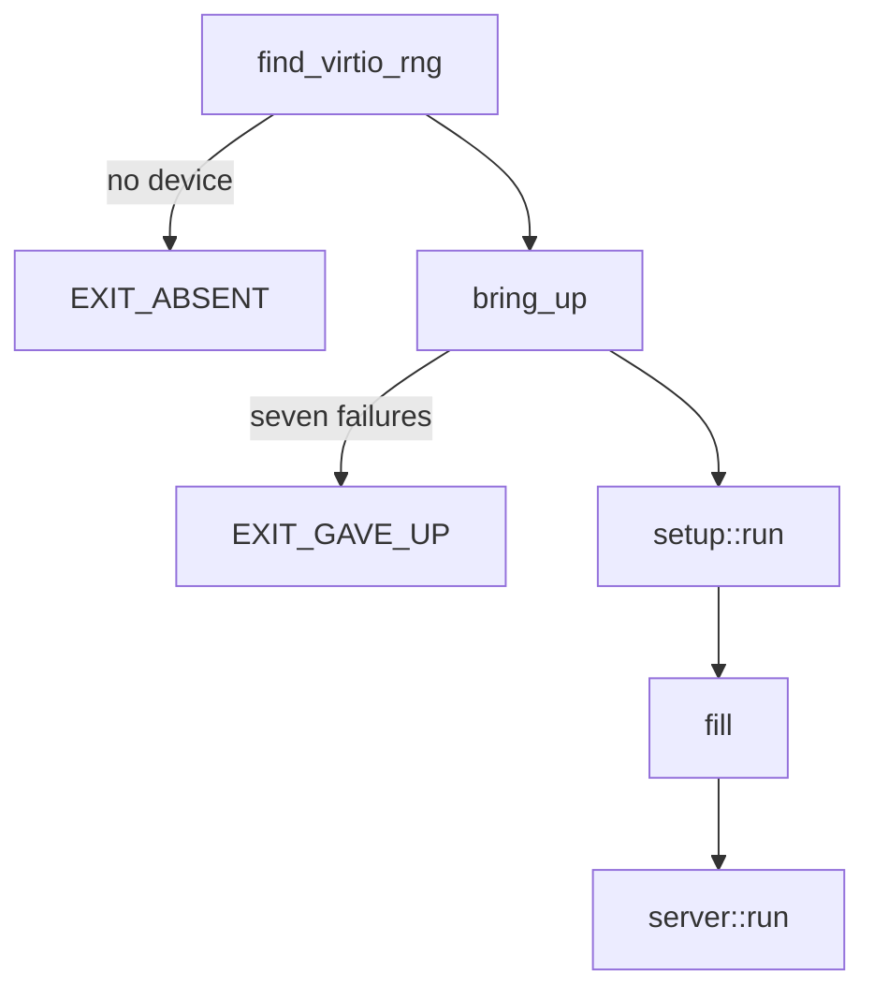

# Writing a driver

A [driver capsule](../overview/glossary.md#driver-capsule) from scratch, built step by step on the real `capsule_driver_virtio_rng`, from its manifest to its [proof crate](../overview/glossary.md#proof-crate) and the build.

## What you build

The example drives the virtio entropy device: PCI vendor 0x1AF4, device 0x1005 (transitional) or 0x1044 (modern), as `VIRTIO_RNG_TRANSITIONAL` and `VIRTIO_RNG_MODERN` say (`userland/capsule_driver_virtio_rng/src/constants/pci.rs:22-24`). It is small, it maps registers by MMIO or port I/O, it takes two DMA buffers, and it answers two requests, a fill and a health check. It polls and binds no interrupt, so the interrupt step below borrows virtio-blk's code. Read [broker-api.md](broker-api.md) first for what each call checks.

A new driver adds these pieces. Every path is virtio-rng's copy.

| Piece | Where | What it is |
|---|---|---|
| Crate | `userland/capsule_driver_virtio_rng/` | the `no_std` program |
| Manifest | `userland/capsule_driver_virtio_rng/Capsule.mk` | identity, endpoints, [capability word](../overview/glossary.md#capability-word) |
| Contract | `userland/capsule_driver_virtio_rng/README.md` | the sections the static checks require |
| [Kernel mirror](../overview/glossary.md#kernel-mirror) | `src/hardware/virtio_rng_capsule/` | embed, spawn and the kernel's client |
| Spawn | `src/userspace/init/spawn_plan/drivers_virtio_io.rs` | when the kernel starts it |
| Who may send | `src/services/registry/held_table.rs` | the [endpoint](../overview/glossary.md#endpoint)'s allowed callers |
| Proof crate | `userland/virtio_rng_proofs/` | host tests on the shipping source |



The program starts in `_start`: `find_virtio_rng` looks for the device, `bring_up` runs `setup::run` until it succeeds or gives up, a first `fill` checks the device, and `server::run` serves requests for good.

## 1. The crate

The crate is a `no_std`, `no_main` binary named `driver_virtio_rng` with `_start` as its entry (`userland/capsule_driver_virtio_rng/src/main.rs:17-36`). It depends on `nonos_libc` for every system call and on `nonos_virtio` for the virtio 1.0 transport (`userland/capsule_driver_virtio_rng/Cargo.toml:17-23`). It reaches hardware only through the broker; the static checks refuse a `crate::drivers` import in this crate, through `capsule_kernel_drivers` (`nonos-ci/run-static-checks.sh:476-483`).

## 2. The manifest

`Capsule.mk` declares who the capsule is. This is the whole of virtio-rng's below its four-line header comment, as the build reads it to fill `CAPSULE_SLUG` and the rest:

```make
CAPSULE_SLUG             := driver-virtio-rng
CAPSULE_HANDLE           := driver.virtio_rng
CAPSULE_DOMAIN           := systems.nonos
CAPSULE_DIR              := userland/capsule_driver_virtio_rng
CAPSULE_BIN_NAME         := driver_virtio_rng
CAPSULE_FEATURE          := nonos-capsule-driver-virtio-rng
CAPSULE_NAMESPACE        := systems.nonos.driver.virtio_rng
CAPSULE_SERVICE_ENDPOINT := service:4200:driver.virtio_rng
CAPSULE_REPLY_ENDPOINT   := reply:4201:endpoint.4294967302
# IPC|Memory|Driver|DeviceEnum|Mmio|Dma|Pio
# = 0x08|0x10|0x10000|0x8000|0x20000|0x80000|0x100000 = 0x1B8018
# No Irq: the driver polls its rings and makes no MkIrq* call (and posts
# no input), the only calls Irq admits. A driver moved to interrupts
# takes the bit back.
CAPSULE_REQUIRED_CAPS    := 0x1B8018
CAPSULE_KERNEL_MIRROR    := src/hardware/virtio_rng_capsule

include nonos-mk/capsule.mk
```

What each line means:

- `CAPSULE_SLUG` names the make targets. The include turns it into `NONOS_CAPSULE_RULES`: `nonos-mk-driver-virtio-rng` builds the ELF, `nonos-mk-driver-virtio-rng-sign` signs it (`nonos-mk/capsule.mk:175-177`). The include refuses a manifest that leaves out `CAPSULE_SLUG` or any other required variable (`nonos-mk/capsule.mk:28-55`).
- `CAPSULE_HANDLE` is the service name clients look up, and `CAPSULE_SERVICE_ENDPOINT` gives it a port. `check_capsule_ports.py` fails when `clashes` finds two capsules on one port (`scripts/check_capsule_ports.py:18-32`).
- `CAPSULE_REPLY_ENDPOINT` names the inbox the kernel's client reads replies from; its name must equal `REPLY_INBOX` in the mirror (`src/hardware/virtio_rng_capsule/client/transport.rs:25-27`).
- `CAPSULE_NAMESPACE` under `systems.nonos.` puts the capsule in the enrolled tier, which `classify` decides (`src/kernel_core/process_spawn/capsule_spawn/runner/tier.rs:22-28`) and `attest_gate` checks at every spawn (`src/kernel_core/process_spawn/capsule_spawn/runner/preflight.rs:72-77`).
- `CAPSULE_REQUIRED_CAPS` is the capability word: `0x1B8018` is IPC, Memory, Driver, DeviceEnum, Mmio, Dma and Pio, and no Irq because the driver polls. The capsule runs with these bits plus any optional bit the spawn grants, as `install_caps` computes (`src/security/capsule_manifest/verify/caps_bits.rs:45-47`). On a boot mode without network, `caps` in the profile gate then takes the Network bit away (`src/kernel_core/process_spawn/capsule_spawn/runner/profile_gate.rs:48-55`).

A driver that prints to the serial console adds `CAPSULE_OPTIONAL_CAPS := 0x100`, the `Debug` bit, and its mirror asks for it with `serial_debug_cap`, which returns it only in a kernel built with `capsule-serial-debug` (`src/capabilities/serial_debug.rs:37-50`). Hardened and Air-Gapped images leave that feature out through `debugFeatures` (`tools/nix/config.nix:78-93`). The shared start code prints its lines, such as `say_absent`'s, with `mk_debug` (`userland/libc/src/bringup/run.rs:64-89`), and the contract table admits `MkDebug` only with `Debug` (`src/syscall/contract/cap_table/mk.rs:138`), so a driver without the bit gives up without a line of its own on the console.

## 3. Finding the device

The id table is the two constants above, and `is_match` is the whole test: a PCI record with vendor 0x1AF4 and one of the two device ids (`userland/capsule_driver_virtio_rng/src/discover/is_match.rs:19-23`). `find_virtio_rng` asks for every class with `mk_device_list(0, ...)` into a buffer of `MAX_DEVICES` (128) records, and keeps the first match that has a usable register BAR (`userland/capsule_driver_virtio_rng/src/discover/find.rs:22-53`). A driver for a PCI class, such as NVMe, matches on `pci_class`, `pci_subclass` and `pci_progif` instead.

## 4. The start

`_start` checks for the device before it claims anything, then hands the attempts to the shared schedule (`userland/capsule_driver_virtio_rng/src/main.rs:35-57`):

```rust
#[no_mangle]
pub unsafe extern "C" fn _start() -> ! {
    if heap_init().is_err() {
        mk_exit(1);
    }

    /*
     * The broker lists every PCI function before the first capsule starts:
     * with no virtio-rng there is nothing to wait for. Discovery used to be
     * retried with everything else for ten seconds of yields.
     */
    if discover::find_virtio_rng().is_none() {
        mk_exit(EXIT_ABSENT);
    }

    /*
     * A present device that will not come up is tried a bounded number of
     * times with a sleep between tries, each failed try releasing what it
     * claimed, and then given up on once, by name.
     */
    let Ok(mut driver) = bring_up(b"driver.virtio_rng", setup::run) else {
        mk_exit(EXIT_GAVE_UP);
    };
```

No device means `EXIT_ABSENT` (2) at once. A device that fails seven attempts means `EXIT_GAVE_UP` (6). After bring-up the driver asks for one `fill` and exits 3 if it fails or 4 if every byte is zero (`userland/capsule_driver_virtio_rng/src/main.rs:59-77`). Thirteen of the drivers call `start_driver` instead, which does the discovery check and the schedule in one call (`userland/libc/src/bringup/run.rs:52-62`).

## 5. One attempt

`setup::run` is one bring-up attempt, and the rule written above `run` is that a failed attempt holds nothing afterwards (`userland/capsule_driver_virtio_rng/src/setup/sequence.rs:27-46`):

```rust
/// One bring-up attempt. A failed one holds nothing afterwards.
pub fn run() -> Result<Driver, &'static str> {
    let dev = find_virtio_rng().ok_or("no virtio-rng device")?;

    let claim_epoch = claim::claim(dev.device_id)?;

    let attempt = claimed(dev, claim_epoch);
    if attempt.is_err() {
        /*
         * Whichever step failed, the claim goes, and every MMIO, PIO and
         * DMA grant with it, so the next attempt can claim afresh. Steps
         * that roll back on their own have released it already and this
         * answers "not claimed". A register BAR the driver cannot map and a refused
         * handshake never did, and every attempt after one of them failed
         * at claim.
         */
        let _ = mk_device_release(dev.device_id);
    }
    attempt
}
```

`claim` keeps the [claim epoch](../overview/glossary.md#claim-epoch) that `mk_device_claim` returns, and every later call passes it (`userland/capsule_driver_virtio_rng/src/setup/claim.rs:24-30`). `transport::probe` then picks legacy or modern virtio from configuration space, which only the holder may read (`userland/capsule_driver_virtio_rng/src/transport/probe.rs:29-40`). When any later step fails, `mk_device_release` takes every grant with the claim, so the next attempt can claim afresh.
