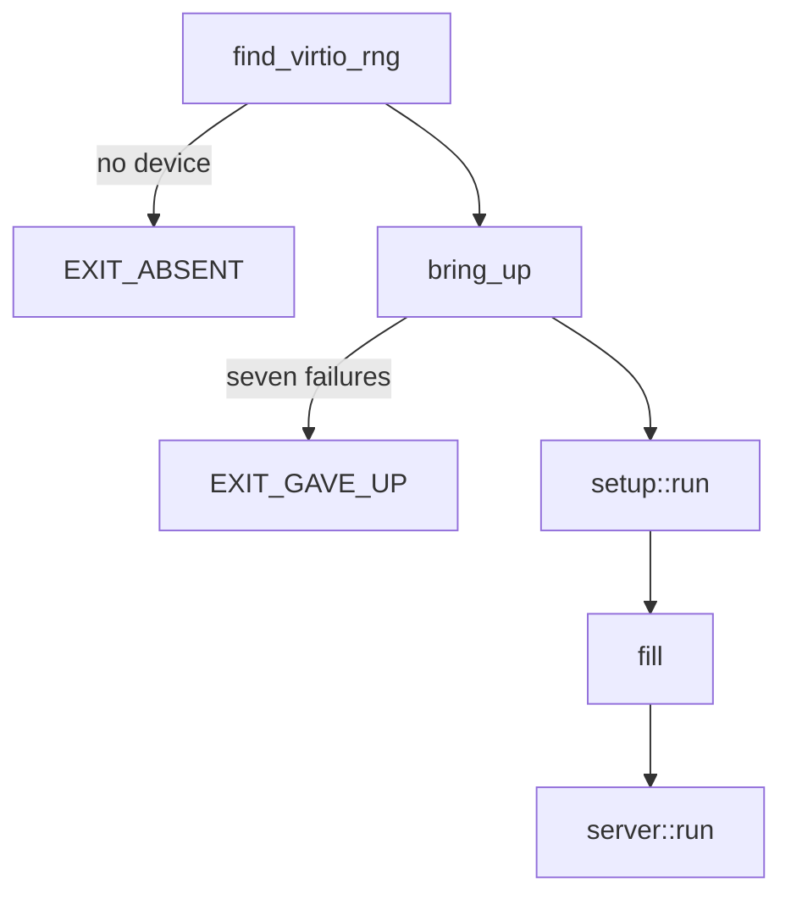

# Writing a driver

A [driver capsule](../overview/glossary.md#driver-capsule) from scratch, built step by step on the real `capsule_driver_virtio_rng`, from its manifest to its [proof crate](../overview/glossary.md#proof-crate) and the build.

## What you build

The example drives the virtio entropy device: PCI vendor 0x1AF4, device 0x1005 (transitional) or 0x1044 (modern), as `VIRTIO_RNG_TRANSITIONAL` and `VIRTIO_RNG_MODERN` say (`userland/capsule_driver_virtio_rng/src/constants/pci.rs:22-24`). It is small, it maps registers by MMIO or port I/O, it takes two DMA buffers, and it answers two requests, a fill and a health check. It polls and binds no interrupt, so the interrupt step below borrows virtio-blk's code. Read [broker-api.md](broker-api.md) first for what each call checks.

A new driver adds these pieces. Every path is virtio-rng's copy.

| Piece | Where | What it is |
|---|---|---|
| Crate | `userland/capsule_driver_virtio_rng/` | the `no_std` program |
| Manifest | `userland/capsule_driver_virtio_rng/Capsule.mk` | identity, endpoints, [capability word](../overview/glossary.md#capability-word) |
| Contract | `userland/capsule_driver_virtio_rng/README.md` | the sections the static checks require |
| [Kernel mirror](../overview/glossary.md#kernel-mirror) | `src/hardware/virtio_rng_capsule/` | embed, spawn and the kernel's client |
| Spawn | `src/userspace/init/spawn_plan/drivers_virtio_io.rs` | when the kernel starts it |
| Who may send | `src/services/registry/held_table.rs` | the [endpoint](../overview/glossary.md#endpoint)'s allowed callers |
| Proof crate | `userland/virtio_rng_proofs/` | host tests on the shipping source |

The program starts in `_start`: `find_virtio_rng` looks for the device, `bring_up` runs `setup::run` until it succeeds or gives up, a first `fill` checks the device, and `server::run` serves requests for good.

## 1. The crate

The crate is a `no_std`, `no_main` binary named `driver_virtio_rng` with `_start` as its entry (`userland/capsule_driver_virtio_rng/src/main.rs:17-36`). It depends on `nonos_libc` for every system call and on `nonos_virtio` for the virtio 1.0 transport (`userland/capsule_driver_virtio_rng/Cargo.toml:17-23`). It reaches hardware only through the broker; the static checks refuse a `crate::drivers` import in this crate, through `capsule_kernel_drivers` (`nonos-ci/run-static-checks.sh:476-483`).
