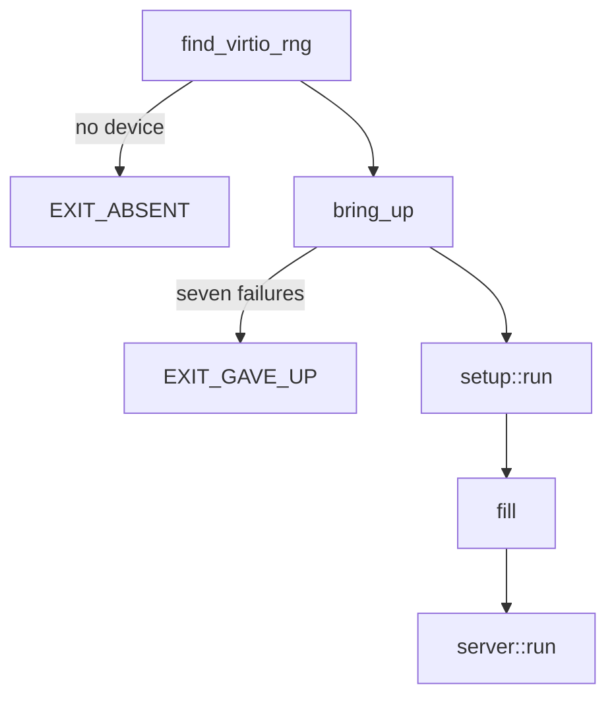

# Writing a driver

A [driver capsule](../overview/glossary.md#driver-capsule) from scratch, built step by step on the real `capsule_driver_virtio_rng`, from its manifest to its [proof crate](../overview/glossary.md#proof-crate) and the build.

## What you build

The example drives the virtio entropy device: PCI vendor 0x1AF4, device 0x1005 (transitional) or 0x1044 (modern), as `VIRTIO_RNG_TRANSITIONAL` and `VIRTIO_RNG_MODERN` say (`userland/capsule_driver_virtio_rng/src/constants/pci.rs:22-24`). It is small, it maps registers by MMIO or port I/O, it takes two DMA buffers, and it answers two requests, a fill and a health check. It polls and binds no interrupt, so the interrupt step below borrows virtio-blk's code. Read [broker-api.md](broker-api.md) first for what each call checks.

A new driver adds these pieces. Every path is virtio-rng's copy.

| Piece | Where | What it is |
|---|---|---|
| Crate | `userland/capsule_driver_virtio_rng/` | the `no_std` program |
| Manifest | `userland/capsule_driver_virtio_rng/Capsule.mk` | identity, endpoints, [capability word](../overview/glossary.md#capability-word) |
| Contract | `userland/capsule_driver_virtio_rng/README.md` | the sections the static checks require |
| [Kernel mirror](../overview/glossary.md#kernel-mirror) | `src/hardware/virtio_rng_capsule/` | embed, spawn and the kernel's client |
| Spawn | `src/userspace/init/spawn_plan/drivers_virtio_io.rs` | when the kernel starts it |
| Who may send | `src/services/registry/held_table.rs` | the [endpoint](../overview/glossary.md#endpoint)'s allowed callers |
| Proof crate | `userland/virtio_rng_proofs/` | host tests on the shipping source |



The program starts in `_start`: `find_virtio_rng` looks for the device, `bring_up` runs `setup::run` until it succeeds or gives up, a first `fill` checks the device, and `server::run` serves requests for good.

## 1. The crate

The crate is a `no_std`, `no_main` binary named `driver_virtio_rng` with `_start` as its entry (`userland/capsule_driver_virtio_rng/src/main.rs:17-36`). It depends on `nonos_libc` for every system call and on `nonos_virtio` for the virtio 1.0 transport (`userland/capsule_driver_virtio_rng/Cargo.toml:17-23`). It reaches hardware only through the broker; the static checks refuse a `crate::drivers` import in this crate, through `capsule_kernel_drivers` (`nonos-ci/run-static-checks.sh:476-483`).

## 2. The manifest

`Capsule.mk` declares who the capsule is. This is the whole of virtio-rng's below its four-line header comment, as the build reads it to fill `CAPSULE_SLUG` and the rest:

```make
CAPSULE_SLUG             := driver-virtio-rng
CAPSULE_HANDLE           := driver.virtio_rng
CAPSULE_DOMAIN           := systems.nonos
CAPSULE_DIR              := userland/capsule_driver_virtio_rng
CAPSULE_BIN_NAME         := driver_virtio_rng
CAPSULE_FEATURE          := nonos-capsule-driver-virtio-rng
CAPSULE_NAMESPACE        := systems.nonos.driver.virtio_rng
CAPSULE_SERVICE_ENDPOINT := service:4200:driver.virtio_rng
CAPSULE_REPLY_ENDPOINT   := reply:4201:endpoint.4294967302
# IPC|Memory|Driver|DeviceEnum|Mmio|Dma|Pio
# = 0x08|0x10|0x10000|0x8000|0x20000|0x80000|0x100000 = 0x1B8018
# No Irq: the driver polls its rings and makes no MkIrq* call (and posts
# no input), the only calls Irq admits. A driver moved to interrupts
# takes the bit back.
CAPSULE_REQUIRED_CAPS    := 0x1B8018
CAPSULE_KERNEL_MIRROR    := src/hardware/virtio_rng_capsule

include nonos-mk/capsule.mk
```

What each line means:

- `CAPSULE_SLUG` names the make targets. The include turns it into `NONOS_CAPSULE_RULES`: `nonos-mk-driver-virtio-rng` builds the ELF, `nonos-mk-driver-virtio-rng-sign` signs it (`nonos-mk/capsule.mk:175-177`). The include refuses a manifest that leaves out `CAPSULE_SLUG` or any other required variable (`nonos-mk/capsule.mk:28-55`).
- `CAPSULE_HANDLE` is the service name clients look up, and `CAPSULE_SERVICE_ENDPOINT` gives it a port. `check_capsule_ports.py` fails when `clashes` finds two capsules on one port (`scripts/check_capsule_ports.py:18-32`).
- `CAPSULE_REPLY_ENDPOINT` names the inbox the kernel's client reads replies from; its name must equal `REPLY_INBOX` in the mirror (`src/hardware/virtio_rng_capsule/client/transport.rs:25-27`).
- `CAPSULE_NAMESPACE` under `systems.nonos.` puts the capsule in the enrolled tier, which `classify` decides (`src/kernel_core/process_spawn/capsule_spawn/runner/tier.rs:22-28`) and `attest_gate` checks at every spawn (`src/kernel_core/process_spawn/capsule_spawn/runner/preflight.rs:72-77`).
- `CAPSULE_REQUIRED_CAPS` is the capability word: `0x1B8018` is IPC, Memory, Driver, DeviceEnum, Mmio, Dma and Pio, and no Irq because the driver polls. The capsule runs with these bits plus any optional bit the spawn grants, as `install_caps` computes (`src/security/capsule_manifest/verify/caps_bits.rs:45-47`). On a boot mode without network, `caps` in the profile gate then takes the Network bit away (`src/kernel_core/process_spawn/capsule_spawn/runner/profile_gate.rs:48-55`).

A driver that prints to the serial console adds `CAPSULE_OPTIONAL_CAPS := 0x100`, the `Debug` bit, and its mirror asks for it with `serial_debug_cap`, which returns it only in a kernel built with `capsule-serial-debug` (`src/capabilities/serial_debug.rs:37-50`). Hardened and Air-Gapped images leave that feature out through `debugFeatures` (`tools/nix/config.nix:78-93`). The shared start code prints its lines, such as `say_absent`'s, with `mk_debug` (`userland/libc/src/bringup/run.rs:64-89`), and the contract table admits `MkDebug` only with `Debug` (`src/syscall/contract/cap_table/mk.rs:138`), so a driver without the bit gives up without a line of its own on the console.

## 3. Finding the device

The id table is the two constants above, and `is_match` is the whole test: a PCI record with vendor 0x1AF4 and one of the two device ids (`userland/capsule_driver_virtio_rng/src/discover/is_match.rs:19-23`). `find_virtio_rng` asks for every class with `mk_device_list(0, ...)` into a buffer of `MAX_DEVICES` (128) records, and keeps the first match that has a usable register BAR (`userland/capsule_driver_virtio_rng/src/discover/find.rs:22-53`). A driver for a PCI class, such as NVMe, matches on `pci_class`, `pci_subclass` and `pci_progif` instead.

## 4. The start

`_start` checks for the device before it claims anything, then hands the attempts to the shared schedule (`userland/capsule_driver_virtio_rng/src/main.rs:35-57`):

```rust
#[no_mangle]
pub unsafe extern "C" fn _start() -> ! {
    if heap_init().is_err() {
        mk_exit(1);
    }

    /*
     * The broker lists every PCI function before the first capsule starts:
     * with no virtio-rng there is nothing to wait for. Discovery used to be
     * retried with everything else for ten seconds of yields.
     */
    if discover::find_virtio_rng().is_none() {
        mk_exit(EXIT_ABSENT);
    }

    /*
     * A present device that will not come up is tried a bounded number of
     * times with a sleep between tries, each failed try releasing what it
     * claimed, and then given up on once, by name.
     */
    let Ok(mut driver) = bring_up(b"driver.virtio_rng", setup::run) else {
        mk_exit(EXIT_GAVE_UP);
    };
```

No device means `EXIT_ABSENT` (2) at once. A device that fails seven attempts means `EXIT_GAVE_UP` (6). After bring-up the driver asks for one `fill` and exits 3 if it fails or 4 if every byte is zero (`userland/capsule_driver_virtio_rng/src/main.rs:59-77`). Thirteen of the drivers call `start_driver` instead, which does the discovery check and the schedule in one call (`userland/libc/src/bringup/run.rs:52-62`).

## 5. One attempt

`setup::run` is one bring-up attempt, and the rule written above `run` is that a failed attempt holds nothing afterwards (`userland/capsule_driver_virtio_rng/src/setup/sequence.rs:27-46`):

```rust
/// One bring-up attempt. A failed one holds nothing afterwards.
pub fn run() -> Result<Driver, &'static str> {
    let dev = find_virtio_rng().ok_or("no virtio-rng device")?;

    let claim_epoch = claim::claim(dev.device_id)?;

    let attempt = claimed(dev, claim_epoch);
    if attempt.is_err() {
        /*
         * Whichever step failed, the claim goes, and every MMIO, PIO and
         * DMA grant with it, so the next attempt can claim afresh. Steps
         * that roll back on their own have released it already and this
         * answers "not claimed". A register BAR the driver cannot map and a refused
         * handshake never did, and every attempt after one of them failed
         * at claim.
         */
        let _ = mk_device_release(dev.device_id);
    }
    attempt
}
```

`claim` keeps the [claim epoch](../overview/glossary.md#claim-epoch) that `mk_device_claim` returns, and every later call passes it (`userland/capsule_driver_virtio_rng/src/setup/claim.rs:24-30`). `transport::probe` then picks legacy or modern virtio from configuration space, which only the holder may read (`userland/capsule_driver_virtio_rng/src/transport/probe.rs:29-40`). When any later step fails, `mk_device_release` takes every grant with the claim, so the next attempt can claim afresh.

## 6. Registers

On the legacy path, `grant` looks at the register BAR's kind and calls `grant_mmio` or `grant_pio` (`userland/capsule_driver_virtio_rng/src/setup/registers/grant.rs:22-28`). `grant_mmio` rounds the BAR size up to whole pages and calls `mk_mmio_map`; on failure it releases the device before it returns (`userland/capsule_driver_virtio_rng/src/setup/registers/grant_mmio.rs:22-31`). `Regs` then reads and writes through the mapping with volatile accesses, or through `mk_pio_read` and `mk_pio_write` for a port BAR (`userland/capsule_driver_virtio_rng/src/regs/state.rs:23-89`).

On the modern path, `enable` sets Memory Space, Bus Master and Interrupt Disable in one `mk_pci_config_write`, because the broker clears Bus Master on every release (`userland/capsule_driver_virtio_rng/src/setup/modern/pci.rs:31-37`). `map_window` from `nonos_virtio` then maps the common and notify structures (`userland/capsule_driver_virtio_rng/src/setup/modern/run.rs:36-41`).

## 7. DMA memory

The driver takes two grants: two pages for the virtqueue and one page for the entropy, `VQ_REGION_SIZE` and `ENTROPY_BUF_LEN` (`userland/capsule_driver_virtio_rng/src/constants/queue.rs:22-29`). `map_queue` maps the queue coherent because both sides write it while it runs (`userland/capsule_driver_virtio_rng/src/setup/dma.rs:28-44`):

```rust
pub fn map_queue(
    device_id: u64,
    claim_epoch: u64,
    regs: RegisterGrant,
) -> Result<DmaMapOut, &'static str> {
    let mut out = DmaMapOut { user_va: 0, device_addr: 0, length: 0, grant_id: 0 };
    // The virtqueue is read and written by both sides while it runs: mapped
    // uncached, so neither needs a cache flush (virtio 1.2, 2.7.13).
    let r =
        mk_dma_map(device_id, claim_epoch, VQ_REGION_SIZE as u64, MK_DMA_MAP_COHERENT, &mut out);
    if r < 0 {
        let _ = regs.release();
        let _ = mk_device_release(device_id);
        return Err("dma map failed (queue)");
    }
    Ok(out)
}
```

The device is given `device_addr`, never `user_va`: the driver writes through `user_va`, and the device reaches the same frames at `device_addr`, an IOVA inside the capsule's [IOMMU domain](../overview/glossary.md#iommu-domain) or the physical address when there is none (`src/hardware/broker/dma/map/transaction.rs:47-65`).

## 8. Polling, or interrupts

virtio-rng polls. `disable_intx` sets Interrupt Disable so the device never holds a shared line up (`userland/capsule_driver_virtio_rng/src/setup/irq.rs:33-41`), and `fill` posts a request, rings the doorbell and checks the used ring with `mk_yield` between looks, giving up after `MAX_YIELDS` (100,000) (`userland/capsule_driver_virtio_rng/src/fill.rs:22-44`).

A driver that takes interrupts adds `Irq` (bit 18) to its manifest and binds one. virtio-blk's `bind` calls `mk_irq_bind` for the legacy line first, falls back to one vector with `MK_IRQ_BIND_MSIX`, and releases what it holds if both fail (`userland/capsule_driver_virtio_blk/src/setup/irq.rs:19-40`). It then waits in slices of `WAIT_SLICE_MS` (100 ms) with `mk_irq_wait`, telling a timeout from a wake by `MK_IRQ_WAIT_TIMED_OUT` (`userland/capsule_driver_virtio_blk/src/io/wait_slice.rs:23-62`). After a wake, `rearm` reads the device's interrupt status, which lowers its line, and only then calls `mk_irq_ack` to unmask it (`userland/capsule_driver_virtio_blk/src/io/rearm.rs:33-41`). Ack before the status read and a level-triggered line fires again at once.

## 9. The service

`server::run` receives a request, decodes the 20-byte header and dispatches on the op (`userland/capsule_driver_virtio_rng/src/server/runner.rs:36-57`):

```rust
pub fn run(driver: &mut Driver) -> ! {
    let mut rx = vec![0u8; RX_BUF_LEN];
    let mut tx = vec![0u8; TX_BUF_LEN];
    loop {
        let n = mk_ipc_recv(0, rx.as_mut_ptr(), RX_BUF_LEN, 0);
        if !nonos_libc::recv_ready(n) {
            continue;
        }
        let req = match decode_request(&rx[..n as usize]) {
            Some(r) => r,
            None => {
                reply_decode_failed(&mut tx, E_INVAL);
                continue;
            }
        };
        match req.op {
            OP_FILL_RANDOM => handlers::fill::handle(driver, &req, &mut tx),
            OP_HEALTHCHECK => handlers::health::handle(&req, &mut tx),
            _ => reply_with_status(&mut tx, &req, E_INVAL),
        }
    }
}
```

The header is magic, version, op, flags, a reserved word, request id and payload length, all little-endian; virtio-rng's `MAGIC` is 0x4E4F5244, `NORD` (`userland/capsule_driver_virtio_rng/src/protocol/header.rs:21-33`). The ops are `OP_FILL_RANDOM` (1) and `OP_HEALTHCHECK` (2) (`userland/capsule_driver_virtio_rng/src/protocol/ops.rs:21-22`). An unknown op gets a reply with status -22 that echoes its request id; a header that does not decode gets one with request id 0. `reply_with_status` sends every reply to `KERNEL_REPLY_ENDPOINT`, the kernel client's inbox, since only the kernel talks to this driver (`userland/capsule_driver_virtio_rng/src/server/error.rs:27-36`). `recv_ready` sleeps `RECV_PARK_MS` (100 ms) after a receive that failed at once, so a loop whose inbox is gone holds no core (`userland/libc/src/bringup/run.rs:95-104`, `userland/libc/src/bringup/policy.rs:128-130`).

## 10. Teardown

`release` drops the grants in reverse order: buffer, queue, registers, then the claim (`userland/capsule_driver_virtio_rng/src/setup/driver.rs:43-48`). The kernel does the same for a driver that exits or crashes, so a missed release leaks nothing past the process.

## 11. The kernel mirror

The kernel mirror is a module under `src/hardware/`, declared in `src/hardware/mod.rs` as `virtio_rng_capsule` (`src/hardware/mod.rs:35`). It holds:

- `embed.rs`: the ELF, certificate, manifest and attestation trailer behind the Cargo feature, as `DRIVER_VIRTIO_RNG_ELF` and its siblings, and empty slices without it (`src/hardware/virtio_rng_capsule/embed.rs:23-52`).
- `spawn.rs`: `spawn_driver_virtio_rng_capsule` fills a `CapsuleSpecVerified` with the endpoints and `requested_caps` and calls `spawn_verified` (`src/hardware/virtio_rng_capsule/spawn.rs:37-63`). Its `requested_caps` must stay inside the manifest or the spawn is refused, and `check_mirror_caps.py` holds `requested_caps` to the manifest on the host (`scripts/check_mirror_caps.py:17-30`).
- `client/`: the kernel's side of the protocol. `round_trip` sends one request and waits for its reply under a lock (`src/hardware/virtio_rng_capsule/client/transport.rs:37-52`), and `gate_read` refuses the call when the current process does not hold `CAP_DRIVER` (`src/hardware/virtio_rng_capsule/capability.rs:25-34`).

In this release nothing in the kernel calls the virtio-rng client; the kernel reads entropy from its own boot-time driver. The mirror still shows the whole shape.

## 12. Who may send to it

A driver serves its device raw, so its endpoint goes into `HELD` with the services allowed to reach it, or with `KERNEL_ONLY` as virtio-rng's is (`src/services/registry/held_table.rs:31-40`). A storage driver may instead check each sender with `mk_cap_check`, as NVMe does (`userland/capsule_driver_nvme/src/server/medium.rs:26-29`). The host test `every_driver_the_kernel_spawns_is_classified` fails on a spawned `driver.` endpoint that is neither in `HELD` nor in its own `GATED_IN_DRIVER` list, which names only `driver.nvme0`, `driver.ahci0` and `driver.virtio_blk0`. A new driver that checks its own senders goes on `GATED_IN_DRIVER` too (`userland/kernel_proofs/src/ipc_held_tests/classified.rs:26-57`).

## 13. Starting it at boot

`spawn_rng` starts the capsule whenever its feature is on (`src/userspace/init/spawn_plan/drivers_virtio_io.rs:22-33`). A driver for hardware a machine may lack asks `present` with a `HardwareFamily` first, as `spawn_blk` does (`src/userspace/init/spawn_plan/drivers_virtio_io.rs:35-48`). A new device class needs a variant in `HardwareFamily` and a rule in `classify_family` (`src/hardware/inventory/classify.rs:28-49`).

## 14. Feature, profile and build

- Add the feature `nonos-capsule-driver-<name> = []` beside the others (`Cargo.toml:150-168`), and a single-driver profile in the shape of `microkernel-driver-virtio-rng` (`Cargo.toml:316-321`).
- Add the feature to each image profile that should carry the driver: `microkernel-desktop-offline` for every image with a desktop, or `microkernel-full-gui` for the real-hardware images only (`Cargo.toml:538-590`, `Cargo.toml:632-646`).
- A network driver also goes into `networkFeatures`, so the Air-Gapped image leaves it out (`tools/nix/config.nix:48-58`), and into `NETWORK_DRIVERS`, so Air-Gapped, Safe Mode and Recovery boots refuse to start it (`src/kernel_core/process_spawn/capsule_spawn/runner/profile_refuse.rs:21-28`).
- Include the manifest with the other drivers (`mk/20-build.mk:528-547`).
- Regenerate the capsule catalogue `tools/nix/capsules.json` with `tools/nix/catalogues.py`; the flake's `catalogues` check fails while it is stale (`mk/60-nix.mk:1-10`).
- Do not add the driver to `userland/apps.list`. That list is for installed tool apps, one line each with a slug, a binary, a `service_port` and a reply port (`userland/apps.list:1-3`).
- Write the README. The static checks fail on a driver README without the sections from `## Role` to `## Verification`, a `text` diagram, the `CAPSULE_REQUIRED_CAPS` it runs with and the broker calls it makes, through the `driver_doc_fail` loop (`nonos-ci/run-static-checks.sh:198-241`).

## 15. The proof crate

Every driver needs a proof crate. `check_driver_proofs.py` fails on a new driver without one, through `unproved` (`scripts/check_driver_proofs.py:36-48`). The virtio-rng proof crate mounts the shipping `constants`, `queue` and `init` modules by `#[path]`, so its tests run the code that boots (`userland/virtio_rng_proofs/src/lib.rs:33-45`):

```rust
#[path = "../../capsule_driver_virtio_rng/src/constants/mod.rs"]
pub mod constants;

pub mod regs;

#[path = "../../capsule_driver_virtio_rng/src/queue/mod.rs"]
pub mod queue;

#[path = "../../capsule_driver_virtio_rng/src/init.rs"]
pub mod init;

#[cfg(test)]
mod tests;
```

The register accessors run against a `FakeBar` from `nonos_devmodel`, a register window in host memory (`userland/virtio_rng_proofs/src/tests/model.rs:19-30`). One test drives the driver's own virtio handshake, `init::bring_up`, not the retry loop of the same name in `nonos_libc`, and checks that the status byte ends with every bit the virtio specification requires and no `STATUS_FAILED` (`userland/virtio_rng_proofs/src/tests/status_tests.rs:28-44`). The port-I/O accessor has no host build, so the crate assembles `Regs` with a shim in its place that refuses to be called (`userland/virtio_rng_proofs/src/regs/mod.rs:17-35`).

The flake finds every `userland/*_proofs` directory with a `Cargo.lock` on its own as `proofDirs` (`tools/nix/checks.nix:18-29`). Each runs `cargo test --release` with overflow checks on, then `clippy` with warnings as errors, except for the few crates the `lintLib` and `lintNone` lists still excuse; a new crate joins neither list (`tools/nix/checks.nix:44-62`, `tools/nix/checks.nix:85-94`). At this commit `proofs-virtio_rng_proofs` passes with 12 tests.
