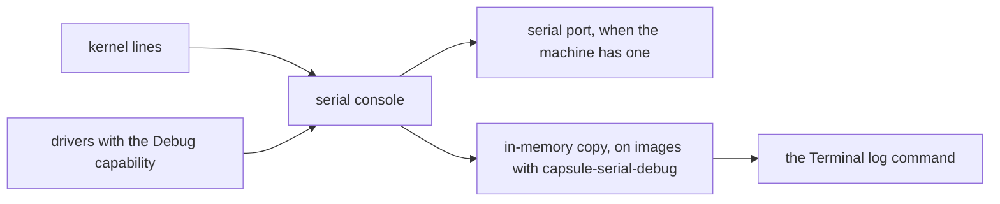

# Reporting a machine

Tell the NONOS team what NONOS 0.9.2 did on your machine, so it can enter the [support matrix](MATRIX.md) or get a driver fixed.

## What a useful report holds

- Which image you ran: the file name and where it came from, or, if you built it, the commit and the [build profile](../overview/glossary.md#build-profile) (Standard, Hardened, Air-Gapped, QEMU).
- The CPU family and the memory size, for example Intel Gemini Lake, 8 GB.
- The ids of the chips that matter: PCI vendor:device for controllers, USB vendor:product for adapters.
- The NONOS log lines for those devices.
- What you did, what you expected and what happened, and whether it happens on every boot.

A device that works is worth reporting too. The matrix lists real hardware only from reports.

## Read the log in the NONOS Terminal

You do not need a serial port. The kernel keeps what it writes to its [serial console](../overview/glossary.md#serial-console) in memory: the first 64 KiB of the boot for good, then the latest 64 KiB. The Terminal's `log` command reads it back.



Open the Terminal and type:

```text
log
log driver- exit
log touchpad i2chid
log hda audio
log rtl8821ce nvme
log warn error
```

Not tested in this release.

`log` alone shows the newest 200 lines. With words, it shows every line that names any of them, ignoring case. Like any command, its output can go to a file, as in `log hda > hda-log.txt`. That file lives in the [file store](../overview/glossary.md#file-store), in memory, and NONOS 0.9.2 cannot copy it to a USB stick. To take it off the machine, `push hda-log.txt host:port/path` sends it as an HTTP PUT to a server on your network that accepts uploads, and only when the default network is Direct. Otherwise copy the lines you need by hand.

The log is there only on images built with `capsule-serial-debug`: Standard, QEMU and [development images](../overview/glossary.md#development-image). A Hardened or Air-Gapped image keeps nothing, and `log` answers `log: no line matches`. On such an image the kernel's lines still reach a serial port, if the machine has one. They do not reach the screen: the kernel's on-screen boot log is off unless the kernel is built with `NONOS_FBCONSOLE=1`, which no build profile sets (see [Logging](../kernel/logging.md)). Without a serial port, describe what the screen and Settings showed instead.

## What the lines mean

| Search word | Example line | Written by |
|---|---|---|
| `driver-` | `[DRIVER-HDA] capsule spawned`, `[DRIVER-NVME] no controller present, not spawned` | the kernel, for each driver it starts or skips at boot |
| `exit` | `[EXIT] driver.<name> status 2: no device present, not started`, or status 6: `device present, bring-up failed and was given up` | the kernel, when a driver ends |
| `touchpad` | `[INFO] touchpad <id> on I2C bus <bus> addr <address> <speed> kHz, ...` | the kernel, from the ACPI tables |
| `acpi` | `[ACPI] power button: fixed feature, polled; a press goes to the desktop as the Power key` | the kernel |
| `hda`, `audio` | `[HDA] controller 8086:<id>`, `[HDA] no playable output: <reason>` | the sound driver and server |
| `i2chid` | `[i2chid] bind addr=<address> ...` | the touchpad driver |
| `rtl8821ce`, `nvme` | the Wi-Fi and NVMe drivers' own lines | those drivers |

The kernel writes the `[DRIVER-...]` lines when it starts a driver or decides not to, and the `[EXIT]` line when a driver ends with any status other than 0, in words for status 2 and 6 and as `ended with an error` for the rest. A driver ended by a signal gets no `[EXIT]` line; a fault has the trap handler's line already.

A driver writes lines of its own only when the kernel grants it the Debug [capability](../overview/glossary.md#capability). The sound, NVMe, RTL8821CE Wi-Fi and I2C-HID touchpad drivers get it, and so do the virtio disk, network and display drivers. The PS/2, I2C controller, xHCI, USB HID, USB storage, AHCI, Intel Wi-Fi and wired Ethernet drivers are started without it. For those drivers the kernel's `[DRIVER-...]` and `[EXIT]` lines are all the log has.

Three more Terminal commands help:

```text
version
capsules
display
```

Not tested in this release.

`version` names the release and who signed the Terminal. `capsules` lists every [capsule](../overview/glossary.md#capsule) running, with the capabilities the kernel granted it, so you can see which drivers are up. `display` prints the screen size.

## Read the ids on another operating system

Boot a Linux live system on the same machine and run:

```text
lspci -nn
lsusb
```

Not tested in this release.

`lspci -nn` prints each PCI function with its class code and its vendor:device pair in brackets. `lsusb` prints `ID` and the vendor:product pair for each USB device. The class code tells you which NONOS driver to look at; most drivers then match by vendor and device id, as the [support matrix](MATRIX.md) lists. A controller the firmware declares only in ACPI, such as an AMD I2C controller, does not appear in `lspci` at all.

| Class code | What it is | NONOS driver |
|---|---|---|
| 0403, 0401 | HD Audio controller | `capsule_driver_hda` |
| 0280 | Wi-Fi | `capsule_driver_rtl8821ce`, `capsule_driver_iwlwifi` |
| 0200 | Ethernet | the Ethernet drivers, matched by id |
| 0108 | NVMe | `capsule_driver_nvme` |
| 0106, 0104 | SATA, RAID | `capsule_driver_ahci` |
| 0805 | SD host; on the Intel ids the driver lists, the internal eMMC | `capsule_driver_ahci` |
| 0c03 | USB host | `capsule_driver_xhci`, for xHCI |
| 0c80, 1180 | Intel LPSS, where the I2C touchpad controller sits | `capsule_driver_i2c_pci` |
| 03xx | display | none on real hardware: the desktop uses the firmware framebuffer; `capsule_driver_virtio_gpu` in a virtual machine |

The [support matrix](MATRIX.md) lists each driver's ids. If a device you care about is not there, report it anyway: that is how a driver gets written.

## What not to include

- No Wi-Fi network names, passwords or keys. Remove any `log` line that shows one.
- No serial numbers. Leave out `lsusb -v` and any disk or device serial.
- No MAC addresses or IP addresses.
- No user names, file names or contents from your own files.
- No brand or model. The form's Machine field asks for a vendor and model, but NONOS lists machines by CPU family and chips only: put the CPU family and memory size there, and the ids under Device involved.

## Where to send it

Open an issue on GitHub at [NON-OS/microkernel](https://github.com/NON-OS/microkernel/issues/new/choose) and choose the form "Hardware or boot bug". Its fields map to what you collected:

| Form field | What to put there |
|---|---|
| Machine | CPU family and memory size, or the QEMU command line for a virtual machine |
| Architecture | x86_64, aarch64 or riscv64 |
| Build | the image file and where it came from, or the commit and profile |
| Serial log | the `log` lines, trimmed in the middle if long, keeping the start and the failure; with no log, what the screen showed |
| What you expected, and what happened instead | in your own words |
| Device involved | the PCI or USB id |

A security problem does not go in a public issue. See [Reporting a vulnerability](../security/reporting-a-vulnerability.md).

## Where this comes from

The source behind the facts above, at the commit in the footer.

- Read the log in the NONOS Terminal
  - The first 64 KiB kept, then the latest 64 KiB: `CAPACITY` in `src/sys/serial/tail.rs:27-32`.
  - `log` reads it back: `run` in `userland/capsule_terminal/src/command/builtin/log.rs:33-55`.
  - The newest 200 lines: `NEWEST` in `userland/capsule_terminal/src/command/builtin/log.rs:31`.
  - Lines that name any word, ignoring case: `contains` in `userland/capsule_terminal/src/command/builtin/log.rs:57-59`.
  - `push` sends an HTTP PUT, on Direct only: `run` in `userland/capsule_terminal/src/command/builtin/nox/push/run.rs:32-47`.
  - Hardened and Air-Gapped images keep nothing: `keep` in `src/sys/serial/tail.rs:49-54`.
  - The on-screen boot log is off unless built in: `FBCONSOLE` in `src/sys/boot_log/init.rs:22-27`.
- What the lines mean
  - The `[DRIVER-...]` lines: `present` in `src/userspace/init/spawn_plan/device_present.rs:29-35`.
  - The `[EXIT]` line: `words` in `src/process/exit/end_rule.rs:38-44`. No line after a signal: `told` in `src/process/exit/end_rule.rs:31-35`.
  - The Debug capability, for the sound driver: `serial_debug_cap` in `src/hardware/hda_capsule/spawn.rs:58`.
  - Started without it, for the PS/2 driver: `requested_caps` in `src/hardware/ps2_kbd_capsule/spawn.rs:51-57`.
  - The `version` command: `run` in `userland/capsule_terminal/src/command/builtin/version.rs:30-40`.
  - The `capsules` command: `run` in `userland/capsule_terminal/src/command/builtin/capsules.rs:34`.
  - The `display` command: `run` in `userland/capsule_terminal/src/command/builtin/display.rs:22-39`.
- Where to send it
  - The form's `name`, Hardware or boot bug: `.github/ISSUE_TEMPLATE/hardware-bug.yml:1`.

## See also

- [Support matrix](MATRIX.md)
- [Troubleshooting](../install/troubleshooting.md)
- [Terminal](../using/terminal.md)
- [Logging](../kernel/logging.md)
- [Drivers](../drivers/README.md)
- [Reporting a vulnerability](../security/reporting-a-vulnerability.md)
