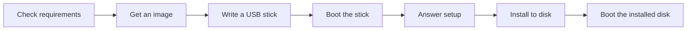

# Installing NONOS

This section takes a machine from nothing to NONOS running from a USB stick, and then installed on an internal disk, in the order you do it.

## The path



1. [Requirements](requirements.md). Check requirements first: an x86_64 processor with UEFI firmware, a USB stick of 2 GB or more, and an NVMe or SATA disk, or an Intel eMMC, if you want to install.
2. [Get an image](get-an-image.md). Build and seal `nonos.img` from this source tree.
3. [Write a USB stick](usb-stick.md). Write the image with `make usb` or `dd`, then compare the stick with the image.
4. [Boot modes](boot-modes.md). Boot the stick and pick an entry in the NONOS boot menu: Standard, Hardened, Safe Mode, Air-Gapped, Recovery, Install or Shut down.
5. [First boot](first-boot.md). Answer setup, thirteen steps. Amnesic keeps nothing. Install keeps your answers and opens the installer.
6. [Install to disk](install-to-disk.md). Choose a disk and type its confirmation word. The installer lays out the whole disk, writes the boot files, the store and the partition table, and reads back every sector it wrote. Then boot the installed disk.
7. [Update](update.md). Move an installed system to a newer release.
8. [Recovery](recovery.md). Boot with no network and no setup, to read an installed system's files or start over.
9. [Troubleshooting](troubleshooting.md). What each refusal and error message means, and how to collect logs.

## What to expect

- The stick boots [amnesic](../overview/glossary.md#amnesic): nothing reaches the machine's own disks unless you choose to install.
- Installing replaces everything on one whole disk, the one you name. NONOS does not share a disk with another system, and the installer is not a secure wipe.
- NONOS 0.9.2 has no in-place update. A newer release is installed over the old one, and that erases it.
- There is no login password. Setup asks for an account name, not a secret.
- The boot menu, setup and the installer are driven from the keyboard.

## Try it in a virtual machine first

With an image sealed, the build boots it under QEMU beside a blank 8 GiB NVMe disk, so you can run the installer without touching real hardware:

```
make boot-install
make boot-installed
```

Not tested in this release.

`make boot-install` boots the sealed image as every `make boot` does: its ESP as a FAT drive and a virtio data disk made from the image, with a software TPM. It adds the blank disk as NVMe. `make boot-installed` boots the disk the installer wrote, alone, which shows the machine starts from what was written (`Makefile`, `tools/nonos_qemu/machine.py`, `tools/nonos_qemu/disk.py`).
