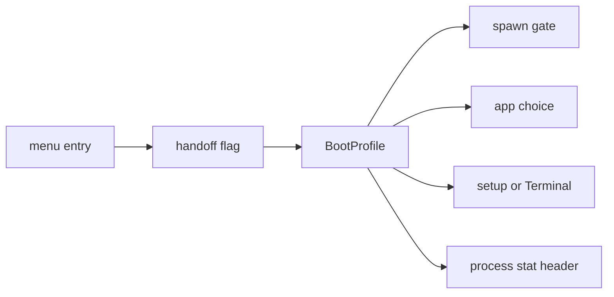

# Boot modes

Pick an entry in the NONOS boot menu: what each of its seven entries changes, and how the kernel learns which one you chose.

## The menu

1. Start the machine from the stick or from an installed disk. The menu opens with a countdown of 10 seconds on the default entry.
2. Choose an entry with Up and Down, or press its number, `1` to `7`.
3. Press Enter.

The loader draws the menu on every boot, from the stick and from an installed disk alike, whenever the firmware gives it a graphics display. Without a display it boots Standard.

The entries, in order:

| Key | Entry | What the menu says about it |
|---|---|---|
| 1 | Standard | Boots when the kernel is signed, attested and current. |
| 2 | Hardened | Standard, and refuses to boot without Secure Boot and a TPM. |
| 3 | Safe Mode | No network, no audio, no optional apps. |
| 4 | Air-Gapped | No network driver or service starts. |
| 5 | Recovery | A terminal and files. No network, no setup. |
| 6 | `Install NØNOS` | Writes to the disk you choose, after you confirm. |
| 7 | Shut down | Power off. |

The default entry is Standard, or Hardened on an image whose build floor is Hardened. The countdown runs on it, and the foot of the menu shows it, for example `STANDARD IN 10 S`. Any key stops the countdown, and the foot then reads `TIMER HELD`.

### Keys

| Key | What it does |
|---|---|
| Up and Down, or `w`, `s`, `k`, `j` | move the selection, wrapping at either end |
| Home or Page Up | the first entry |
| End or Page Down | the last entry |
| `1` to `7` | jump to that entry |
| Enter | start the selected entry |
| Escape, or any other key | hold the countdown |

### What the menu tells you before you choose

Above the list the loader shows four facts about this machine: `SECURE BOOT` on or off, `TPM 2.0` measuring or not found, `ROLLBACK` with a TPM counter or none, and the `BUILD FLOOR`.

Under the selected entry it shows one sentence, a line naming the checks the loader makes for that entry, and a verdict: `READY ON THIS MACHINE`, or `REFUSED HERE: NO` followed by what is missing. The names it can list are crypto self-test, signing keys, hardware RNG, Secure Boot, PK, db and TPM 2.0. The verdict names what the loader's own checks will refuse, and decides nothing itself.

## What each entry changes

| Entry | What the loader requires | What the kernel starts | First-boot setup |
|---|---|---|---|
| Standard | a signed kernel (Ed25519 and ML-DSA-65), its STARK attestation, the rollback check, a hardware RNG | everything the image carries | runs, unless an earlier boot kept its answers |
| Hardened | Standard, plus Secure Boot with PK and db, and a TPM 2.0 | the same as Standard | the same as Standard |
| Safe Mode | the same as Standard | no network driver or service, no audio, no optional app | the same as Standard |
| Air-Gapped | Standard, plus a TPM whose rollback floor it can read | no network driver or service; Browser and Marketplace stay off | the same as Standard |
| Recovery | the same as Standard | no network; a Terminal opens, with Files and the Editor | skipped |
| `Install NØNOS` | the same as Standard, raised to the build floor | the same as Standard, then the installer | runs, starting on Install; when an earlier boot kept its answers, the installer opens at once |
| Shut down | nothing | nothing: the machine powers off | does not run |

On the loader's side, every entry that boots except Hardened shows the same checks line, `ED25519 · ML-DSA-65 · STARK · ROLLBACK · RNG`. Hardened shows `STANDARD + SECURE BOOT · PK · DB · TPM 2.0`. The menu can raise the image's build floor and never lower it, so on a `hardened` or `airgapped` image every entry needs [Secure Boot](../overview/glossary.md#secure-boot) and a [TPM](../overview/glossary.md#tpm). These lines say what each entry asks for. The signature, Secure Boot and RNG checks themselves run in the loader's verification code, which these pages do not describe; see [Boot chain and signatures](../security/boot-chain-and-signatures.md) for what is known of them.

Hardened and Air-Gapped are the two modes that need a TPM, because it holds the [rollback floor](../overview/glossary.md#rollback-floor). The menu does not list the TPM under Air-Gapped, but the loader stops an Air-Gapped boot that cannot read the floor, with the reason `Air-Gapped needs a TPM: its rollback floor keeps an older signed kernel from booting`. On every entry, a TPM floor above the kernel's signed rollback index stops the boot.

On the kernel's side, Hardened changes nothing: the kernel treats it as Standard for the network and the apps. The other modes change what starts:

- On Safe Mode, Air-Gapped and Recovery boots the [spawn gate](../overview/glossary.md#spawn-gate) refuses every network driver, every `net.` service and the model fetcher. Safe Mode also refuses `driver.hda0`, `audio.server`, `app.snake` and `app.hello`.
- On those three boots every program that does start loses the Network [capability](../overview/glossary.md#capability), so none can bring a network up later.
- Each refusal goes to the kernel log as `[PROFILE] <mode>: not started: <name>`.
- Init keeps apps off by mode: every optional app on Safe Mode, the Browser and the Marketplace on Air-Gapped, and everything but Files and the Editor on Recovery, beside the Terminal and Settings every boot has.
- Recovery skips first-boot setup and opens a Terminal once the desktop is up.

`Install NØNOS` boots the same verified kernel as Standard and asks it to install. The loader sets [handoff](../overview/glossary.md#handoff) bit 11, the install request, and no mode bit, since the entry resolves to Standard. Setup then opens with Install chosen on its Mode step, and the installer takes the whole screen when setup ends. See [Install to disk](install-to-disk.md).

## How the kernel learns the mode

The chosen entry travels to the kernel as one bit of the handoff flags: bit 12 for Hardened, 13 for Safe Mode, 14 for Air-Gapped and 15 for Recovery, and none for Standard or Install. The kernel reads them into one `BootProfile`, checking Recovery first, then Safe Mode, Air-Gapped and Hardened, and a kernel started with no handoff runs Standard.

The spawn gate, the app choice and the setup plan above all ask that profile. Programs read the mode from the process stat header, bits `BOOT_PROFILE_HARDENED` to `BOOT_PROFILE_RECOVERY`. The Terminal's splash shows it, for example `NONOS, Recovery boot: no network`.

## Development boots

The menu has no development entry, on purpose. A loader built with the development [policy](../overview/glossary.md#loader-policy), which only the `dev` profile and the development twins use, looks for F12 three times, 50 ms apart, as it starts. With F12 held and Secure Boot off it skips the menu and boots in Development mode, whose description reads `Unsigned kernel allowed; the kernel's STARK is still required`. With Secure Boot on it prints `[SECURITY] F12 dev mode blocked: Secure Boot is enabled` and shows the menu. A Development boot also takes a kernel whose rollback index is below the TPM floor. A `--release` seal refuses a profile that uses the development loader.

## Where this comes from

- The menu
  - No display boots Standard: `MenuAction::Timeout`, `nonos-bootloader/src/bootmenu/run.rs:35-38`, `nonos-bootloader/src/entry/action.rs:28`.
  - The entries, in order: `ENTRIES`, `nonos-bootloader/src/bootmenu/entries.rs:33-56`.
  - The default entry: `default_index`, `nonos-bootloader/src/bootmenu/keys.rs:42-47`.
  - The countdown: `TIMEOUT_S`, `nonos-bootloader/src/bootmenu/run.rs:31`.
  - The keys: `special` and `printable`, `nonos-bootloader/src/bootmenu/input.rs:36-55`, and `apply`, `nonos-bootloader/src/bootmenu/keys.rs:23-35`.
  - The four machine facts: `secure_boot_enabled` and `measured_boot_active`, `nonos-bootloader/src/bootmenu/platform.rs:31-48`.
  - What the verdict can name: `missing`, `nonos-bootloader/src/bootmenu/ready.rs:51-65`.
- What each entry changes
  - The checks lines: `STD`, `nonos-bootloader/src/bootmenu/entries.rs:59`, and `SecurityMode::Hardened`, `nonos-bootloader/src/bootmenu/entries.rs:40-45`.
  - The build floor is raised, never lowered: `policy_of`, `nonos-bootloader/src/bootmenu/ready.rs:40-49`.
  - The loader's column of the table rests on the checks lines and on `missing`, which mirrors the loader's policy check, `nonos-bootloader/src/bootmenu/ready.rs:51-65`. The signature, Secure Boot and RNG checks themselves run in the loader's verification module, which these pages do not cover; the TPM and rollback rules are read from the code.
  - The modes that need a TPM: `requires_tpm`, `nonos-bootloader/src/menu/types/mode.rs:56-59`.
  - Air-Gapped without a readable floor: `Floor::Refuse`, `nonos-bootloader/src/boot/crypto/rollback/floor.rs:41-51`.
  - A floor above the kernel's index: `Floor::Held`, `nonos-bootloader/src/boot/crypto/rollback/floor.rs:30-40`.
  - Hardened is Standard to the kernel: `network` and `minimal`, `src/boot/handoff/api/profile.rs:44-52`.
  - What the spawn gate refuses: `NETWORK_DRIVERS` and `NOT_SAFE`, `src/kernel_core/process_spawn/capsule_spawn/runner/profile_refuse.rs:21-40`.
  - The Network capability dropped: `caps`, `src/kernel_core/process_spawn/capsule_spawn/runner/profile_gate.rs:48-55`.
  - The `[PROFILE]` log line: `check`, `src/kernel_core/process_spawn/capsule_spawn/runner/profile_gate.rs:31-46`.
  - Apps kept off by mode: `withheld`, `src/userspace/init/app_choice/profile.rs:37-44`.
  - Recovery skips setup and opens a Terminal: `skips_setup`, `src/userspace/init/spawn_plan/wizard_plan.rs:27-48`.
  - Install boots the Standard kernel: `BootIntent`, `nonos-bootloader/src/menu/types/intent.rs:19-31`, and `resolve_action`, `nonos-bootloader/src/entry/action.rs:22-45`.
  - Bit 11: `INSTALL_REQUESTED` and `handoff_flag`, `nonos-bootloader/src/handoff/types/install.rs:44-48`.
  - Setup starts on Install: `mode_sel`, `userland/capsule_setup_wizard/src/state.rs:70`.
- How the kernel learns the mode
  - The mode bits: `PROFILE_RECOVERY`, `src/boot/handoff/types/constants.rs:51-54`.
  - The reading order and the no-handoff default: `boot_profile`, `src/boot/handoff/api/profile.rs:60-75`.
  - The process stat header: `BOOT_PROFILE_HARDENED`, `src/syscall/microkernel/procstat_header.rs:66-69`.
  - The Terminal's splash: `os_line`, `userland/capsule_terminal/src/paint/fetch_boot.rs:17-35`.
- Development boots
  - The development loader on the `dev` profile and its twins: `loader`, `tools/nix/config.nix:102-107`, `tools/nix/config.nix:142`.
  - Looking for F12: `check_dev_key_held`, `nonos-bootloader/src/menu/dev_check.rs:20-41`.
  - The F12 override and its description: `dev_override`, `nonos-bootloader/src/entry/dev.rs:22-37`, and `description`, `nonos-bootloader/src/menu/types/mode.rs:41-44`.
  - A Development boot past the floor: `Floor::Held`, `nonos-bootloader/src/boot/crypto/rollback/floor.rs:30-40`.
  - The release seal: `args.release`, `tools/nonos_seal/__main__.py:119-120`.

## The loader's entry handlers

### `resolve_action` (`nonos-bootloader/src/entry/action.rs`)

On an Install action the mode resolves to Standard, never less: enforcement raises it to the build floor, and the kernel is verified and attested exactly as a Standard boot.

### `install_source` (`nonos-bootloader/src/entry/install_source.rs`)

The two regions the installer writes to a disk, and the partition the loader came from, recorded for the kernel.

The loader is recorded as the file the firmware read, not the image it built from that file: what sits at LoadedImage's base is the PE after section placement and relocation, a megabyte larger than BOOTX64.EFI and not a bootable file. So the file is read again here, from the volume this loader came from, into loader memory the kernel never reclaims. The kernel image is the buffer that was read and verified above. A loader whose file cannot be found records a zero region, and the installer then says so instead of writing a disk with no bootloader on it.

`boot_media` is leaked into loader memory like the loader file, so it outlives boot services; a zero region when the firmware named no partition.

`boot_disk` reads the package store here for a kernel whose own disk drivers may not reach the disk it lies on, and from the same disk the live plan's model files; a zero region for either the disk does not carry.

### `secure_boot_enabled` (`nonos-bootloader/src/entry/dev.rs`)

The SecureBoot global variable is a single byte; uefi 0.23 writes it into a caller-provided buffer and returns the filled slice with its attributes.

## See also

- [First boot](first-boot.md)
- [Install to disk](install-to-disk.md)
- [Recovery](recovery.md)
- [Troubleshooting](troubleshooting.md)
- [Boot chain and signatures](../security/boot-chain-and-signatures.md)
- [Rollback protection](../security/rollback-protection.md)
- [Boot handoff](../kernel/boot-handoff.md)
