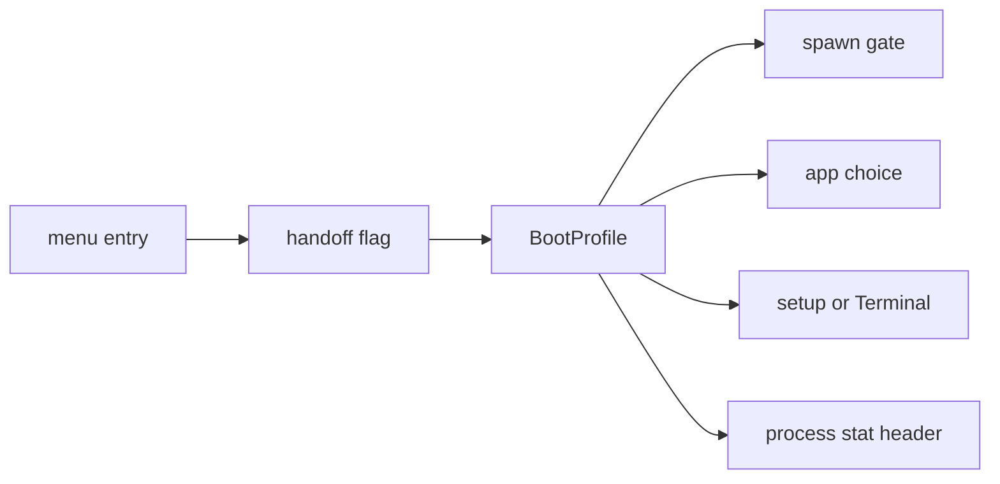

# Boot modes

How to pick an entry in the NONOS boot menu, what each of its seven entries changes, and how the kernel learns which one you chose.

## The menu

The loader draws the menu on every boot, from the stick and from an installed disk alike, whenever the firmware gives it a graphics display. Without a display it returns `MenuAction::Timeout`, which boots as `Standard` (`nonos-bootloader/src/bootmenu/run.rs:35-38`, `nonos-bootloader/src/entry/action.rs:28`).

The entries, in order, are the `ENTRIES` table (`nonos-bootloader/src/bootmenu/entries.rs:33-56`):

| Key | Entry | What the menu says about it |
|---|---|---|
| 1 | Standard | Boots when the kernel is signed, attested and current. |
| 2 | Hardened | Standard, and refuses to boot without Secure Boot and a TPM. |
| 3 | Safe Mode | No network, no audio, no optional apps. |
| 4 | Air-Gapped | No network driver or service starts. |
| 5 | Recovery | A terminal and files. No network, no setup. |
| 6 | `Install NØNOS` | Writes to the disk you choose, after you confirm. |
| 7 | Shut down | Power off. |

The default entry is `Standard`, or `Hardened` on an image whose build floor is Hardened (`default_index` in `nonos-bootloader/src/bootmenu/keys.rs:42-47`). A countdown of 10 seconds runs on it (`TIMEOUT_S` in `nonos-bootloader/src/bootmenu/run.rs:31`), and the foot of the menu shows it, for example `STANDARD IN 10 S`. Any key stops the countdown, and the foot then reads `TIMER HELD`.

### Keys

| Key | What it does |
|---|---|
| Up and Down, or `w`, `s`, `k`, `j` | move the selection, wrapping at either end |
| Home or Page Up | the first entry |
| End or Page Down | the last entry |
| `1` to `7` | jump to that entry |
| Enter | start the selected entry |
| Escape, or any other key | hold the countdown |

The keys are `special` and `printable` in `nonos-bootloader/src/bootmenu/input.rs:36-55`, and `apply` in `nonos-bootloader/src/bootmenu/keys.rs:23-35`.

### What the menu tells you before you choose

Above the list the loader shows four facts about this machine: `SECURE BOOT` on or off, `TPM 2.0` measuring or not found, `ROLLBACK` with a TPM counter or none, and the `BUILD FLOOR` (`secure_boot_enabled` and `measured_boot_active` in `nonos-bootloader/src/bootmenu/platform.rs:31-48`).

Under the selected entry it shows one sentence, a line naming the checks the loader makes for that entry, and a verdict: `READY ON THIS MACHINE`, or `REFUSED HERE: NO` followed by what is missing. The names it can list are crypto self-test, signing keys, hardware RNG, Secure Boot, PK, db and TPM 2.0 (`missing` in `nonos-bootloader/src/bootmenu/ready.rs:51-65`). The verdict names what the loader's own checks will refuse, and decides nothing itself.

## What each entry changes

| Entry | What the loader requires | What the kernel starts | First-boot setup |
|---|---|---|---|
| Standard | a signed kernel (Ed25519 and ML-DSA-65), its STARK attestation, the rollback check, a hardware RNG | everything the image carries | runs, unless an earlier boot kept its answers |
| Hardened | Standard, plus Secure Boot with PK and db, and a TPM 2.0 | the same as Standard | the same as Standard |
| Safe Mode | the same as Standard | no network driver or service, no audio, no optional app | the same as Standard |
| Air-Gapped | Standard, plus a TPM whose rollback floor it can read | no network driver or service; Browser and Marketplace stay off | the same as Standard |
| Recovery | the same as Standard | no network; a Terminal opens, with Files and the Editor | skipped |
| `Install NØNOS` | the same as Standard, raised to the build floor | the same as Standard, then the installer | runs, starting on Install; when an earlier boot kept its answers, the installer opens at once |
| Shut down | nothing | nothing: the machine powers off | |

On the loader's side, every entry that boots except Hardened shows the same checks line, `ED25519 · ML-DSA-65 · STARK · ROLLBACK · RNG` (`STD` in `nonos-bootloader/src/bootmenu/entries.rs:59`). Hardened shows `STANDARD + SECURE BOOT · PK · DB · TPM 2.0` (`SecurityMode::Hardened` in `nonos-bootloader/src/bootmenu/entries.rs:40-45`). The menu can raise the image's build floor and never lower it, so on a `hardened` or `airgapped` image every entry needs Secure Boot and a [TPM](../overview/glossary.md#tpm) (`policy_of` in `nonos-bootloader/src/bootmenu/ready.rs:40-49`).

Hardened and Air-Gapped are the two modes that need a TPM, because it holds the [rollback floor](../overview/glossary.md#rollback-floor) (`requires_tpm` in `nonos-bootloader/src/menu/types/mode.rs:56-59`). The menu does not list the TPM under Air-Gapped, but the loader stops an Air-Gapped boot that cannot read the floor, with the reason `Air-Gapped needs a TPM: its rollback floor keeps an older signed kernel from booting` (`Floor::Refuse` in `nonos-bootloader/src/boot/crypto/rollback/floor.rs:41-51`). On every entry, a TPM floor above the kernel's signed rollback index stops the boot (`Floor::Held` in `nonos-bootloader/src/boot/crypto/rollback/floor.rs:30-40`).

On the kernel's side, Hardened changes nothing: the kernel treats it as Standard for the network and the apps (`network` and `minimal` in `src/boot/handoff/api/profile.rs:44-52`). The other modes change what starts:

- On Safe Mode, Air-Gapped and Recovery boots the spawn gate refuses every network driver, every `net.` service and the model fetcher; Safe Mode also refuses `driver.hda0`, `audio.server`, `app.snake` and `app.hello` (`NETWORK_DRIVERS` and `NOT_SAFE` in `src/kernel_core/process_spawn/capsule_spawn/runner/profile_refuse.rs:21-40`).
- On those three boots every program that does start loses the Network [capability](../overview/glossary.md#capability), so none can bring a network up later (`caps` in `src/kernel_core/process_spawn/capsule_spawn/runner/profile_gate.rs:48-55`).
- Each refusal goes to the kernel log as `[PROFILE] <mode>: not started: <name>` (`check` in `src/kernel_core/process_spawn/capsule_spawn/runner/profile_gate.rs:31-46`).
- Init keeps apps off by mode: every optional app on Safe Mode, the Browser and the Marketplace on Air-Gapped, and everything but Files and the Editor on Recovery, beside the Terminal and Settings every boot has (`withheld` in `src/userspace/init/app_choice/profile.rs:37-44`).
- Recovery skips first-boot setup and opens a Terminal once the desktop is up (`skips_setup` in `src/userspace/init/spawn_plan/wizard_plan.rs:27-48`).

`Install NØNOS` boots the same verified kernel as Standard and asks it to install (`BootIntent` in `nonos-bootloader/src/menu/types/intent.rs:19-31`). The loader sets handoff bit 11, `INSTALL_REQUESTED`, beside the boot mode's bit (`handoff_flag` in `nonos-bootloader/src/handoff/types/install.rs:44-48`). Setup then opens with Install chosen on its Mode step (`mode_sel` in `userland/capsule_setup_wizard/src/state.rs:70`), and the installer takes the whole screen when setup ends. See [Install to disk](install-to-disk.md).

## How the kernel learns the mode

The chosen entry travels to the kernel as one bit of the [handoff](../overview/glossary.md#handoff) flags: bit 12 for Hardened, 13 for Safe Mode, 14 for Air-Gapped and 15 for Recovery, and none for Standard or Install (`PROFILE_RECOVERY` in `src/boot/handoff/types/constants.rs:51-54`). The kernel reads them into a `BootProfile`, checking Recovery first, then Safe Mode, Air-Gapped and Hardened, and a kernel started with no handoff runs Standard (`boot_profile` in `src/boot/handoff/api/profile.rs:60-75`).

The spawn gate, the app choice and the setup plan above all ask `boot_profile`. Programs read the mode from the process stat header, bits `BOOT_PROFILE_HARDENED` to `BOOT_PROFILE_RECOVERY` (`src/syscall/microkernel/procstat_header.rs:66-69`). The Terminal's splash shows it, for example `NONOS, Recovery boot: no network` (`os_line` in `userland/capsule_terminal/src/paint/fetch_boot.rs:17-35`).

## Development boots

The menu has no development entry, on purpose. A loader built with the development policy, which only the `dev` profile and the development twins use (`tools/nix/config.nix`), looks for F12 three times, 50 ms apart, as it starts (`check_dev_key_held` in `nonos-bootloader/src/menu/dev_check.rs:20-41`). With F12 held and Secure Boot off it skips the menu and boots `SecurityMode::Development`, whose description reads `Unsigned kernel allowed; the kernel's STARK is still required` (`dev_override` in `nonos-bootloader/src/entry/dev.rs:22-37`, `description` in `nonos-bootloader/src/menu/types/mode.rs:41-44`). With Secure Boot on it prints `[SECURITY] F12 dev mode blocked: Secure Boot is enabled` and shows the menu. A `--release` seal refuses a profile that uses the development loader (`tools/nonos_seal/__main__.py`).

## See also

- [First boot](first-boot.md)
- [Install to disk](install-to-disk.md)
- [Recovery](recovery.md)
- [Troubleshooting](troubleshooting.md)
- [Boot chain and signatures](../security/boot-chain-and-signatures.md)
- [Rollback protection](../security/rollback-protection.md)
- [Boot handoff](../kernel/boot-handoff.md)
