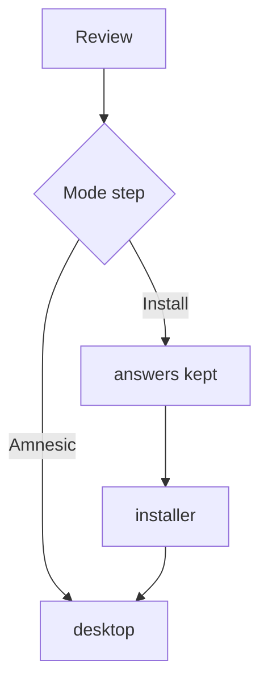

# First boot

Answer the thirteen steps of first-boot setup, in order: what each answer changes, and where it is kept.

## What starts before setup

After the boot menu, the loader checks the kernel, shows its proofs panel for a moment and hands over. The kernel starts the compositor and the input router, and setup runs on them before any desktop app.

Setup does not run:

- on a Recovery boot, which goes straight to the desktop with a Terminal open;
- when an earlier boot kept its answers: setup restores them and exits without drawing, and the kernel log says `[SETUP] kept from an earlier boot; starting the desktop`, or `opening the installer` on a boot from the menu's `Install NØNOS` entry;
- on an image built with `install = false` in `nonos.toml`, which has no setup and no installer.

There is no login and no password. The `login` service starts with nothing on screen, and no program in this release asks it to start or end a session.

## Keys in setup

| Key | What it does |
|---|---|
| Enter | go to the next step |
| Escape | go back to the step before |
| Up and Down, or `k` and `j` | move in a list |
| Home and End | jump to either end of a list |
| a digit | pick that row of a list |
| Ctrl+Alt+Space | cycle the keyboard layout, at any time, in the PS/2 and the USB keyboard drivers alike |

## The steps

1. Keyboard. Six layouts: US QWERTY, UK, German, French AZERTY, Italian and Spanish, the ones the keyboard drivers have tables for. The choice takes effect when you press Enter. See [Keyboard layouts](../using/keyboard-layouts.md).
2. Your name. The account name the Terminal shows as name@host: lowercase letters, digits, `-` and `_`, starting with a letter, 1 to 32 characters. Left empty, it is `nonos`. A refused key is named on the screen.
3. Time zone. Whole hours from UTC, from UTC-12 to UTC+14, for the menu bar clock. `j` or Down adds an hour, and `k` or Up takes one off.
4. Mode. Where this machine keeps what you do:
   - `Amnesic (default)`: RAM only. Nothing is written to any disk, and setup runs again on the next boot.
   - `USB live (unavailable)`: cannot be chosen. It would keep an encrypted volume on the boot stick, and its screen says why it cannot: NONOS keeps state only on an NVMe, SATA or virtio disk today, and has no passphrase-keyed volume. The answers Install keeps on the stick, below, are plain records in its store, not that volume.
   - `Install to this computer`: keeps your answers in the [package store](../overview/glossary.md#store) of the disk this boot came from, so setup does not run again, then opens the installer when setup ends.

   After the boot menu's `Install NØNOS` entry, this step starts on Install.
5. Network. The first row is `No network (default, private)`. Under it come up to six Wi-Fi networks the card has heard, strongest first. The list refreshes every 2 seconds, and `s` looks again.
   - Enter on an open network sends the join at once, but the join fails: the drivers' join engine refuses a network with no RSN element.
   - A secured network asks for its passphrase: 8 to 63 characters, or a 64-digit hex key, shown as stars. Tab shows it, Escape clears it, Enter joins. A join takes up to 30 seconds. A failed join says why and wipes what you typed.
   - With the Install mode chosen, `r` remembers the joined network, sealed with a key the [TPM](../overview/glossary.md#tpm) derives. It is kept in the stick's store, and the installer does not carry it to the disk it writes, so join again from Settings once the installed system boots.
   - The step's own note reads `WPA3 (SAE) and enterprise networks cannot be joined.` Its WPA3 half is older than the join code, which joins WPA3-Personal networks.
   - A wired card is used as soon as a cable is plugged in, without asking. Read from the code, only virtio-net, in a virtual machine, gets an address that way in this release: the e1000, RTL8139 and RTL8169 drivers carry [a receive fault](../drivers/ethernet/README.md#the-receive-fault).

   On Safe Mode and Air-Gapped boots the step says `This boot runs no network: the boot menu chose it.` See [Wi-Fi and networking](../using/wifi-and-networking.md).
6. Network route. Which network the browser and the Terminal use. The screen describes Qwen downloads under each choice, but they do not follow it: downloads for an install, a Qwen model or a Linux package go over the [Anyone network](../overview/glossary.md#anyone-network) whatever this step says, unless you ask for one download to go direct.
   - `Nym mixnet (default)`: hides who you talk to, even from someone watching the whole internet. Pages and downloads are slow.
   - `Anyone network`: onion routing through three relays, much faster than the mixnet. Someone watching both ends at once could match the traffic.
   - `Direct`: no anonymity network. Every site and your own network see this machine's address. The wallet still reads the chain over [Nym](../overview/glossary.md#nym-mixnet) or Anyone.

   A route that fails never falls back to another, and Settings changes the choice later. See [Privacy networks](../using/privacy-network.md).
7. Privacy. Three statements, with no switch:
   - The e1000, RTL8169 and RTL8821CE drivers send from a random MAC address drawn at each start. So do the RTL8139, virtio-net and iwlwifi drivers, which the screen does not name.
   - Shutdown and reboot wipe process memory, kernel stacks and held keys. The [data volume](../overview/glossary.md#data-volume) key and a few other kernel statics stay, and in this release only the installer's restart runs that wipe ([Device secrets and keys](../security/device-secrets-and-keys.md#wiped-at-shutdown-and-reboot)).
   - NONOS has no telemetry.
8. Appearance. Which wallpapers this machine keeps, and which one is the desktop's. Space keeps or drops the highlighted one, `a` keeps them all, `n` keeps only the desktop's, and Enter makes the highlighted one the desktop's and goes on.
9. Qwen model. Which Qwen tier the Terminal's `qwen` runs when you name none. The list starts with `None for now`, then the tiers that fit this machine's memory, smallest first. The step starts on Qwen3 0.6B, the tier the stick carries, when it fits, and otherwise on the largest tier that fits. On an amnesic stick the model is held in memory and is gone at power off. With no NONOS disk at all, no tier is offered. See [Local AI](../using/local-ai.md).
10. Apps. Each optional app is on until you turn it off with Space. An app turned off is not started, and its dock icon does not open it. With Linux and Qwen off, `qwen` and Linux packages do not run. Required apps are listed without a switch. On a Safe Mode boot no optional app starts, whatever this step says.
11. Installed software. `Only NONOS software`, the default, or `Also software installed here`, which lets programs from the Marketplace run. The screen notes that this machine proves them.
12. Computer name. The host in name@host: lowercase letters, digits and `-`, starting with a letter and ending with a letter or digit, up to 63 characters. Left empty, it is `nonos`.
13. Review. Your answers in a table, and lines that say what is kept. Enter applies them and starts the desktop, or opens the installer on Install. If the settings service refused an answer, the screen names it once, after `Not applied to this session:`, and the next Enter goes on without it.

## What is kept, and where

Every answer is handed to the settings service, which applies it to this session in either mode. What reaches a disk depends on the Mode step:

| What | Path | When it is written |
|---|---|---|
| The answers: keyboard, time zone, wallpaper and the wallpapers kept, name, Qwen tier, apps turned off, computer name, network route | `/nonos/setup/answers` | Install: written to the store. Amnesic: held in memory for the installer, gone at shutdown |
| The marker that setup is done | `/nonos/setup/done` | Install only, after the answers |
| Consent to run installed software | `/nonos/consent/local.token` | Install, with `Also software installed here` chosen |
| A remembered Wi-Fi network | `/nonos/wifi/saved` | Install, with `r` checked and a TPM present |

- The answers go first and the marker last, so a save cut short restores nothing and setup simply runs again.
- The answers and the marker are not encrypted. The store is written to the disk as it is.
- The Wi-Fi passphrase is never written in the clear. It is shown as stars, never sent to the console, and wiped from memory on Escape, after a failed join, and once review has used it.
- Until you install, the store that keeps your answers is the stick's. The installer carries the answers to the disk it writes, so setup does not run there either.
- To run setup again on a stick that kept answers, write the image to it again: a freshly written store holds no answers.

## When setup cannot start

Setup first waits up to 30 seconds for this boot's store to load. If setup cannot draw at all, it writes `[SETUP] not started:` and the reason to the kernel log, and the desktop starts without it.

## After setup

Amnesic starts the desktop. Install keeps the answers, then hands the whole screen to the installer with no desktop behind it. If you leave the installer without installing, the desktop starts.

## Where this comes from

- What starts before setup
  - The proofs panel before the handoff: `show_proofs`, `nonos-bootloader/src/display/boot/proofs/show.rs:32-47`.
  - Setup before any desktop app, and none on Recovery: `spawn_desktop` and `skips_setup`, `src/userspace/init/spawn_plan/wizard_plan.rs:27-38`.
  - Kept answers skip setup: `already_done` and `install_boot`, `userland/capsule_setup_wizard/src/main.rs:29-42`.
  - No setup with `install = false`: `installFeatures`, `tools/nix/config.nix:143`.
  - The `login` service starts clear: `paint_clear`, `userland/capsule_login/src/setup/run.rs:37-39`.
- Keys in setup
  - Enter and Escape: `default_key`, `userland/capsule_setup_wizard/src/server/step.rs:23-28`.
  - Moving in a list: `list_nav`, `userland/capsule_setup_wizard/src/server/step.rs:31-58`.
  - Ctrl+Alt+Space: `cycle`, `userland/capsule_driver_ps2_input/src/poll/absorb.rs:66-74`, `userland/capsule_driver_usb_hid/src/hid/keyboard/push_key.rs:26-29`.
- The steps
  - The step names: `STEP_LABELS`, `userland/capsule_setup_wizard/src/render/theme.rs:29`; each screen is a file under `userland/capsule_setup_wizard/src/render/screens/`.
  - Keyboard layouts: `POLICY_LAYOUTS`, `userland/nonos_keymap/src/policy.rs:28`.
  - Time zone keys: `on_key`, `userland/capsule_setup_wizard/src/render/screens/timezone.rs:44-50`.
  - The three modes: `MODES`, `userland/capsule_setup_wizard/src/render/screens/mode.rs:18-19`, and the start on Install, `mode_sel`, `userland/capsule_setup_wizard/src/state.rs:70`.
  - The network list, every 2 seconds, strongest first: `POLL_MS` and `refresh`, `userland/capsule_setup_wizard/src/network/poll.rs:13-55`.
  - Open networks refused: `OpenNetwork`, `userland/nonos_wifi_core/src/mlme/beacon.rs:50-51`.
  - The remembered network stays behind: `gather`, `userland/nonos_disk/src/carry/gather.rs:35-90`.
  - Downloads over Anyone: `for_installs`, `userland/nonos_route_link/src/chosen.rs:50-52`.
  - The privacy statements: `FACTS`, `userland/capsule_setup_wizard/src/render/screens/privacy.rs:10-18`.
  - Random MAC addresses: `draw`, `userland/capsule_driver_e1000/src/init/station_address.rs:24-26`; `program`, `userland/capsule_driver_rtl8169/src/init/mac.rs:27-29`; `draw`, `userland/capsule_driver_rtl8821ce/src/station.rs:24-26`; for the drivers the screen does not name, `apply`, `userland/nonos_mac/src/local.rs:53`.
  - The Qwen step's starting row: `default_row`, `userland/capsule_setup_wizard/src/qwen/default.rs:78-86`, and `STICK_TIER`, `userland/capsule_model_fetch/src/default_tier.rs:84-88`.
  - Installed software: `MODES`, `userland/capsule_setup_wizard/src/render/screens/local_software.rs:24-30`.
  - A refused answer named once on Review: `unsaved_told`, `userland/capsule_setup_wizard/src/render/screens/review.rs:69-80`.
- What is kept, and where
  - Applied to this session: `commit`, `userland/capsule_setup_wizard/src/render/screens/commit.rs:17`.
  - The paths: `ANSWERS_PATH` and `DONE_PATH`, `userland/policy_proto/src/setup_record/layout.rs:33-34`; `TOKEN`, `userland/capsule_setup_wizard/src/consent/restore.rs:24`; `PATH`, `userland/nonos_wifi_client/src/saved/file.rs:21`.
  - Answers first, marker last: `save`, `userland/capsule_setup_wizard/src/keep/save.rs:30-37`.
  - The store written as it is: `block_device::write`, `src/syscall/microkernel/store_write.rs:55`.
- When setup cannot start
  - The 30-second wait: `STORE_WAIT_MS`, `userland/capsule_setup_wizard/src/keep/skip.rs:29`.
  - The `[SETUP] not started:` line: `say`, `userland/capsule_setup_wizard/src/main.rs:51-53`.
- After setup
  - Install hands the screen to the installer: `Ended::Installer` and `hand_over`, `src/userspace/init/supervisor/after_setup.rs:37-44`.
  - Leaving the installer starts the desktop: `spawn_post_wizard`, `src/userspace/init/supervisor/after_install.rs:41-46`.

## See also

- [Boot modes](boot-modes.md)
- [Install to disk](install-to-disk.md)
- [The desktop](../using/desktop.md)
- [Settings](../using/settings.md)
- [Keyboard layouts](../using/keyboard-layouts.md)
