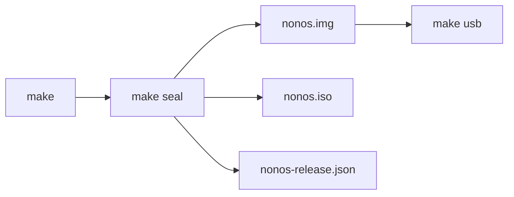

# Get an image

Where a NONOS image comes from, and how to build, seal and check one.

## Released images

This repository holds no image, names no download location and publishes no checksum file for images. NONOS 0.9.2 is installed from an image built from this source tree, as below.

If someone hands you an image, ask for the `nonos-release.json` the [seal](../overview/glossary.md#seal) wrote beside it, which records the sha256 of every file it sealed, and compare (see [Check the image](#check-the-image)). That shows the copy matches its record, not who made it. The boot checks do not show that either: the loader checks the kernel against keys compiled into that same loader, so an image someone sealed with their own keys passes them. Only firmware [Secure Boot](../overview/glossary.md#secure-boot), with the NONOS db certificate enrolled, checks who signed the loader, and that is not tested in this release ([Boot chain and signatures](../security/boot-chain-and-signatures.md#secure-boot)).

## Build and seal

The build runs in Nix with flakes turned on, and needs nothing else on the host. `make doctor` says whether this machine can build ([Toolchain](../build/toolchain.md)).

```
make doctor
make
make seal
```

Not tested in this release.

- `make` builds the kernel, every [capsule](../overview/glossary.md#capsule), the Linux userland and the loader, unsigned and built to be reproducible. The build ends with a receipt that names every artifact by sha256.
- `make seal` enrolls, signs and packs those bytes into a bootable image. It needs signing keys, which a build never holds. Without them the seal stops and names each missing key file. `make dev-image` below makes a bootable test image without them. [Seal](../build/seal.md) explains each step.



The seal writes into `target/release/<name>/`, where the name is the profile's, so `target/release/standard/` for the default profile. A development twin adds `-dev` to the name, and an image built with `install = false` adds `-live`:

| File | What it is |
|---|---|
| `nonos.img` | the USB stick image: a GPT, the package store, the ESP and the Qwen3 0.6B model |
| `nonos.iso` | a UEFI ISO of the ESP's `EFI` directory alone, for a disc or `qemu -cdrom` |
| `esp/` | the files of the EFI system partition |
| `nonos-release.json` | the release record: the configuration, the build manifest, and the sha256 of each sealed file |
| `build-receipt.json` | the receipt of what the build and the seal produced |

Write `nonos.img` to a stick with `make usb` or `dd` ([Write a USB stick](usb-stick.md)). The ISO holds the boot files and nothing else, with no package store and no model. The build's own notes say firmware reads a plain El Torito ISO less dependably than a GPT disk.

## Choose a profile

`nonos.toml` picks the [build profile](../overview/glossary.md#build-profile), `standard` by default. `PROFILE=` picks another for one command:

```
PROFILE=hardened make build seal
```

Not tested in this release.

| Profile | For | What the image carries |
|---|---|---|
| `standard` | a person's own machine | every driver, the desktop, first-boot setup and the installer; capsules may write to the serial console, so the Terminal's `log` works |
| `hardened` | a machine that may be seized | Secure Boot and a TPM required at boot; no capsule writes to a serial console |
| `airgapped` | keys and documents that must never touch a network | `hardened`, with no network driver, stack or online program compiled in |
| `qemu` | trying NONOS in a virtual machine | the desktop, without the drivers only real hardware has |
| `dev` | working on NONOS | the `qemu` image with the loader's development policy and path-only attestation; a `--release` seal refuses it |
| `core` | kernel work | the microkernel and its base capsules, no desktop |

`make profiles` prints the same table, with each profile's privacy posture. [Profiles](../build/profiles.md) has the details.

## A development image, without the signing keys

`make dev-image` seals a profile's [development twin](../overview/glossary.md#development-image), the `qemu` profile's unless `PROFILE=` names another, in a copy of the tree under `target/dev`, with throwaway keys and path-only attestation: its capsules are admitted on their path, without a [STARK proof](../overview/glossary.md#stark-proof). Its loader has the development override compiled in, and it is never a release. `make dev-boot` boots it under QEMU with a software TPM.

```
make dev-image
make dev-boot
```

Not tested in this release.

For a laptop, `make dev-image PROFILE=standard` seals the `standard` profile's twin, which carries the real hardware drivers, at `target/dev/tree/target/release/standard-dev/nonos.img`. [Write a USB stick](usb-stick.md#before-you-start) says how to write it.

## Check the image

The seal records the sha256 of the stick image under `sealed`, `usb`, `sha256` in `nonos-release.json`. Compare it with the image you are about to write:

```
sha256sum target/release/standard/nonos.img
python3 -c 'import json; print(json.load(open("target/release/standard/nonos-release.json"))["sealed"]["usb"]["sha256"])'
```

Not tested in this release.

The two values must be the same. Whether a build gives the same bytes as another is on [Reproducible builds](../build/reproducible-builds.md).

## Where this comes from

- Build and seal
  - The receipt after every build: `build` in `Makefile:50-56`, and `receipt` in `tools/nonos-receipt:129-144`.
  - The seal needs keys a build never holds: `seal` in `Makefile:10-14`.
  - The seal names each missing key file: `require` in `tools/nonos_seal/keys.py:46-49`.
  - The output folder, named for the profile with `-dev` or `-live`: `name` in `tools/nonos_seal/__main__.py:113` and `tools/nix/config.nix:184`.
  - The ISO holds the ESP's `EFI` directory alone: `iso` in `tools/nonos_seal/media.py:126-141`.
  - The El Torito note, above `NONOS_ISO`: `mk/30-image.mk:6-20`.
- Choose a profile
  - The profile table: `profiles` in `tools/nix/config.nix:69-118`, printed by `profiles` in `Makefile:101-102`.
- A development image, without the signing keys
  - The twin, the `qemu` profile's unless named, sealed under `target/dev` with throwaway keys: `DEV_ATTR` in `Makefile:70-78`.
  - Path-only attestation and the development loader: `defaults` in `tools/nix/config.nix:120-126`, and `loaders` in `tools/nix/config.nix:64-66`.
  - The `standard` twin's path: `main` in `tools/nonos-dev-image:146-160`.
- Check the image
  - The sha256 of each sealed file in `nonos-release.json`: `record` and `sealed` in `tools/nonos_seal/verify.py:89-104`.
  - The stick image recorded as `usb`: `record` in `tools/nonos_seal/__main__.py:166`.

## See also

- [Requirements](requirements.md)
- [Write a USB stick](usb-stick.md)
- [Building NONOS](../build/README.md)
- [Make targets](../build/make-targets.md)
- [Boot chain and signatures](../security/boot-chain-and-signatures.md)
