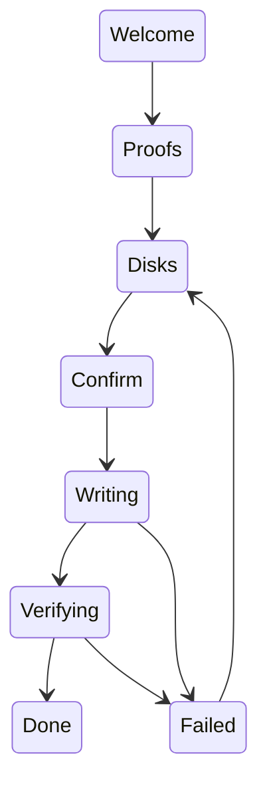

# Install to disk

How the NONOS installer picks a disk, what it writes there, what it refuses, and how you know the install worked.

## Start the installer

The installer is `capsule_install`. It writes the system this machine is running onto a disk you name, with its package [store](../overview/glossary.md#store) and an encrypted [data volume](../overview/glossary.md#data-volume) (`userland/capsule_install/src/install/ui/screens/welcome.rs`). There are three ways in:

- Boot the stick and choose `Install NØNOS` in the boot menu. Setup opens with Install chosen on its Mode step, and when you finish the Review step the installer takes the whole screen, with no desktop behind it. If an earlier boot of the stick kept its answers, setup does not run and the installer opens at once (`userland/capsule_setup_wizard/src/main.rs`).
- Choose `Install to this computer` on setup's Mode step, on any boot that runs setup (`src/userspace/init/supervisor/after_setup.rs`).
- From the desktop, open the Install tile on the dock (`userland/capsule_desktop_shell/src/state/apps.rs`). The installer then runs in a window.

If you leave the full-screen installer without installing, the desktop starts, and the kernel log says `[INIT] installer ended without a restart; starting the desktop` (`src/userspace/init/supervisor/after_install.rs`). A kernel built without the installer stops an install boot with `Install NONOS: this image has no installer`, before anything starts (`src/kernel_core/init/entry/install_refusal.rs`).

## The screens

The screens run in a fixed order (`userland/capsule_install/src/install/state/screen.rs`). Escape steps back. On Welcome and on Stopped it closes the installer, and on Done it closes a windowed installer. While the disk is written, Escape only stops the write early; during the read-back no key does anything (`userland/capsule_install/src/install/event/router.rs`, `userland/capsule_install/src/install/event/after.rs`).

| Screen | Title | What you do there |
|---|---|---|
| Welcome | Install NØNOS on this computer | Read what will be written: the loader and kernel sizes, the kernel measurement, the boot verdict, the firmware's Secure Boot state, the TPM. Enter goes on. |
| Proofs | What this boot proved | Read what each proof found. `VERIFIED` and `FAILED` are verdicts a check reached. `SELF-REPORTED` is a pass on the loader's word alone, with nothing measuring it. `NOT VERIFIED`, `NOT CHECKED` and `UNKNOWN` are not passes (`Mark` in `userland/capsule_install/src/install/proofs/mark.rs`). Enter lists the disks. |
| Disks | Choose the disk | Up and Down choose a disk, `r` looks again, Enter goes on. |
| Confirm | Everything on this disk will be erased | Read what is erased and written, type the disk's word, press Enter. |
| Writing | Writing | Watch the bar. Escape stops the write only until the new partition table starts, and leaves a disk with no partition table. |
| Verifying | Reading back | Every sector written is read back and compared. This cannot be stopped. |
| Done | Installed | Remove the USB stick, then press Enter to restart. |
| Failed | Stopped | Read what happened and what to do. Enter looks at the disks again and goes back to them. |

Nothing touches the disk before Enter on Confirm (`userland/capsule_install/src/install/job/prepare.rs`, `userland/capsule_install/src/install/job/start.rs`).
