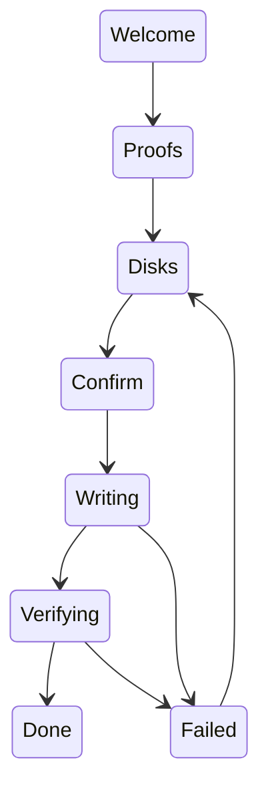

# Install to disk

Put NONOS on a disk in this computer: how the installer picks the disk, what it writes there, what it refuses, and how you know the install worked.

## Start the installer

The installer is `capsule_install`. It writes the system this machine is running onto a disk you name, with its package [store](../overview/glossary.md#store) and an encrypted [data volume](../overview/glossary.md#data-volume). There are three ways in:

- Boot the stick and choose `Install NØNOS` in the boot menu. Setup opens with Install chosen on its Mode step. When you finish the Review step, the installer takes the whole screen, with no desktop behind it. If an earlier boot of the stick kept its answers, setup does not run and the installer opens at once.
- Choose `Install to this computer` on setup's Mode step, on any boot that runs setup.
- From the desktop, open the Install tile on the dock. The installer then runs in a window.

If you leave the full-screen installer without installing, the desktop starts, and the kernel log says `[INIT] installer ended without a restart; starting the desktop`. A kernel built without the installer stops an install boot with `Install NONOS: this image has no installer`, before anything starts.

## The screens

The screens run in a fixed order. Nothing touches the disk before you press Enter on Confirm.

1. Welcome, titled `Install NØNOS on this computer`. Read what will be written: the loader and kernel sizes, the kernel measurement, the boot verdict, the firmware's [Secure Boot](../overview/glossary.md#secure-boot) state and the [TPM](../overview/glossary.md#tpm). Press Enter.
2. Proofs, titled `What this boot proved`. Read what each proof found. `VERIFIED` and `FAILED` are verdicts a check reached. `SELF-REPORTED` is a pass on the loader's word alone, with nothing measuring it. `NOT VERIFIED`, `NOT CHECKED` and `UNKNOWN` are not passes. Press Enter to list the disks.
3. Disks, titled `Choose the disk`. Choose a disk with Up and Down, press `r` to look again, and press Enter.
4. Confirm, titled `Everything on this disk will be erased`. Read what is erased and written, type the disk's word, and press Enter.
5. Writing, titled `Writing`. Watch the bar. Escape stops the write only until the new partition table starts, and leaves a disk with no partition table.
6. Verifying, titled `Reading back`. Every sector written is read back and compared. This cannot be stopped.
7. Done, titled `Installed`. Remove the USB stick, then press Enter to restart.

The Failed screen, titled `Stopped`, says what happened and what to do. Enter there looks at the disks again and goes back to them.

Escape steps back. On Welcome and on Stopped it closes the installer, and on Done it closes a windowed installer. While the disk is written, Escape only stops the write early; during the read-back no key does anything.

## Which disks are offered

The Disks screen lists every disk the NVMe, SATA and virtio-blk drivers serve, and the SATA driver also serves Intel eMMC hosts. Each row gives the model or the bus, the size, the serial, the block size when it is not 512 bytes, and what the disk holds now: `blank`, `NONOS installed`, `another system (GPT)`, `another system (MBR)`, `unrecognised contents` or `did not answer a read`.

Some rows are not targets, and say why:

- The stick this boot came from is left off the list, by the loader's record of its partition.
- A disk that holds a copy of the running loader, with no such record to tell it from the stick, reads `holds the loader this boot ran, so it may be the boot disk: not offered`.
- A controller whose driver did not start reads, for example, `NVMe controller present, its driver did not come up`.
- A disk whose first sectors do not read reads `its first sectors did not read:` with the driver's status, and `not offered`.

USB disks never appear: the list asks those three drivers only. While the list has nothing to install to, or a driver is missing, it looks again every two seconds, or after four times as long as the last look took when that is longer. Press `r` to look at once. With no disk and an Intel RST or VMD controller on the bus, the screen says `Intel RST/VMD is on: set the BIOS storage mode to AHCI (or turn VMD off), then boot this stick again.` It adds that a Windows already on the computer may need switching to AHCI first, or it will not start after the change.

## The confirmation word

The Confirm screen names the disk again, says what erasing it destroys, lists every region it erases and writes, and shows the word to type beside the field: `the word is` and the word. The word is the last four characters of the disk's serial, in lower case, when they are printable. Otherwise it is the bus name, `nvme`, `sata` or `virtio`, with the instance number after it past the first, as in `sata1`.

What you type is turned to lower case. Enter does nothing until the word matches and the plan for the disk is made, so no single key can start an erase.

## What is refused before anything is written

The installer makes the whole plan when you choose the disk, and says on the Confirm screen why a disk cannot take NONOS:

| Message | Why |
|---|---|
| `the disk holds ...; NONOS needs a disk of at least ... (2177 MiB)` | the disk is smaller than 2177 MiB, the floor for every image whose boot files fit in 1 GiB |
| `this disk uses 4096-byte blocks, and NONOS lays its partition table out in 512-byte ones, which firmware would not find here` | the disk's logical blocks are not 512 bytes |
| `this boot's store is still loading; choose the disk again` | the running store is not loaded yet, so what it carries is not all there |
| `the kernel gave no entropy for the identifiers` and an errno | no randomness for the disk and partition GUIDs |
| `that disk has no working driver` | the row is not a disk the installer can write |

## What is written

The disk gets a GPT with four partitions, laid out in 512-byte sectors:

| Sectors | Partition | What it holds |
|---|---|---|
| 0 to 33 | | the protective MBR and the primary GPT |
| 256 to 245,759 | `NONOS-STORE` | the package store |
| 245,760 to 262,143 | `NONOS-PLAN` | the [disk plan](../overview/glossary.md#disk-plan) naming the data volume, then the key header, cleared |
| 262,144 to the ESP | `NONOS-DATA` | the data volume, everything between the plan and the ESP |
| 1 GiB, or whole MiBs more for larger boot files, ending on the last MiB boundary before the backup GPT | `NONOS-ESP` | the boot files |
| the last 33 sectors | | the backup GPT |

The [ESP](../overview/glossary.md#esp) holds `EFI/BOOT/BOOTX64.EFI`, then `kernel.bin`, `bootloader.trailer`, `boot_root.approval`, `boot.cfg` and, when the running image has one, `kernel.approval` under `EFI/nonos/`, and `startup.nsh` at the top. The loader and kernel bytes are the ones the loader verified on this boot and handed to the kernel, read back from the kernel and not read again from the stick.

The store carries, in this order, while it has room: setup's answers and their marker, the wallpapers those answers keep, the signed programs under `/linux/` and then `/capsules/`, each program whole or not at all, then the files the Linux programs read. Nothing else from the running session is carried: files you made, the consent to run installed software and remembered Wi-Fi networks stay behind. The store is not encrypted: the kernel writes it to the disk as it is given.

The data volume is the encrypted part. The installer clears its key header and zeroes its header ring, so the first boot from the disk keys the volume with the TPM and formats it.

The installer is not a secure wipe. It first wipes the old partition tables and the kernel's markers, then writes the ESP, the zeroed header ring and key header, the store, the disk plan and the new tables, in that order. The rest of the data region is not overwritten: what the disk held there stays on it until the new volume writes over it. NONOS never reads those old bytes, but they are not destroyed.

## How long it takes

The write and the read-back move 2 MiB per step. The screen shows the percentage, the bytes and the rate the disk acknowledged, and the Done screen gives the write time in seconds. This release records no typical duration.

## After the install

The Done screen says `Remove the USB stick, then press Enter to restart.`

1. Remove the USB stick.
2. Press Enter. The machine restarts.
3. If the machine does not start NONOS from the disk, choose that disk in the firmware's boot menu.

The installer writes no firmware boot entry: the firmware finds the loader at the fallback path `EFI/BOOT/BOOTX64.EFI`. The installed disk shows the same boot menu as the stick, because it carries the same loader. The stick has to come out because, while a USB stick that carries NONOS is plugged in, the kernel keeps the boot's state on it before any internal disk.

On its first boot, the first time a program asks for the data volume, the kernel finds the cleared key header, derives the volume key from the TPM and formats the volume, and the log says `[DATA] formatted a volume of` with its size in sectors. Without a TPM the volume stays closed: the program gets EIO, and the serial console says `[DATA] refused with EIO: MachineKey(...)`. The kernel's own `[DATA] no machine key` line goes to its structured log, which nothing installs in this release, so it does not print. Setup does not run there when setup's answers came with the store.

Installing to an internal NVMe disk and booting from it was reported on real hardware. Works on an x86_64 laptop (Intel Gemini Lake, 8 GB), maintainer hardware report, 6 October 2026; the image commit was not recorded.

## Other installers in the tree

- `install-cli` is the installer as a command-line program, built on the same disk and block crates and built into the images. No command in this release runs it: the Terminal's `install` goes to the Marketplace installer.
- `capsule_nonos_install` is a console installer that no image carries. Its last four steps print `pending` and write nothing.
- `capsule_installer` installs Marketplace packages into the store. It owns no storage device and never lays out a disk.

## Where this comes from

- Start the installer
  - What the installer writes: `INTRO`, `userland/capsule_install/src/install/ui/screens/welcome.rs:30-31`.
  - Mode starts on Install on an install boot: `mode_sel`, `userland/capsule_setup_wizard/src/state.rs:70`.
  - Kept answers open the installer at once: `install_boot`, `userland/capsule_setup_wizard/src/main.rs:37-39`.
  - Install on the Mode step hands over the screen on any boot: `Ended::Installer`, `src/userspace/init/supervisor/after_setup.rs:37-44`.
  - The Install tile on the dock: `LauncherIcon::Install`, `userland/capsule_desktop_shell/src/state/apps.rs:119-123`.
  - Leaving the installer starts the desktop: `spawn_post_wizard`, `src/userspace/init/supervisor/after_install.rs:41-46`.
  - A kernel without the installer stops: `refuse_install_without_installer`, `src/kernel_core/init/entry/install_refusal.rs:34-39`.
- The screens
  - Screen order and titles: `Screen` and `title`, `userland/capsule_install/src/install/state/screen.rs:21-43`.
  - Proof marks: `Mark`, `userland/capsule_install/src/install/proofs/mark.rs:19-31`.
  - Nothing touches the disk before Confirm: `prepare`, `userland/capsule_install/src/install/job/prepare.rs:32-33`, and `start`, `userland/capsule_install/src/install/job/start.rs:30-38`.
  - Escape on Welcome: `on_start_key`, `userland/capsule_install/src/install/event/start.rs:27-29`.
  - Escape while writing, no key while reading back: `stoppable`, `userland/capsule_install/src/install/event/router.rs:66-67`, and `cancel`, `userland/capsule_install/src/install/event/cancel.rs:26-34`.
  - Escape and Enter on Done and Stopped: `on_after_key`, `userland/capsule_install/src/install/event/after.rs:31-47`.
- Which disks are offered
  - What a row says the disk holds: `Contents`, `userland/nonos_blk_client/src/disks/probe.rs:33-41`.
  - The boot stick left off, a loader copy withheld: `By::Partition` and `withheld`, `userland/nonos_blk_client/src/disks/scan.rs:100-102`, `userland/nonos_blk_client/src/disks/scan.rs:139-149`.
  - A driver that did not come up: `fault`, `userland/nonos_blk_client/src/disks/scan.rs:154-162`.
  - First sectors that did not read: `unread`, `userland/nonos_blk_client/src/disks/probe.rs:46-55`.
  - Three drivers only, eMMC through SATA: `ALL` and `serves`, `userland/nonos_blk_client/src/driver/table.rs:31`, `userland/nonos_blk_client/src/driver/table.rs:76-79`.
  - Looking again: `EVERY_MS` and `due`, `userland/capsule_install/src/install/rescan.rs:27-32`.
  - The RST or VMD hint: `RAID`, `userland/capsule_install/src/install/ui/screens/disks.rs:36`, and `raid_hides_disks`, `userland/nonos_blk_client/src/disks/scan.rs:68-72`.
- The confirmation word
  - The word: `confirm_word`, `userland/nonos_blk_client/src/disks/describe.rs:61-78`, and `serial_word`, `userland/nonos_blk_client/src/disks/word.rs:28-32`.
  - Lower case, and Enter waits for the word and the plan: `on_confirm_key`, `userland/capsule_install/src/install/event/confirm.rs:26-53`.
- What is refused before anything is written
  - Too small: `DiskTooSmall`, `userland/nonos_disk/src/writer/error_text.rs:30-35`, and `needed`, `userland/nonos_disk/src/layout/plan.rs:45-49`.
  - Blocks that are not 512 bytes: `refusal`, `userland/nonos_blk_client/src/disks/describe.rs:52-58`.
  - Store still loading, no entropy, no driver: `plan_for`, `userland/capsule_install/src/install/job/prepare.rs:36-54`.
- What is written
  - The layout: `nonos_disk_map`, `userland/nonos_disk/src/lib.rs:19-28`; `STORE_BASE_LBA`, `PLAN_LBA` and `DATA_FLOOR`, `userland/nonos_disk_map/src/places.rs:25-44`; `Layout::plan`, `userland/nonos_disk/src/layout/plan.rs:54-71`; `esp_sectors_for`, `userland/nonos_disk/src/layout/plan.rs:39-42`.
  - The ESP's files: `tree`, `userland/nonos_disk/src/image/nonos.rs:49-63`.
  - Loader and kernel read back from the kernel: `mk_install_source`, `userland/capsule_install/src/install/source/load.rs:92-97`.
  - What the store carries, in order: `gather` and `linux_data`, `userland/nonos_disk/src/carry/gather.rs:33-76`.
  - The store written as given: `block_device::write`, `src/syscall/microkernel/store_write.rs:55`.
  - Key header cleared, header ring zeroed: `state_jobs`, `userland/nonos_disk/src/session/queue_state.rs:30-42`.
  - The order of the writes: `queue`, `userland/nonos_disk/src/session/queue.rs:48-62`.
- How long it takes
  - 2 MiB per step: `BUDGET`, `userland/capsule_install/src/install/job/work.rs:61`.
  - The write time on Done: `seconds`, `userland/capsule_install/src/install/ui/screens/done.rs:49`.
- After the install
  - The fallback path: `tree`, `userland/nonos_disk/src/image/nonos.rs:49-50`.
  - A USB stick comes before internal disks: `ORDER`, `src/hardware/block_device/select.rs:48`.
  - First boot keys and formats the volume: `derive_for_kernel` and `mount_or_format`, `src/fs/blockfs_volume/open_machine.rs:75-79`, and `volume_sectors`, `src/fs/blockfs_volume/mount_or_format.rs:69`.
  - The EIO line on the serial console: `errno`, `src/syscall/microkernel/data/errno.rs:30-53`.
- Other installers in the tree
  - `install-cli` in `userland/tool_install/`: `nonos_install_cli`, `userland/tool_install/Cargo.toml:11-21`, built into the images by `installFeatures`, `tools/nix/config.nix:46`.
  - The Terminal's `install`: `jobs::classify`, `userland/capsule_terminal/src/command/builtin/tool.rs:37-38`.
  - The console installer's pending steps: `step_write_esp`, `userland/capsule_nonos_install/src/arch/x86_64/asm/steps.S:26-40`.
  - The package installer: `capsule_installer`, `userland/capsule_installer/README.md:5-12`.

## See also

- [First boot](first-boot.md)
- [Update](update.md)
- [Troubleshooting](troubleshooting.md)
- [Storage drivers](../drivers/storage/README.md)
- [Hardware support matrix](../hardware/MATRIX.md)
- [Device secrets and keys](../security/device-secrets-and-keys.md)
