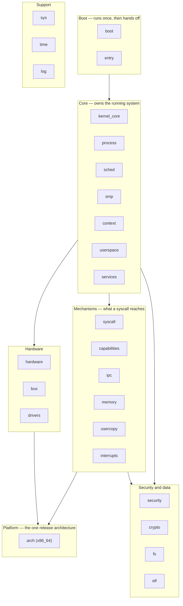
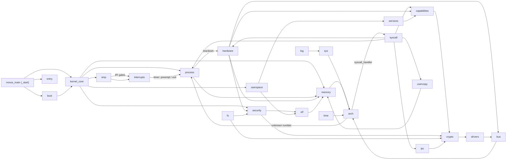

# Kernel internals: the source map

This section maps the kernel source tree itself: one page for each top-level module under `src/`, what it is responsible for, the shape of its subtree, its most important types and entry points with the file and line where each lives, and how it wires to the rest of the kernel. It is the developer's companion to the behavior pages under [Kernel](../kernel/README.md): those say what the kernel does, these say where in the tree it is done.

Every file and line this section names is read from the current source. When a page and the code disagree, the code is what runs; line numbers drift as the tree changes, so each anchor names the function or type as well, which is what to search for if the line has moved.

NONOS is a `no_std` Rust microkernel. The crate root is `src/lib.rs`, which is where the 26 top-level modules below are declared (`src/lib.rs:58-83`). x86_64 is the only release target: any other architecture is refused at compile time unless the `nonos-arch-preview` feature is set (`src/lib.rs:30-34`).

## The tree in one diagram

The modules group into layers. Boot runs once and hands off; the core layer owns the running system; the mechanism layer is what a system call reaches; the platform layer is the one architecture under all of it; and the hardware, data and support layers sit to the side, used from several places.

Read it as "rests on": boot rests on the core to start it, the core rests on the mechanisms, and the mechanisms rest on the one architecture.

## The main dependencies

The layers say which modules sit where; this says who calls whom. Every edge below is a real call path confirmed in the source while this section was written — the direction is "calls into". It is the trunk, not every edge: the full set for one module is on that module's page.

Three things to read out of it. [crypto](crypto.md) is a sink — [security](security.md), [capabilities](capabilities.md), [fs](fs.md) and [ipc](ipc.md) all call into it and it calls almost nothing back. [arch](arch.md) is the other sink — the mechanisms and the hardware layer bottom out there. And [hardware](hardware.md)'s broker is the one place a device is reached, with [memory](memory.md)'s IOMMU confining it.

## The modules

Sizes are Rust files and lines under each module's directory, on the current tree.

| Module | Path | Files | Lines | What it is | Page |
|---|---|--:|--:|---|---|
| boot | `src/boot/` | 61 | 3,235 | Takes the loader's handoff and brings the core systems up | [boot.md](boot.md) |
| entry | `src/entry/` | 4 | 178 | The out-of-memory and early-panic handlers the crate installs | [boot.md](boot.md#entry) |
| kernel_core | `src/kernel_core/` | 124 | 5,866 | Init order, process spawn, the microkernel main loop | [kernel-core.md](kernel-core.md) |
| process | `src/process/` | 261 | 16,613 | Processes, the scheduler, exit and teardown, foreign frames | [process.md](process.md) |
| sched | `src/sched/` | 2 | 93 | The thin scheduler facade over `process::scheduler` | [process.md](process.md#sched) |
| smp | `src/smp/` | 65 | 4,176 | Starting and parking the other CPUs | [process.md](process.md#smp) |
| context | `src/context/` | 5 | 304 | Saved register state and the context switch | [process.md](process.md#context) |
| interrupts | `src/interrupts/` | 112 | 5,298 | The interrupt and exception handlers above the arch vectors | [interrupts.md](interrupts.md) |
| syscall | `src/syscall/` | 284 | 14,427 | The syscall boundary: numbers, dispatch, per-call contracts | [syscall.md](syscall.md) |
| capabilities | `src/capabilities/` | 72 | 3,754 | The capability bits and the word a capsule carries | [capabilities.md](capabilities.md) |
| ipc | `src/ipc/` | 26 | 2,132 | The kernel inboxes capsules send messages through | [ipc.md](ipc.md) |
| usercopy | `src/usercopy/` | 19 | 896 | The checked copy across the user/kernel boundary | [syscall.md](syscall.md#usercopy) |
| memory | `src/memory/` | 628 | 28,417 | Frames, paging, address spaces, the heap, DMA | [memory.md](memory.md) |
| arch | `src/arch/` | 1,584 | 78,384 | Everything specific to a CPU: x86_64 is the release target | [arch.md](arch.md) |
| hardware | `src/hardware/` | 466 | 21,323 | The broker through which driver capsules claim devices | [hardware.md](hardware.md) |
| bus | `src/bus/` | 19 | 1,153 | The bus abstraction the broker enumerates over | [hardware.md](hardware.md#bus) |
| drivers | `src/drivers/` | 118 | 8,858 | The few drivers the kernel keeps for its own boot | [hardware.md](hardware.md#drivers) |
| security | `src/security/` | 419 | 23,536 | Capsule manifests, the TPM, attestation posture | [security.md](security.md) |
| crypto | `src/crypto/` | 318 | 23,569 | The signature, hash and STARK primitives | [crypto.md](crypto.md) |
| fs | `src/fs/` | 309 | 20,237 | The encrypted data volume | [fs.md](fs.md) |
| elf | `src/elf/` | 289 | 11,424 | The ELF loader that lays a capsule out in memory | [elf.md](elf.md) |
| services | `src/services/` | 28 | 1,438 | The service registry and restart policy | [services.md](services.md) |
| userspace | `src/userspace/` | 364 | 16,457 | Init: the order capsules start in and the supervisor | [userspace.md](userspace.md) |
| sys | `src/sys/` | 156 | 6,843 | Low-level system facilities shared across the kernel | [support.md](support.md#sys) |
| time | `src/time/` | 4 | 197 | The monotonic clock the kernel reads | [support.md](support.md#time) |
| log | `src/log/` | 19 | 985 | The serial log everything writes to | [support.md](support.md#log) |

## How to read a page

Each page has the same five parts: what the module is for; its subtree, two levels deep, so the directory names map to responsibilities; the key types and functions, each with `path:line` and what it does; how execution reaches the module and what it reaches in turn; and a see-also to the behavior pages and the neighboring modules. Read a page top to bottom for the module whole, or jump to the key-items table to find where one thing lives.

## See also

- [Architecture](../overview/architecture.md): the whole system in one diagram, from firmware to a running capsule.
- [Kernel](../kernel/README.md): the behavior pages — what the kernel does, where this section says where.
- [The ABI](../abi/README.md): the syscalls, errors and capabilities as published numbers and layouts.
- [Architectures](../architectures/README.md): x86_64, and what the preview architectures do and do not do.
