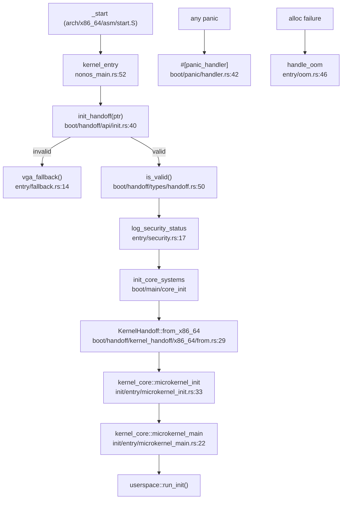

# boot and entry

`src/boot/` is the bridge from the loader to the running kernel: it takes the handoff the UEFI loader passes, checks it, brings up the pre-kernel systems, and owns the lowest-level output — the VGA text surface, the serial print macros, and the kernel panic handler. `src/entry/` is the handful of last-resort handlers the boot path installs: out of memory, no framebuffer, and the one-time security-status log.

Neither module is the program's first instruction. That is `kernel_entry` in `src/nonos_main.rs:52`, the function the x86_64 `_start` trampoline in `src/arch/x86_64/asm/start.S` jumps to with the handoff pointer in `rdi`. `kernel_entry` drives boot, then entry, then hands the running system to [kernel_core](kernel-core.md). (aarch64 arrives elsewhere, at `kernel_entry` in `arch::aarch64::boot`, with a device tree instead of a handoff; `src/nonos_main.rs:28-35` notes the two entries.)

## The boot sequence



The loader passes a `BootHandoffV1` by pointer. `init_handoff` stores it after `is_valid` checks its magic, version and size; an invalid or missing handoff ends at `vga_fallback`, which writes to the VGA text buffer and halts. `init_core_systems` brings up the pre-kernel systems — ACPI tables, the CPU tables, the syscall MSRs and memory encryption — and then the `BootHandoffV1` is turned into the arch-neutral `KernelHandoff` the core consumes. From there control passes to `kernel_core`.

## The subtree

```
src/boot/
  mod.rs              module root; serial_print! / serial_println! macros
  init.rs             init_early, VGA output bring-up
  stop.rs             fatal boot stop
  entry_marker.rs     paint a boot breadcrumb to the framebuffer
  firmware.rs         firmware blob lookup
  handoff/            the loader -> kernel contract
    types/            BootHandoffV1 and the framebuffer/memory/security/firmware views
    api/              init_handoff, query, profile, cleanup, the security orchestrator
    kernel_handoff/   KernelHandoff<'a> and the per-arch conversion into it
  main/               (x86_64) pre-kernel bring-up
    core_init/        init_core_systems: ACPI tables, CPU tables, syscall MSRs
    init_memory_encryption.rs
  panic/              #[panic_handler], halt, IRQ control
  vga/                the VGA text surface: output, splash, panic screen, colors
```

## Key items

| Item | Where | What it does |
|---|---|---|
| `kernel_entry` | `src/nonos_main.rs:52` | The C entry the loader jumps to; drives boot then entry then core. |
| `struct BootHandoffV1` | `src/boot/handoff/types/handoff.rs:28` | The loader/kernel contract: memory map, framebuffer, security, entropy. |
| `BootHandoffV1::is_valid` | `src/boot/handoff/types/handoff.rs:50` | Checks the handoff's magic, version and size. |
| `init_handoff` | `src/boot/handoff/api/init.rs:40` | Validates and stores the handoff for the rest of boot to read. |
| `get_handoff` | `src/boot/handoff/api/query.rs:24` | Returns the stored handoff. |
| `struct KernelHandoff<'a>` | `src/boot/handoff/kernel_handoff/handoff.rs:26` | The arch-neutral view the core consumes. |
| `from_x86_64` | `src/boot/handoff/kernel_handoff/x86_64/from.rs:29` | Turns a `BootHandoffV1` into a `KernelHandoff`. |
| `init_core_systems` | `src/boot/main/` (via `main/mod.rs`) | Pre-kernel ACPI/CPU-table/syscall-MSR bring-up. |
| `#[panic_handler] panic` | `src/boot/panic/handler.rs:42` | Serial + VGA panic, panic IPI to the other cores, then halt. |
| `halt_loop` | `src/boot/panic/interrupts.rs:18` | The final halt the panic and fallback paths end in. |
| `stop` | `src/boot/stop.rs:28` | Fatal boot stop with a step and a detail. |

## entry

`src/entry/` is flat — four files, each a handler the boot path installs.

| Item | Where | What it does |
|---|---|---|
| `handle_oom` | `src/entry/oom.rs:46` | The alloc-error handler: dumps the memory map and surface accounting, then halts. |
| wired as `#[alloc_error_handler]` | `src/lib.rs:54-55` | The crate's global allocation-failure handler calls `entry::handle_oom`. |
| `vga_fallback` | `src/entry/fallback.rs:14` | Writes to the VGA buffer and halts when there is no usable framebuffer. |
| `log_security_status` | `src/entry/security.rs:17` | Logs the boot's secure-boot and signature status, and applies the loader RNG seed. |

`handle_oom` reaches back into the core's `dump_surface_accounting` (`src/kernel_core/surface_registry/`) and into `crate::syscall::microkernel::memory` for the memory map, so the out-of-memory report names what was mapped when the allocation failed. The security log applies the loader's `rng.seed32` through `crate::crypto::rng` and then wipes the boot seed.

## Wiring

- **Called by:** the `_start` trampoline (through `kernel_entry`), the global alloc handler (`src/lib.rs:54`), and every panic.
- **Calls into:** [kernel_core](kernel-core.md) (hands it the `KernelHandoff`, and `microkernel_main` calls `boot::stop` on a refusal), [crypto](crypto.md) (the RNG seed), [memory](memory.md) and the surface registry (the OOM report), and `src/sys/` serial for output.

## See also

- [Boot handoff](../kernel/boot-handoff.md): the handoff record from the behavior side.
- [kernel_core](kernel-core.md): what runs after the handoff is accepted.
- [Panic and boot stop](../kernel/panic-and-boot-stop.md): what a panic and a stop do.
- [Boot chain and signatures](../security/boot-chain-and-signatures.md): the checks the loader runs before any of this.
