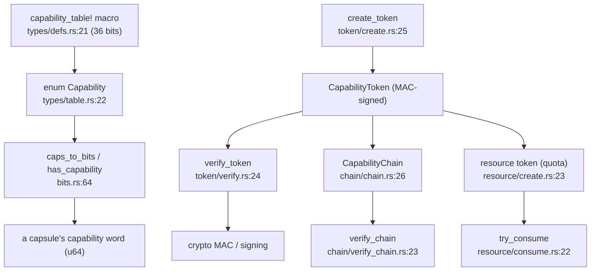

# capabilities

`src/capabilities/` defines the kernel's capability universe — 36 bits — and the signed-token machinery that carries authority: tokens, delegation chains, multisig tokens, resource/quota tokens, and an audit log of capability use. A capsule holds a capability word; a token proves a right; the syscall boundary resolves one against the other.

The 36 bits are the whole vocabulary of authority in the system. Every right a capsule can hold, and every right a syscall can demand, is one of them.

## Bits, words and tokens



The 36 bits are declared by one macro, which generates the `Capability` enum. Folding a set of capabilities gives the `u64` word a capsule carries. A `CapabilityToken` is MAC-signed and verified against that signature; tokens chain for delegation, and a resource token additionally carries a quota that `try_consume` charges against. The syscall layer's `Capability::resolve` is the consumer of all of this.

## The subtree

```
src/capabilities/
  types/           defs.rs (the 36-bit capability_table! macro), table.rs (enum Capability), guard, display
  bits.rs          caps_to_bits / bits_to_caps / has_capability and the word operations
  token/           create, verify, sign, validate, revocation, nonce, signing_key, material
  chain/           delegation chains: chain, verify_chain, verify_caps
  delegation/      create_checked / create_unchecked, sign, verify, lifetime
  multisig/        multi-signature tokens
  resource/        quota-bearing tokens: create, consume, quota, limits
  audit/           the capability-use audit log: log, buffer, counters, query
  roles.rs, serial_debug.rs
```

## Key items

| Item | Where | What it does |
|---|---|---|
| `capability_table!` | `src/capabilities/types/defs.rs:21` | Declares the 36 capabilities, bit `1<<0` (`CoreExec`) to `1<<35` (`DeviceSecret`). |
| `enum Capability` | `src/capabilities/types/table.rs:22` | The generated enum (`all()` at `:35`, `count()` at `:41`). |
| `caps_to_bits` | `src/capabilities/bits.rs:64` | Fold a capability slice into a `u64` mask. |
| `has_capability` | `src/capabilities/bits.rs:74` | Test a bit in a capability word. |
| `create_token` | `src/capabilities/token/create.rs:25` | Mint a `CapabilityToken`. |
| `verify_token` | `src/capabilities/token/verify.rs:24` | MAC-verify a token. |
| `struct CapabilityChain` | `src/capabilities/chain/chain.rs:26` | An ordered delegation chain of tokens. |
| `verify_chain` | `src/capabilities/chain/verify_chain.rs:23` | Validate a whole delegation chain. |
| `create_resource_token` | `src/capabilities/resource/create.rs:23` | Mint a quota-bearing token. |
| `try_consume` | `src/capabilities/resource/consume.rs:22` | Charge a quota, or fail. |

## Wiring

- **Called by:** the [syscall](syscall.md) boundary (`contract::capability::resolve` uses `CapabilityToken` and the resolver), the [hardware](hardware.md) capsule spawners (the grant masks), and [process](process.md) (token storage on the PCB).
- **Calls into:** [crypto](crypto.md) for the MAC and signatures that make a token unforgeable, and [process](process.md) for owner pids. The module is otherwise largely self-contained.

## See also

- [Capabilities](../kernel/capabilities.md) and the [capability ABI](../abi/capabilities.md): the behavior and the published bits.
- [syscall](syscall.md): where a capability is resolved on every call.
- [security](security.md): the manifest verification that decides a capsule's initial word.
- [crypto](crypto.md): the MAC and signing a token rests on.
