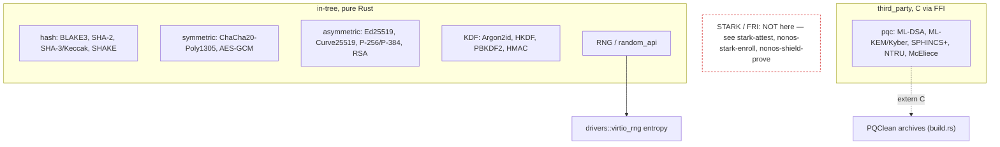

# crypto

`src/crypto/` is the kernel's cryptographic primitive library: hashes, symmetric AEADs, classical asymmetric signatures, post-quantum KEM and signatures, key-derivation functions, and the RNG. It is a leaf of the dependency graph — [security](security.md), [capabilities](capabilities.md) and [fs](fs.md) call into it; it calls almost nothing back.

Two facts about scope matter for anyone reading the security claims. First, the classical primitives are in-tree pure Rust; the **post-quantum** ones (ML-DSA and the rest) are **third-party PQClean C**, linked by `build.rs` through an FFI boundary. Second, **there is no STARK, FRI or zk code in this module** — a search finds zero matches. STARK attestation is implemented in the separate top-level crates (`stark-attest/`, `nonos-stark-enroll/`, `nonos-shield-prove/`), not in the kernel's `src/crypto`. When a page here or elsewhere speaks of STARK, it means those crates.

## What is in-tree and what is linked



## The subtree

```
src/crypto/
  mod.rs, error.rs, base64.rs, hardware_accel.rs
  hash/           blake3/, sha3/, sha384.rs, sha512/, unified/ (sha256, hmac, hkdf, ripemd160)
  symmetric/      aes/, aes_gcm/, chacha20poly1305/
  asymmetric/     ed25519/, curve25519/, p256/, p384/, rsa/, alg_id/
  pqc/            ml_dsa_65/ (api, ffi, verify_stack), kyber, sphincs/, ntru/, mceliece/
  pqclean_support/  the C glue (malloc/free/randombytes) for the PQClean archives
  core/           aead, traits, the AEAD wrappers
  util/           argon2/, bigint/, constant_time/, entropy/, hmac/, rng/
  random_api/     basic, entropy_check, hardware_mix, platform, wallet/
  application/    nonos_signing, certification, vault/
```

## Key items

| Item | Where | What it does |
|---|---|---|
| `sign` / `verify` (Ed25519) | `src/crypto/asymmetric/ed25519/signature.rs:89` / `:116` | Classical signature sign and verify. |
| `struct KeyPair` / `struct Signature` | `src/crypto/asymmetric/ed25519/signature.rs:34` / `:49` | The Ed25519 key pair and signature. |
| `ml_dsa_65_verify` | `src/crypto/pqc/ml_dsa_65/api.rs:62` | Post-quantum ML-DSA-65 verify (FFI to PQClean). |
| `ml_dsa_65_keypair` / `ml_dsa_65_sign` | `src/crypto/pqc/ml_dsa_65/api.rs:35` / `:43` | ML-DSA-65 keygen and sign. |
| the ML-DSA FFI boundary | `src/crypto/pqc/ml_dsa_65/ffi.rs:18` | `extern "C"` into `PQCLEAN_MLDSA*_CLEAN_*`. |
| `struct Chacha20Poly1305Aead` | `src/crypto/core/aead.rs:44` | The ChaCha20-Poly1305 AEAD. |
| `struct Aes256GcmAead` | `src/crypto/core/aead.rs:75` | The AES-256-GCM AEAD. |
| `aead_wrap` / `aead_unwrap` | `src/crypto/core/aead.rs:106` / `:119` | Generic AEAD seal/open. |
| BLAKE3 / SHA re-exports | `src/crypto/hash/mod.rs:23-27` | The hash surface (blake3, sha3, sha512, sha256, hmac, hkdf). |
| `argon2id` | `src/crypto/util/argon2/mod.rs:36` | The password KDF. |
| `fill_random_bytes` / `get_random_bytes` | `src/crypto/mod.rs:55` | The RNG surface. |

## Wiring

- **Called by:** [security](security.md) (manifest signature verify, the BLAKE3 image measurement, constant-time compares), [capabilities](capabilities.md) (token MAC and signing), [fs](fs.md) (all volume and file sealing), and broadly across the kernel. [entry](boot.md#entry) applies the boot RNG seed through it.
- **Calls into:** the global allocator, the `build.rs`-linked PQClean C archives, and [drivers](hardware.md#drivers) `virtio_rng` for entropy. It does not call [security](security.md), [fs](fs.md) or [elf](elf.md) — it is a leaf.

## See also

- [Randomness and cryptography](../security/randomness-and-cryptography.md): the behavior and the entropy sources.
- [STARK attestation](../security/stark-attestation.md): where the STARK side lives (the top-level crates, not here).
- [security](security.md): the main consumer of signatures and hashes.
- [fs](fs.md): the volume sealing built on the AEADs here.
