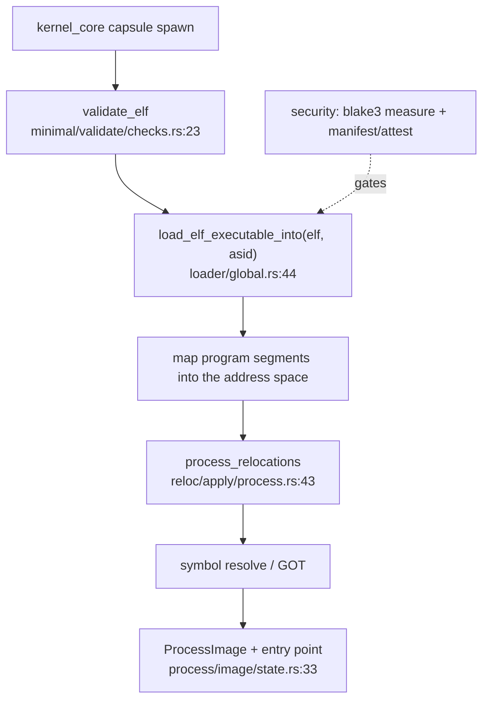

# elf

`src/elf/` is the ELF loader: it parses, validates, maps, relocates and links an ELF image into an address space to build a runnable capsule or process image. It is a pure parser and loader — it imports no crypto and no security code; [security](security.md) wraps it from outside (it measures and attests the same ELF bytes, and the manifest check gates whether a load happens at all).

The loader's job ends where execution begins: it produces an image and an entry point in a target address space; the spawn path takes it from there.

## From bytes to a runnable image



A capsule's bytes are validated, then mapped into a target address space by asid, relocated, and symbol-resolved, producing a `ProcessImage` with an entry point. The [security](security.md) layer measures those same bytes and gates the load — the loader itself does no trust checking.

## The subtree

```
src/elf/
  loader/        global (the load entry points), core/loader/ (load_executable_into, runtime_load)
  minimal/       validate/ (checks, entry, queries) — the fast validity checks
  process/       builder/ (build, config), image/ (ProcessImage, state, memory)
  reloc/         apply/ (process relocations), context/ (resolve), utils/
  types/         header, program, section, symbol, dynamic, reloc, constants
  symbol/, got/, hash/ (gnu, sysv), dynlink/, libmgr/ (link_map)
  tls/, init/, fini/, aslr/, auxv/, stack/, cache/, interpreter/, embedded/
```

## Key items

| Item | Where | What it does |
|---|---|---|
| `load_elf_executable_into` | `src/elf/loader/global.rs:44` | Load an executable into a target address space. |
| `load_elf_entry_into` | `src/elf/loader/global.rs:50` | Load and return the entry point for a target asid. |
| `init_elf_loader` / `get_elf_loader` | `src/elf/loader/global.rs:32` / `:40` | Initialize and fetch the global loader. |
| `struct ElfLoader` | `src/elf/loader/core/loader/state.rs:24` | The loader state. |
| `validate_elf` | `src/elf/minimal/validate/checks.rs:23` | Fast validity check of ELF bytes. |
| `entry_from_bytes` | `src/elf/minimal/validate/entry.rs:21` | Read the entry point from bytes. |
| `ProcessBuilder::build` | `src/elf/process/builder/build.rs:25` | Build a `ProcessImage` from ELF data. |
| `struct ProcessImage` | `src/elf/process/image/state.rs:33` | The built, mappable process image. |
| `process_relocations` | `src/elf/reloc/apply/process.rs:43` | Apply the relocation entries. |
| `struct RelocationContext` | `src/elf/reloc/context/state.rs:23` | The relocation resolution context. |

## Wiring

- **Calls into [memory](memory.md):** mapping program segments into an address space is the loader's main outbound dependency.
- **Self-contained otherwise:** no `crate::crypto` or `crate::security` imports (grep-clean) — a pure parser/loader.
- **Called by:** [kernel_core](kernel-core.md) — `init/entry/init_runtime.rs` and the capsule-spawn path (`capsule_spawn/runner/install/load_elf_into_pid.rs`).
- **Wrapped by [security](security.md):** `capsule_attest::measure` BLAKE3-hashes the same ELF bytes, and the manifest/attest verification decides whether the loader runs at all.

## See also

- [Processes and capsule spawn](../kernel/processes-and-spawn.md): the spawn path that drives the loader.
- [kernel_core](kernel-core.md): where `load_elf_*` is called from.
- [security](security.md): the measurement and manifest gate around the load.
- [memory](memory.md): the address space the image is mapped into.
