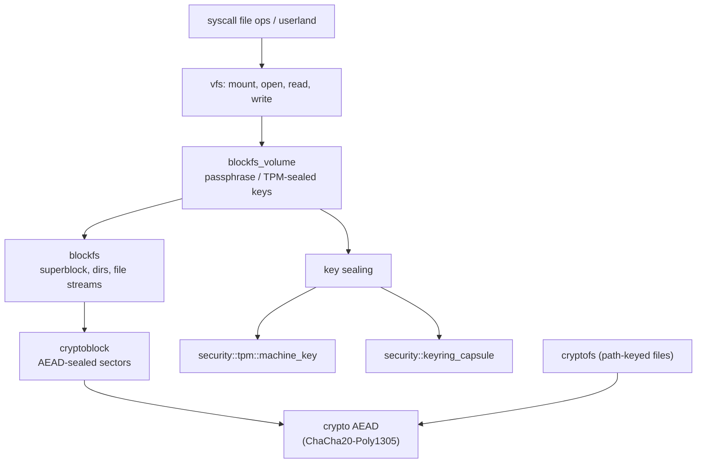

# fs

`src/fs/` is the filesystem subsystem: a VFS layer, an authenticated-encrypted on-disk data volume, and the in-memory and pseudo filesystems (ramfs, procfs, pipe). The encrypted volume is the reason this module is large — it is built in three layers, from sealed sectors up to a mountable, passphrase- or TPM-keyed volume.

Everything written to disk is sealed. The sector layer is an AEAD over raw blocks; the volume layer owns the keys and binds them to a passphrase or the TPM machine key.

## The three encryption layers



A file operation enters through the VFS. The data volume (`blockfs_volume`) mounts a `blockfs` filesystem — superblocks, directories, file streams — which stores its blocks through `cryptoblock`, the layer that AEAD-seals each sector with a key. The volume layer derives and seals that key: to a passphrase, or to the TPM machine key. `cryptofs` is a separate path-keyed encrypted-file API over the same crypto.

## The subtree

```
src/fs/
  mod.rs, api.rs, ops.rs, manager.rs, mapping.rs, errors.rs
  cryptoblock/      the AEAD-sealed sector layer: seal, open, read, write, epoch, window
  blockfs/          the on-disk fs: superblock, node, dir, tree, file streams (~80 files)
  blockfs_volume/   the user-facing volume: create, format, mount, passphrase, key_seal, import
  cryptofs/         path-keyed encrypted files: core, crypto, ops
  vfs/              vfs_core, vfs_global, table, fd_ops, open_file, path_validate
  fd/, path/, pipe/, procfs/, ramfs/, cache/, storage/
  ramfs_capsule/, vfs_capsule/
```

(The legacy `devfs`, `ext4` and `sysfs` trees are intentionally excluded; `mod.rs:23-28` notes this.)

## Key items

| Item | Where | What it does |
|---|---|---|
| `seal` | `src/fs/cryptoblock/seal.rs:22` | AEAD-seal a sector. |
| `open` / `open_into` | `src/fs/cryptoblock/open.rs:24` / `:36` | Open (decrypt) a sealed sector. |
| `read` / `write` (sector) | `src/fs/cryptoblock/read.rs:23` / `write.rs:21` | Read/write by LBA with a key. |
| `passphrase_volume` | `src/fs/blockfs_volume/passphrase.rs:32` | Create or unlock a passphrase-keyed volume. |
| `mount_volume` | `src/fs/blockfs_volume/mount_volume.rs:23` | Mount a volume by key id. |
| `struct CryptoFileSystem` | `src/fs/cryptofs/core.rs:48` | The path-keyed encrypted filesystem (`init_cryptofs` at `:128`). |
| `derive_key` / `encrypt_data` | `src/fs/cryptofs/crypto.rs:36` / `:55` | Per-path key derivation and encryption. |
| `VirtualFileSystem::new` / `mount` | `src/fs/vfs/vfs_core.rs:40` / `:66` | The VFS and its mount. |

## Wiring

- **Calls into [crypto](crypto.md):** every seal — `cryptoblock` uses ChaCha20-Poly1305 (`seal.rs:19`), `cryptofs` uses the AEAD plus PBKDF2-HMAC-SHA256 (`crypto.rs:27-29`), and the volume key sealing uses the ChaCha AEAD and the RNG.
- **Calls into [security](security.md):** the volume key is sealed to `security::tpm::machine_key` and managed through `security::keyring_capsule` (`blockfs_volume/error.rs:22-23`).
- **Called by:** the [syscall](syscall.md) `microkernel/` file handlers, [userspace](userspace.md) init, and [hardware](hardware.md)'s `block_device`.

## See also

- [Memory and paging](../kernel/memory-and-paging.md) and the data-volume behavior pages under [Security](../security/README.md).
- [Device secrets and keys](../security/device-secrets-and-keys.md): the TPM machine key the volume seals to.
- [crypto](crypto.md): the AEADs and KDFs underneath.
- [hardware](hardware.md): the block device the volume sits on.
