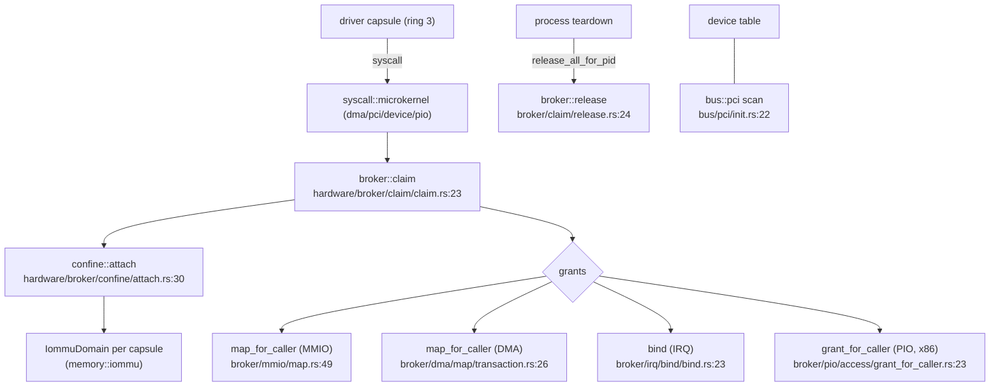

# hardware, bus and drivers

These three modules are the kernel's device layer, and the division between them is the point. `src/hardware/` is the **broker**: the security mediator through which a userland driver capsule claims a device and receives confined MMIO/DMA/IRQ/PIO grants — no driver touches hardware without going through it. `src/bus/` is the low-level PCI bus underneath (raw config access, enumeration, BAR assignment). `src/drivers/` holds only the handful of drivers the kernel keeps for its own boot; every other driver is a userland capsule.

## The broker is the gate



A capsule claims a device by pid; the broker gives that capsule its own IOMMU domain and moves the device into it, out of the identity domain. Each grant kind — MMIO window, DMA buffer, IRQ binding, port I/O — is a separate brokered call, each needing its own capability bit. When the process ends, teardown calls `release_all_for_pid` and the broker quiesces and detaches the device. The device table the broker works from is built from the `bus::pci` bus scan.

## hardware

```
src/hardware/
  broker/           the device-claim + grant engine
    claim/          claim, release, quiesce
    confine/        attach (per-capsule IOMMU domain), the confinement table, posture
    mmio/ dma/ irq/ pio/   the four grant kinds (pio is x86-only)
    pci/            the brokered PCI config-access gate
    class.rs, table/, windows.rs, power.rs
  inventory/        device scan + family classification
  block_device/     a block abstraction over ahci/nvme/virtio/usb-msc
  <device>_capsule/ one packager per driver (spawn + embed + state), e.g. nvme_capsule, xhci_capsule
```

| Item | Where | What it does |
|---|---|---|
| `claim` | `src/hardware/broker/claim/claim.rs:23` | A capsule claims a device by pid. |
| `release` / `release_all_for_pid` | `src/hardware/broker/claim/release.rs:24` / `:51` | Drop one claim, or all a pid holds. |
| `attach` | `src/hardware/broker/confine/attach.rs:30` | Give the capsule an `IommuDomain` and move the device into it (`:88-99`). |
| `map_for_caller` (MMIO) | `src/hardware/broker/mmio/map.rs:49` | Grant an MMIO window. |
| `map_for_caller` (DMA) | `src/hardware/broker/dma/map/transaction.rs:26` | Grant a DMA buffer. |
| `bind` (IRQ) | `src/hardware/broker/irq/bind/bind.rs:23` | Bind an interrupt (arch variants for GICv3/PLIC). |
| `grant_for_caller` (PIO) | `src/hardware/broker/pio/access/grant_for_caller.rs:23` | Grant x86 port I/O. |
| `read` (brokered PCI) | `src/hardware/broker/pci/read.rs:24` | A brokered PCI config read. |
| `classify_pci` | `src/hardware/broker/class.rs:57` | Classify a PCI device by class/subclass/prog-if. |
| `init_from_pci` | `src/hardware/broker/table/init.rs:28` | Build the device table from the bus scan. |
| `scan` | `src/hardware/inventory/scan.rs:24` | Scan and record present devices. |

## bus

`src/bus/mod.rs` is thin — `pub mod pci; pub use pci::*;` — so `bus` today *is* the PCI subsystem: raw config-space I/O, enumeration, BAR/command enabling, resource-window assignment, and (x86) AER error reporting. It is the hardware-access primitive the broker and the boot path build on.

| Item | Where | What it does |
|---|---|---|
| `init` | `src/bus/pci/init.rs:22` | Enumerate the PCI bus. |
| `pci_read32` / `pci_write32` | `src/bus/pci/config.rs:23` / `:37` | Raw config-space access (8/16/32-bit). |
| `enable_bus_master` | `src/bus/pci/enable.rs:19` | Enable bus mastering / memory / I/O space. |
| `find_device_by_id` / `enumerate_devices` | `src/bus/pci/find.rs:27` / `:84` | Find a device, or list them all. |
| `struct PciDevice` | `src/bus/pci/types.rs:30` | A discovered PCI device. |

## drivers

`src/drivers/mod.rs` declares only `pci`, `security` and `virtio_rng`, and re-exports `init_pci` and `init_virtio_rng`. These are the **only** drivers in the kernel — the two the microkernel boot path needs (PCI enumeration and a virtio-rng entropy probe). Every other driver is a userland capsule under `src/hardware/*_capsule/`. The `security` submodule is driver-facing validators (DMA/MMIO/LBA/PCI bounds and rate limiting) used across the trusted paths.

| Item | Where | What it does |
|---|---|---|
| `init_pci` | `src/drivers/pci/manager/global.rs:30` | Initialize the kernel PCI manager. |
| `init` (virtio-rng) | `src/drivers/virtio_rng/init.rs:24` | Bring up the virtio-rng entropy source. |
| `get_random_bytes` | `src/drivers/virtio_rng/api.rs:25` | The entropy-consumer API. |
| `validate_dma_buffer` | `src/drivers/security/dma.rs` (via `mod.rs:36`) | Bounds-check a DMA buffer. |
| `struct RateLimiter` | `src/drivers/security/rate_limiter.rs:58` | Per-driver operation rate limiting. |

## Wiring

- **broker** is called by the [syscall](syscall.md) `microkernel/` handlers (dma, device, pci, pio, mmap/munmap), and calls [memory](memory.md) (`IommuDomain` for confinement), [bus](#bus) (consumes `PciDevice` for its table), [capabilities](capabilities.md), [kernel_core](kernel-core.md) spawn, [security](security.md) (the capsule spawners verify id-certs) and the [drivers](#drivers) helpers.
- **bus** is called by the boot/platform init, the broker, the virtio-rng driver and the arch IOMMU/watchdog code; it calls [arch](arch.md) for the port/MMIO config primitives.
- **drivers** is called heavily by [crypto](crypto.md) for entropy (`virtio_rng`) and by the broker; it calls [bus](#bus) to find its device and [arch](arch.md)/[memory](memory.md) for MMIO.

Three PCI paths exist and are distinct: `bus::pci` (the raw bus), `drivers::pci` (a higher-level manager with allow/block lists, MSI, stats) and `hardware::broker::pci` (the brokered config-access gate capsules go through).

## See also

- [Hardware broker](../kernel/hardware-broker.md) and [Broker API](../drivers/broker-api.md): the behavior, kernel and driver sides.
- [Drivers](../drivers/README.md) and [Writing a driver](../drivers/writing-a-driver.md): the capsule driver model.
- [memory](memory.md) and [IOMMU](../kernel/iommu.md): the confinement the broker sets up.
- [PCI and ACPI](../kernel/pci-and-acpi.md): enumeration from the behavior side.
