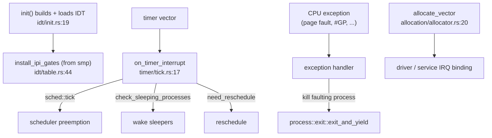

# interrupts

`src/interrupts/` is the x86_64 interrupt and exception infrastructure that sits above the raw arch vectors: it builds and loads the IDT, provides the ISR entry stubs and the exception/IRQ handlers, allocates interrupt vectors, drives the timer tick and liveness, guards interrupt context, and keeps the interrupt stats. It is where a hardware event becomes a kernel action — the timer preempts, an exception kills the faulting process.

## From a vector to a scheduler decision



The IDT is built and loaded during early init, and the SMP module installs its IPI gates into the same table. The timer vector drives the scheduler: each tick advances preemption, wakes sleepers and decides whether to reschedule. A CPU exception runs its handler, which for a fault in a process calls `exit_and_yield` to kill it. Vectors for devices are handed out by the allocator.

## The subtree

```
src/interrupts/
  idt/            table, entry, init/load, vectors, IST stacks, trampolines (x86_64)
  isr/            the ISR entry wrappers (x86_64)
  handlers/       exception and IRQ handler bodies (x86_64)
  apic/           local APIC: init, eoi, query (x86_64)
  pic/            legacy PIC: init, mask, eoi (x86_64)
  allocation/     the vector allocator and handler registry
  timer/          the timer tick, clock, hooks, state
  safety/         interrupt-context guards
  stats/          interrupt counters and queries
```

## Key items

| Item | Where | What it does |
|---|---|---|
| `init` (IDT) | `src/interrupts/idt/init.rs:19` | Build and load the IDT (re-exported as `init_idt`). |
| `install_ipi_gates` call | `src/interrupts/idt/table.rs:44` | Pulls the SMP IPI gates into the table. |
| `allocate_vector` | `src/interrupts/allocation/allocator.rs:20` | Allocate an interrupt vector. |
| `free_vector` | `src/interrupts/allocation/allocator.rs:34` | Release a vector. |
| `on_timer_interrupt` | `src/interrupts/timer/tick.rs:17` | The timer ISR body; drives the scheduler. |
| `tick` | `src/interrupts/timer/tick.rs:74` | Bump the tick counter. |
| `set_tick_hook` | `src/interrupts/timer/hooks.rs:27` | Register a periodic tick hook. |
| `get_interrupt_stats` | `src/interrupts/mod.rs:94` | Read the interrupt stats. |
| exception handlers | `src/interrupts/mod.rs:46-52` | `page_fault`, `double_fault`, `general_protection_fault`, timer, syscall. |
| interrupt-context guards | `src/interrupts/mod.rs:89-92` | `in_interrupt_context`, `InterruptGuard`, `disable_interrupts_guard`. |

## Wiring

- **Reached from:** early kernel init (the IDT is built and loaded there) and every hardware interrupt or CPU exception thereafter.
- **Receives from [smp](process.md#smp):** `src/interrupts/idt/table.rs:44` installs `crate::smp::install_ipi_gates` into the IDT — so smp injects its vectors here.
- **Drives [process](process.md):** the timer path calls `crate::sched::tick()` (`timer/tick.rs:36`), `check_sleeping_processes` (`:43`) and `need_reschedule`/`clear_reschedule` (`:61-63`); exception handlers call `crate::process::exit::exit_and_yield(...)` to kill a faulting process (for example `handlers/exceptions/segment.rs:81`, `stack.rs:52`, `divide.rs:41`). It also feeds `kernel_core::surface_registry` on each tick.
- **Calls into [arch](arch.md):** the APIC and PIC drivers here sit on the arch interrupt hardware.

## See also

- [Scheduler and SMP](../kernel/scheduler-and-smp.md) and [Timers](../kernel/timers.md): the behavior the timer path drives.
- [process](process.md): the scheduler this preempts and the exits it triggers.
- [smp](process.md#smp): the IPI gates installed into the IDT here.
- [arch](arch.md): the APIC/IDT hardware underneath.
