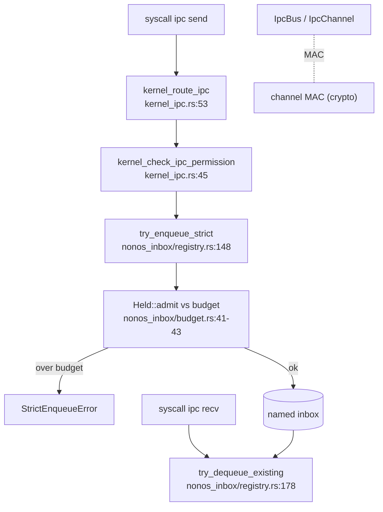

# ipc

`src/ipc/` is the kernel's message passing: byte-budgeted per-name inbox queues, a MAC-authenticated channel bus, the router helpers the IPC syscalls call, and FIFO pipes for fd tables. Capsules never share memory to talk; they send messages that wait in kernel inboxes, under a fixed byte budget that bounds how much memory all the waiting messages can hold.

The budget is the load-bearing invariant: all inboxes together hold at most 96 MiB, one inbox at most 16 MiB, and one sender at most half of any one inbox.

## A message through an inbox



A send resolves a permission (the caller must be on the target's peer list), then enqueues into the named inbox, where the byte budget decides whether the message is admitted or rejected. A receive dequeues from the inbox. The channel bus is the authenticated variant, where each message carries a MAC.

## The subtree

```
src/ipc/
  mod.rs
  kernel_ipc.rs      router helpers for the IPC syscalls (permission + route)
  nonos_inbox/       the budgeted per-name inbox queues
    budget.rs        TOTAL_BYTES_MAX / INBOX_BYTES_MAX / SHARE_BYTES_MAX and admission
    registry.rs      register_inbox, try_enqueue_strict, try_dequeue_existing
    take.rs, waiter.rs, drop_pid.rs, stats.rs
  nonos_channel/     the MAC-authenticated channel bus
    bus.rs, channel.rs, message.rs (IpcMessage), hash.rs
  pipe/              FIFO pipes for fd tables
```

## Key items

| Item | Where | What it does |
|---|---|---|
| `TOTAL_BYTES_MAX` | `src/ipc/nonos_inbox/budget.rs:41` | All inboxes together: 96 MiB. |
| `INBOX_BYTES_MAX` | `src/ipc/nonos_inbox/budget.rs:42` | One inbox: 16 MiB. |
| `SHARE_BYTES_MAX` | `src/ipc/nonos_inbox/budget.rs:43` | One sender into one inbox: 8 MiB (half an inbox). |
| `try_enqueue_strict` | `src/ipc/nonos_inbox/registry.rs:148` | Budgeted enqueue; fails if over budget. |
| `try_dequeue_existing` | `src/ipc/nonos_inbox/registry.rs:178` | Pop one message from an inbox. |
| `register_inbox` | `src/ipc/nonos_inbox/registry.rs:86` | Create a named inbox for an owner pid. |
| `struct IpcMessage` | `src/ipc/nonos_channel/message.rs:25` | The wire envelope (`validate_integrity` at `:71`). |
| `struct IpcBus` | `src/ipc/nonos_channel/bus.rs:32` | The channel bus (`open_channel` at `:51`). |
| `kernel_check_ipc_permission` | `src/ipc/kernel_ipc.rs:45` | Peer-list permission check before a send. |
| `kernel_route_ipc` | `src/ipc/kernel_ipc.rs:53` | Route a message to an inbox. |
| `create_pipe` | `src/ipc/pipe/api.rs:21` | Create a `(read_fd, write_fd)` FIFO pipe. |

## Wiring

- **Called by:** the [syscall](syscall.md) IPC handlers (`send`, `recv_from`, `reply`, `proc_stdin`, private write), [kernel_core](kernel-core.md) spawn (which registers a capsule's inboxes at install), and [userspace](userspace.md) init (the boot frame).
- **Calls into:** [process](process.md) for pids and peer lists, and [crypto](crypto.md) for the channel MAC (`hash.rs`). Callers copy user buffers through [usercopy](syscall.md#usercopy) before enqueuing.

## See also

- [IPC](../kernel/ipc.md) and the [IPC ABI](../abi/ipc.md): the behavior and the message formats.
- [IPC services](../userland/ipc-services.md): the services capsules reach over IPC by name.
- [services](services.md): the registry that names the endpoints.
- [syscall](syscall.md): the handlers that call the router here.
