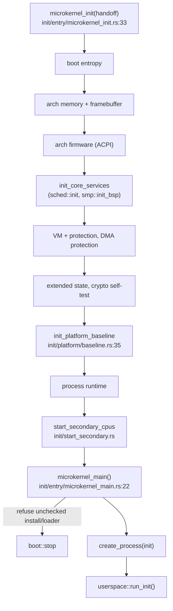

# kernel_core

`src/kernel_core/` is the microkernel's core: it owns the ordered bring-up that runs after the handoff is accepted, the transition into userspace, the spawn path that turns a verified capsule image into a process, the kernel/user boundary, and the shared-surface registry through which the framebuffer and input are handed to capsules. It is where "the kernel starts running the system" lives.

Two functions are the spine. `microkernel_init` runs the staged init pipeline once; `microkernel_main` never returns — it creates the init process and enters userspace. Both are called from `kernel_entry` in `src/nonos_main.rs` after [boot](boot.md) produces the `KernelHandoff`.

## From handoff to userspace



`microkernel_init` walks the stages in a fixed order: boot entropy first, then the architecture's memory and framebuffer, firmware tables, the core services (the scheduler and the boot CPU's SMP state), the VM and memory protections, extended CPU state and the crypto self-test, the platform baseline, the process runtime, and finally the other CPUs. `microkernel_main` then refuses an unchecked install or loader, waits briefly, creates the `init` process and calls `userspace::run_init`, which starts the capsules and never comes back.

## The subtree

```
src/kernel_core/
  mod.rs               re-exports microkernel_init/main, the boundary, spawn, the service registry
  boundary.rs          KernelComponent and is_kernel_component: what is in-kernel vs a capsule
  service.rs           ServiceDescriptor / SERVICE_REGISTRY: the kernel-side service record
  spawn.rs             spawn_init / spawn_service: the entry points init uses
  init/                the boot sequence
    entry/             microkernel_init, microkernel_main, the staged init_* steps, refusals
    framebuffer/       the console framebuffer: init, hidpi, report, state
    memory/            (x86_64) early memory setup, low DMA span, fallback
    platform/          baseline, entropy, the hardware broker, token signing key, boot nonce
    start_secondary.rs the SMP application-processor bring-up call
  process_spawn/       turning a verified capsule into a process
    capsule_spawn/     runner (spawn_verified), from_vfs, instance, spec
    kernel_stack.rs, user_stack.rs, context.rs
  surface_registry/    shared framebuffer + input rings handed to capsules
```

## Key items

| Item | Where | What it does |
|---|---|---|
| `microkernel_init` | `src/kernel_core/init/entry/microkernel_init.rs:33` | Runs the ordered post-handoff bring-up once. |
| `microkernel_main` | `src/kernel_core/init/entry/microkernel_main.rs:22` | Creates the init process and enters userspace; never returns. |
| `init_platform_baseline` | `src/kernel_core/init/platform/baseline.rs:35` | Brings up the platform baseline (broker, signing key, boot nonce). |
| `enum KernelComponent` | `src/kernel_core/boundary.rs:19` | The set of things that run in the kernel. |
| `is_kernel_component` | `src/kernel_core/boundary.rs:70` | Answers whether a name is in-kernel or a capsule. |
| `struct ServiceDescriptor` | `src/kernel_core/service.rs:36` | The kernel-side record of a service. |
| `SERVICE_REGISTRY` | `src/kernel_core/service.rs:58` | The static table of those records. |
| `spawn_init` | `src/kernel_core/spawn.rs:20` | Spawns the init process. |
| `spawn_service` | `src/kernel_core/spawn.rs:24` | Spawns one service by id. |
| `spawn_verified` | `src/kernel_core/process_spawn/capsule_spawn/` (`mod.rs`) | Spawns a capsule only after its manifest verifies. |
| `dump_surface_accounting` | `src/kernel_core/surface_registry/dump.rs` | Dumps the shared-surface accounting; also used by the OOM handler. |

## Wiring

- **Reached from:** `kernel_entry` in `src/nonos_main.rs` (`microkernel_init` then `microkernel_main`).
- **Calls into:** [boot](boot.md) (consumes the `KernelHandoff`, and `boot::stop` on a refusal), [process](process.md) (`create_process`, and `sched::init` / `smp::init_bsp` in the core-services stage), [memory](memory.md) (paging and the VM bring-up), [crypto](crypto.md) (the self-test), [security](security.md) (the boot checks), [smp](process.md#smp) (the secondary CPUs), and [userspace](userspace.md) (`run_init`).
- **Called back by:** the OOM handler in [entry](boot.md#entry), which reads `surface_registry::dump_surface_accounting`.
- **Spawn gate:** `spawn_verified` is the single path a capsule becomes a process, and it runs the [security](security.md) manifest check first.

## See also

- [Boot handoff](../kernel/boot-handoff.md) and [Processes and capsule spawn](../kernel/processes-and-spawn.md): the behavior side.
- [boot](boot.md): what hands control here.
- [userspace](userspace.md): what `run_init` starts, and in what order.
- [process](process.md): the scheduler and the process table the core brings up.
