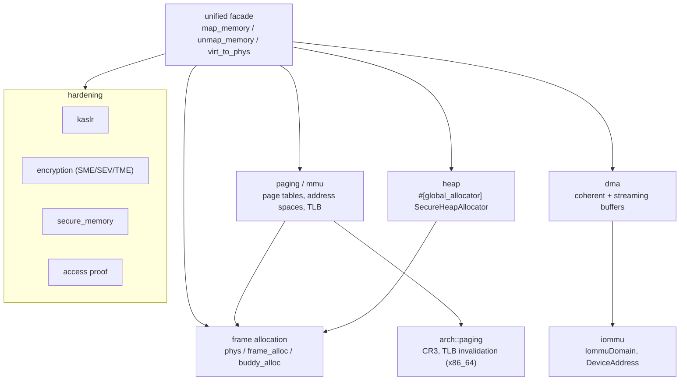

# memory

`src/memory/` is the kernel's memory authority: physical frame allocation, virtual-memory paging and page tables, per-process address spaces, the global kernel heap, DMA memory, the IOMMU domain types, and the memory-hardening layers (KASLR, encryption, secure regions, access proofs). Most of the kernel reaches it through one facade, `crate::memory::unified`, rather than the allocators underneath.

At 628 files it is the second-largest module, because each allocator, each paging operation and each protection is its own small, separately testable file. The map below groups them by job.

## The layers



Read it top-down: callers use the unified facade; it maps through the paging layer, which draws frames from the physical allocators and programs the real page tables through `arch::paging`. The heap is a global allocator backed by the same frame layer. DMA sits beside paging and produces addresses in an `IommuDomain`. The hardening layers wrap all of it.

## The subtree

```
src/memory/
  mod.rs, api.rs, stats.rs       the re-export hub and process-memory helpers
  unified/                       THE public facade: mapping, translate, system, secure, tlb
  addr/                          PhysAddr, VirtAddr and the x86_64 address math
  phys/                          physical frame allocator (bitmap, zones, contiguous)
  frame_alloc/                   the global frame manager over phys
  buddy_alloc/                   the buddy allocator
  page_allocator/, page_info/, region/, boot_memory/
  paging/                        page tables + address spaces
    manager/api/mapping/         one file per map/unmap operation (user, kernel, huge, mmio, dma)
    manager/address_space/       create / switch / cleanup an address space
    protection/, translation/, shootdown/, faults/, tlb/
  mmu/                           (x86_64) the MMU driver behind paging
  layout/, kaslr/                VM layout constants and KASLR
  heap/                          the global kernel heap (SecureHeapAllocator)
  dma/                           coherent + streaming DMA buffers, pools, constraints
  iommu/                         IommuDomain, DeviceAddress, DomainId, the VT-d-facing types
  mmio/                          MMIO mapping and ordering backends
  secure_memory/, hardening/, encryption/, proof/, safety/
```

## Key items

| Item | Where | What it does |
|---|---|---|
| `map_memory` | `src/memory/unified/mapping.rs:24` | The unified entry to map a virtual range. |
| `unmap_memory` | `src/memory/unified/mapping.rs:64` | The unified unmap. |
| `virt_to_phys` | `src/memory/unified/translate.rs:26` | Translate a virtual address to physical. |
| `init_all_memory_subsystems` | `src/memory/unified/system.rs:24` | Boot bring-up of every memory subsystem. |
| `struct SecureHeapAllocator` | `src/memory/heap/types/allocator.rs:28` | The kernel heap allocator. |
| `#[global_allocator]` | `src/memory/heap/manager/globals.rs:21` | The live global heap static. |
| `allocate_frame` (global) | `src/memory/frame_alloc/manager/alloc.rs:22` | Allocate one physical frame. |
| `allocate_frame` (phys) | `src/memory/phys/allocator/alloc.rs:20` | The physical-layer frame allocation with flags. |
| `map_page` | `src/memory/paging/manager/api/mapping/map_page.rs:24` | The core page-table map. |
| `create_address_space` | `src/memory/paging/manager/address_space/create.rs:39` | Create a per-process address space. |
| `switch_address_space` | `src/memory/paging/manager/address_space/switch.rs:21` | Switch the active address space. |
| `struct IommuDomain` | `src/memory/iommu/domain.rs:27` | A device DMA domain (`allocate` at `:33`, `map` at `:57`). |
| `alloc_coherent` | `src/memory/dma/allocator/api.rs:35` | Allocate a coherent DMA buffer under constraints. |
| `struct PhysAddr` / `struct VirtAddr` | `src/memory/addr/phys.rs:19` / `virt.rs:19` | The two address newtypes. |

## Wiring

- **Calls into:** [arch](arch.md) above all — `arch::paging` reads and writes CR3, invalidates the TLB, and describes PTEs; memory also uses `arch::run_without_interrupts` and the time counter. It calls [process](process.md) for the current pid and process table (in `api.rs`), and [usercopy](syscall.md#usercopy)'s `copy_from_user` for the process-memory read helper.
- **Called by:** nearly everything — the heaviest consumers are [arch](arch.md) and [elf](elf.md), then [process](process.md), [hardware](hardware.md), [drivers](hardware.md#drivers), [syscall](syscall.md), [smp](process.md#smp), [fs](fs.md) and [boot](boot.md).
- **Arch gating:** `encryption/` and `mmu/` are x86_64-only; `iommu/` builds everywhere but refuses mappings where there is no backend (no SMMU on ARM yet). `mod.rs` keeps some `nonos_*` legacy aliases because storage and SMP paths still resolve through them.

## See also

- [Memory and paging](../kernel/memory-and-paging.md) and [Frame allocator](../kernel/frame-allocator.md): the behavior side.
- [IOMMU](../kernel/iommu.md): how the `IommuDomain` types here are driven from the broker.
- [arch](arch.md): the x86_64 paging and TLB primitives memory sits on.
- [hardware](hardware.md): the broker that asks memory for DMA grants and domains.
