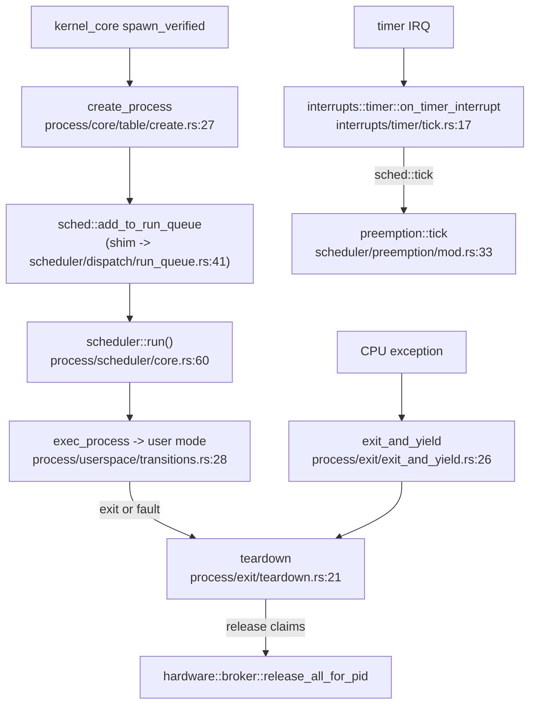

# process, sched, smp and context

`src/process/` owns process lifecycle and all per-process state: the process control block and table, address spaces, file-descriptor tables, signals, the foreign (Linux) guests, exit and teardown — and, as a submodule, the canonical scheduler. `src/sched/`, `src/smp/` and `src/context/` sit beside it: `sched` is a thin forwarding shim onto the real scheduler, `smp` starts and coordinates the other CPUs, and `context` tracks what the current CPU is running.

## How a process runs, preempts and exits



A process is created by the spawn path, made runnable through the `sched` shim, and picked up by the scheduler's dispatch loop, which enters user mode. The timer interrupt drives preemption through the same shim. When a process exits — deliberately or because an exception killed it — `teardown` runs, and it is teardown that gives back every hardware claim the process held, by calling into the [hardware](hardware.md) broker.

## process

```
src/process/
  core/            pcb.rs (ProcessControlBlock), table/ (create), api (context_switch), isolation
  address_space/   fork, ops, pcid, pte, tlb
  context/         the saved CPU register context and its install
  exit/            teardown, exit_and_yield, finalize, postmortem, reap
  foreign/         (x86_64) the Linux-guest frames, exec, trap, signal (~55 files)
  scheduler/       THE canonical scheduler (see below)
  signal/          signal frames and queues
  userspace/       the user-mode transition and its asm
  accounting/, fd_table.rs, manager.rs, alarm.rs, caps.rs
```

| Item | Where | What it does |
|---|---|---|
| `struct ProcessControlBlock` | `src/process/core/pcb.rs:31` | The PCB: one process's whole state. |
| `create_process` | `src/process/core/table/create.rs:27` | Allocate a new process in the table. |
| `context_switch` | `src/process/core/api.rs:54` | Switch the CPU to a given pid. |
| `teardown` | `src/process/exit/teardown.rs:21` | Tear a process down; releases its hardware claims at `:48-51`. |
| `exit_and_yield` | `src/process/exit/exit_and_yield.rs:26` | Exit the current process and reschedule; never returns. |
| `exec_process` | `src/process/userspace/transitions.rs:28` | Enter user mode for a process image. |
| `struct ForeignFrame` | `src/process/foreign/frame.rs:36` | A parked Linux-guest register frame. |
| `is_foreign` | `src/process/foreign/registry.rs:41` | Whether a pid is a Linux guest. |

### The canonical scheduler

`src/process/scheduler/` is the real scheduler: the dispatcher loop, the pid run queue, the realtime and deadline tiers, preemption and time-slicing, and the policy/affinity registry the syscall layer uses.

| Item | Where | What it does |
|---|---|---|
| `run` | `src/process/scheduler/core.rs:60` | The main dispatcher loop; never returns. |
| `enter` | `src/process/scheduler/core.rs:97` | Enter the scheduler. |
| `init` | `src/process/scheduler/core.rs:39` | Initialize scheduler state. |
| `add_to_run_queue` | `src/process/scheduler/dispatch/run_queue.rs:41` | Make a pid runnable. |
| `sleep_until` | `src/process/scheduler/dispatch/sleep.rs:19` | Sleep a pid until a wake time. |
| `tick` / `yield_now` | `src/process/scheduler/preemption/mod.rs:33` / `:35` | The preemption tick and voluntary yield. |
| `struct RunQueue` | `src/process/scheduler/runqueue/types.rs:20` | The run queue itself. |
| `set_policy` / `set_affinity` | `src/process/scheduler/policy.rs:47` / `:122` | Back `sched_setscheduler` and affinity. |

## sched

`src/sched/` is **a forwarding shim only** — frozen, no new code (`src/sched/mod.rs:17-22` names it the Phase-1 kill list and points at `src/process/scheduler` as the canonical authority). Every item in it is a `pub use crate::process::scheduler::…` re-export. Despite that, `crate::sched::*` is the path the rest of the kernel actually calls — `crate::sched::tick()`, `add_to_run_queue`, `yield_now`, `wake_process` — so external callers go through `sched`, which forwards into `process::scheduler`. When reading the tree, treat `sched` as the public name and `process::scheduler` as the implementation.

## smp

`src/smp/` brings up and coordinates the other CPUs: boot-CPU init, application-processor (AP) bring-up, per-CPU data, inter-processor interrupts, topology, TLB-shootdown service, and preemption signalling.

| Item | Where | What it does |
|---|---|---|
| `init_bsp` | `src/smp/init/bsp.rs:24` | Boot-CPU SMP init. |
| `start_aps` | `src/smp/init/start.rs:31` | Bring every application processor online. |
| `ap_entry` | `src/smp/ap/entry.rs:25` | The AP trampoline entry point. |
| `current_cpu` / `is_bsp` | `src/smp/cpu.rs:30` / `:43` | The current CPU descriptor; whether it is the boot CPU. |
| `call_on_cpu` / `call_on_all` | `src/smp/ipi/operations.rs:46` / `:75` | Targeted and broadcast IPIs. |
| `install_ipi_gates` | `src/smp/mod.rs:53` | Install the IPI vectors into the IDT. |

`init_bsp` is called from the core-services init stage and `start_aps` from `start_secondary.rs`. `smp` injects its IPI vectors **into** [interrupts](interrupts.md) (`src/interrupts/idt/table.rs:44`), and `src/smp/preempt.rs:42` calls back into the scheduler.

## context

`src/context/` is a small current-execution-context tracker: whether the CPU is in the kernel or running a specific process (its pid, capability word and page table), and the capability checks that reads. It is distinct from `src/process/context/`, which holds the saved register state.

| Item | Where | What it does |
|---|---|---|
| `enum ExecutionContext` | `src/context/types.rs:58` | Kernel vs a specific process. |
| `get_current_context` | `src/context/current.rs:78` | Read the current execution context. |
| `set_process_context` | `src/context/current.rs:106` | Set pid + capabilities + page table on a switch. |
| `require_capability` | `src/context/capability.rs:38` | Require a capability or return a `ContextError`. |

## Wiring

- **process** is reached from [kernel_core](kernel-core.md) spawn, from [interrupts](interrupts.md) exception handlers (which call `exit_and_yield` to kill a faulting process), and from the [syscall](syscall.md) layer; it calls out to the [hardware](hardware.md) broker (claim release), [context](#context) and the paging layer in [memory](memory.md).
- **scheduler** is reached almost entirely through the `sched` shim; the timer path in [interrupts](interrupts.md) is its main driver.
- **smp** is called from [kernel_core](kernel-core.md) init, installs gates into [interrupts](interrupts.md), and calls the scheduler to preempt.

## See also

- [Scheduler and SMP](../kernel/scheduler-and-smp.md) and [Processes and capsule spawn](../kernel/processes-and-spawn.md): the behavior side.
- [interrupts](interrupts.md): the timer tick that preempts and the exceptions that kill.
- [hardware](hardware.md): the broker teardown reaches to release claims.
- [Linux personality](../userland/linux-personality.md): what the `foreign/` guests are.
