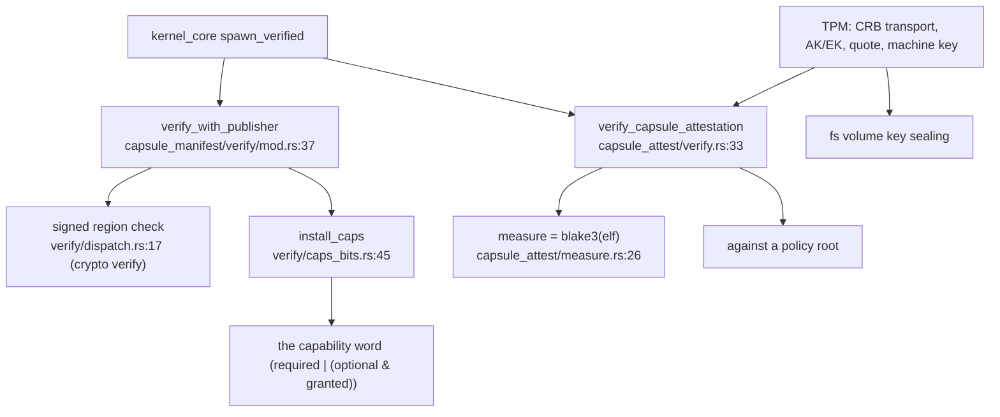

# security

`src/security/` enforces the capsule trust chain: it verifies a capsule's manifest and its attestation, computes the capability word the capsule installs with, drives the TPM-backed roots, runs secure boot, and keeps the runtime hardening and monitoring. It is the module that decides whether a capsule is allowed to run and with what authority — the gate [kernel_core](kernel-core.md)'s spawn path consults before any capsule becomes a process.

The one function that produces a capsule's authority is `install_caps`: the word is the required bits, plus the optional bits that were both declared and granted, and nothing else.

## Verifying a capsule before it runs



The spawn path verifies the manifest against the publisher certificate (a crypto signature check), and `install_caps` derives the capability word. In parallel the capsule's attestation is checked: the image is measured (a BLAKE3 hash of the ELF) and proven against a policy root, with the TPM providing the hardware root — attestation keys, PCR quotes and the machine key that seals the data volume.

## The subtree

```
src/security/
  init.rs             init_all_security: subsystem bring-up
  capsule_manifest/   decode + verify a capsule manifest
    verify/           caps_bits (install_caps), signed_region, cert_binding, capsule_id
    schema/, decode/
  capsule_attest/     verify, measure (blake3 of the ELF), against_root, policy_root
  tpm/                CRB transport, AK/EK enroll, PCR quote, machine_key, device_secret
  attest_doc/, attest_policy/, attest_registry/
  nonos_id_cert/, nonos_trust_anchor/, dev_roots/, image_ceiling/
  crypto/             a thin security-local helper (constant_time, trusted_keys) — not src/crypto
  boot/               firmware, secure_boot, loader_check, slots
  hardening/          memory_encryption, memory_sanitization, spectre/speculation mitigations
  monitoring/, observability/, policy/, quantum/pqc/, zerostate/
  *_capsule/          crypto/entropy/keyring/market IPC capsule clients
```

## Key items

| Item | Where | What it does |
|---|---|---|
| `install_caps` | `src/security/capsule_manifest/verify/caps_bits.rs:45` | The capability word: `required | (optional & granted)`. |
| `verify_with_publisher` | `src/security/capsule_manifest/verify/mod.rs:37` | Verify a manifest against its publisher cert. |
| signed-region check | `src/security/capsule_manifest/verify/dispatch.rs:17` | Uses `crypto::asymmetric` to verify the signed region. |
| `verify_capsule_attestation` | `src/security/capsule_attest/verify.rs:33` | Prove a capsule image against a policy root. |
| `measure` | `src/security/capsule_attest/measure.rs:26` | The capsule image digest: `blake3::hash(elf)`. |
| `init_all_security` | `src/security/init.rs:32` | Bring up the security subsystems. |
| `transact` (TPM) | `src/security/tpm/mod.rs:37` | The TPM command transport (CRB driver under `crb/`). |
| `ak_sign` / `ak_public` | `src/security/tpm/enroll/ak_calls.rs:40` / `:31` | Attestation-key sign and public read. |
| `parse_quote` | `src/security/tpm/quote/response.rs:37` | Parse a TPM PCR quote. |

## Wiring

- **Calls into:** [crypto](crypto.md) heavily — the manifest signed-region check, the BLAKE3 measurement, constant-time comparisons and HMAC. It measures [elf](elf.md) images (and the manifest/attest checks gate whether an ELF is loaded at all).
- **Called by:** [kernel_core](kernel-core.md) spawn (`capsule_spawn` preflight and load), the [syscall](syscall.md) capsule-verify handlers, and [userspace](userspace.md) init's capsule boot.
- **Called back by [fs](fs.md):** the encrypted volume seals its key to `security::tpm::machine_key` and `security::keyring_capsule`.

## See also

- [Security](../security/README.md) and [Protections and limits](../security/protections-and-limits.md): the behavior and the known gaps.
- [Boot chain and signatures](../security/boot-chain-and-signatures.md) and [Measured boot and the TPM](../security/measured-boot-and-tpm.md).
- [capabilities](capabilities.md): the bits `install_caps` composes.
- [crypto](crypto.md): the signatures and hashes underneath, and where STARK attestation actually lives.
