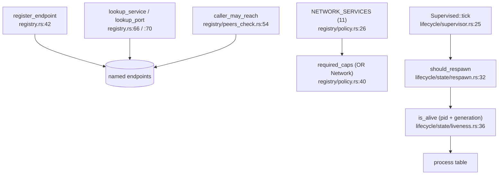

# services

`src/services/` is the kernel-side plumbing for system services, and only that: the capability bits a service needs, the named-endpoint registry that kernel-side IPC clients look services up in, and the liveness/restart lifecycle primitives. The service *implementations* are userland capsules — no protocol or engine logic lives here (`src/services/mod.rs` says so in its header).

The registry is where the "reaching a network service costs the Network bit" rule lives: eleven named services carry traffic off the machine, and the registry ORs the Network bit onto the capabilities any caller needs to reach them.

## Registry, caps and lifecycle



A service registers a named (or ported) endpoint tied to its pid. Kernel-side clients look it up by name or port, and reachability is checked against a peer policy — with the network-services list forcing the Network bit. The lifecycle side tracks whether a capsule is still alive (by pid and generation) and decides, per the restart policy, whether to respawn it.

## The subtree

```
src/services/
  mod.rs            re-exports caps + registry
  registry.rs       register_endpoint, lookup_service, lookup_port
  registry/         policy (NETWORK_SERVICES, required_caps), endpoint, peers_check, held
  caps/             ServiceCap, check_service_cap, CapError
  lifecycle/        supervisor (Supervised, tick), registry (liveness), transport, reply_wait
    state/          CapsuleState, liveness, respawn, constants
```

## Key items

| Item | Where | What it does |
|---|---|---|
| `register_endpoint` | `src/services/registry.rs:42` | Add a named/ported endpoint for a pid. |
| `lookup_service` / `lookup_port` | `src/services/registry.rs:66` / `:70` | Find an endpoint by name or port. |
| `NETWORK_SERVICES` | `src/services/registry/policy.rs:26` | The 11 services that need the Network bit (`net.core`..`net.socks5`). |
| `required_caps` | `src/services/registry/policy.rs:40` | OR the Network bit onto a network service's caps. |
| `struct ServiceEndpoint` | `src/services/registry/endpoint.rs:22` | A name/port/pid/caps record. |
| `caller_may_reach` | `src/services/registry/peers_check.rs:54` | The reachability policy check. |
| `check_service_cap` | `src/services/caps/check.rs:21` | Verify a caller holds a service's caps. |
| `struct Supervised` | `src/services/lifecycle/supervisor.rs:19` | A supervised capsule: name + state fn + spawn fn. |
| `Supervised::tick` | `src/services/lifecycle/supervisor.rs:25` | Respawn dead capsules per the restart policy. |
| `should_respawn` | `src/services/lifecycle/state/respawn.rs:32` | The restart gate. |
| `is_alive` | `src/services/lifecycle/state/liveness.rs:36` | Whether a capsule's pid+generation is still live. |

## Wiring

- **Calls into:** [capabilities](capabilities.md) (the caps and the policy pull from `crate::capabilities`), and the [process](process.md) table (the lifecycle checks `is_alive`).
- **Called by:** [userspace](userspace.md) (the capsule kernel-mirrors register endpoints and `CapsuleState`; init's supervisor drives the restarts) and the [ipc](ipc.md)/[syscall](syscall.md) clients doing endpoint lookups.

## See also

- [IPC services](../userland/ipc-services.md): the services themselves, with their endpoints.
- [userspace](userspace.md): init, which starts and supervises them.
- [capabilities](capabilities.md): the Network bit the registry enforces.
- [ipc](ipc.md): the message layer endpoints are reached over.
