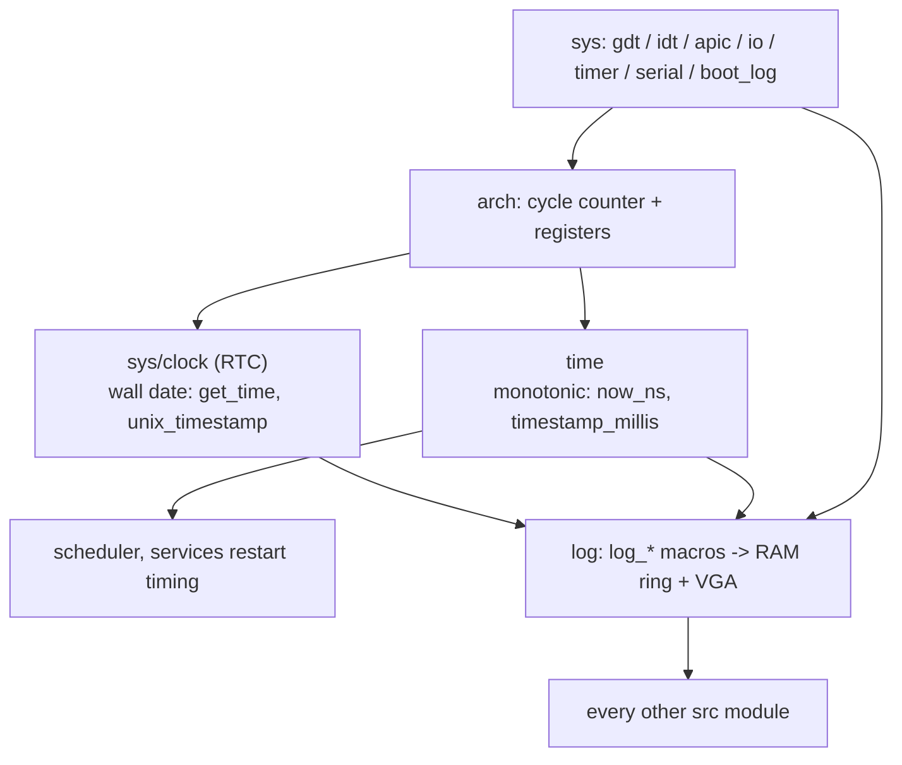

# sys, time and log

Three support modules the rest of the kernel leans on. `src/sys/` is the platform-near glue — GDT/IDT/APIC setup, port I/O, the timer, serial, the RTC wall clock, the boot-log framebuffer, benchmarking and diagnostics. `src/time/` is the architecture-neutral monotonic clock. `src/log/` is the logging subsystem — severity-tagged entries to pluggable backends, and the `log_*` macros everything uses.

Two clocks, deliberately split: `sys/clock` reads the RTC for wall-clock date and time; `time` converts the CPU cycle counter into monotonic elapsed nanoseconds. Date comes from `sys`; "how long since boot" comes from `time`.



## sys

`src/sys/` is the bottom layer — "how the machine works." It is a peer of [kernel_core](kernel-core.md), not nested under it: `sys` is the hardware glue and the low-level system services, where `kernel_core` is the higher-level orchestration.

```
src/sys/
  apic/, gdt/, idt/   (x86_64) the descriptor tables and local APIC setup
  io/                 port I/O (inb/outb, io_wait)
  timer/              uptime, delay, callbacks, stopwatch
  clock/              the RTC wall clock: Time, get_time, unix_timestamp
  serial/             the serial debug sink: trace, print
  boot_log/           the boot framebuffer: screen, panic screen, notice screen
  policy/, diag/, bench/, microbench/, sync/
```

| Item | Where | What it does |
|---|---|---|
| `struct Time` / `get_time` | `src/sys/clock/time.rs:20` / `:26` | An RTC wall-clock snapshot. |
| `unix_timestamp` | `src/sys/clock/mod.rs:35` | Derived Unix time from the RTC. |
| `io_wait` | `src/sys/io/ops.rs:76` | The port-I/O settle wait (with `inb`/`outb`). |
| `trace` / `trace_str` | `src/sys/serial/mod.rs:37` / `:42` | The serial debug sink. |
| `struct Site` / `refused` | `src/sys/diag/mod.rs:35` / `:54` | Structured refusal diagnostics. |
| `gdt_setup` / `idt_setup` | `src/sys/mod.rs:37` / `:39` | The descriptor-table setup re-exports. |
| timer re-exports | `src/sys/mod.rs:56-62` | `delay_ms`, `register_callback`, `uptime_ms`, `Stopwatch`, `rdtsc`. |

## time

`src/time/` is architecture-neutral monotonic/elapsed time: it reads the per-arch cycle counter (x86 TSC, aarch64 CNTPCT) and converts it through an anchor and a rate into nanoseconds. This is elapsed time, not a date.

```
src/time/
  now.rs     the counter read -> ns
  boot.rs    the anchor + counter-Hz calibration
  units.rs   ns/ms/sec/tick conversions
```

| Item | Where | What it does |
|---|---|---|
| `now_ns` | `src/time/now.rs:34` | Raw monotonic nanoseconds from the counter. |
| `timestamp_millis` / `timestamp_secs` | `src/time/units.rs:26` / `:32` | Elapsed milliseconds and seconds. |
| `monotonic_ns` | `src/time/units.rs:52` | Monotonic nanoseconds. |
| `anchor` / `set_counter_hz_if_unknown` | `src/time/mod.rs` (via `boot`) | The calibration API. |

## log

`src/log/` routes severity-tagged entries to pluggable backends — a RAM ring buffer and the VGA console — behind a global `LogManager` with a panic mode, and exposes the `log_*` macros the whole tree uses. A separate lightweight binary ring (`dbg_ring`) carries machine-readable traces.

```
src/log/
  macros.rs, helpers.rs, compat.rs   the log_* macros and a log-crate-compatible facade
  types/      severity, entry
  backend/    traits, ram_buffer, vga
  manager/    state, api (init, log, panic mode, readback)
  dbg_ring/   the binary trace ring
```

| Item | Where | What it does |
|---|---|---|
| `init` | `src/log/manager/api.rs:26` | Install the global `LogManager`. |
| `log` | `src/log/manager/api.rs:49` | Record a severity-tagged entry. |
| `enter_panic_mode` / `log_critical` | `src/log/manager/api.rs:55` / `:59` | Panic-path logging. |
| `get_log_entries` | `src/log/manager/api.rs:67` | Read the buffered entries back. |
| `enum Severity` | `src/log/types/severity.rs:21` | The log levels and their colours. |
| `trait LogBackend` | `src/log/backend/traits.rs:19` | The backend interface (RAM, VGA). |
| `dbg_emit` | `src/log/dbg_ring/emit.rs:23` | Emit a binary trace record. |
| the macro surface | `src/log/mod.rs:37-49` | `debug!`, `info!`, `warn!`, `error!`, `security_log!`, `log_fatal!`. |

## Wiring

- **sys** is called broadly: [userspace](userspace.md) init uses `sys::boot_log`; the [log](#log) VGA backend and the clock feed from here; the timer, APIC, IDT and GDT are consumed by [interrupts](interrupts.md), [smp](process.md#smp) and the boot path. It depends downward on [arch](arch.md) for register reads.
- **time** reads the counter through [arch](arch.md) and is consumed at ~67 call sites — the scheduler, log timestamps, and the services restart timing. It is the companion to `sys/clock`.
- **log** backends depend on [sys](#sys) (the VGA framebuffer and serial) and on [time](#time)/`sys::clock` for timestamps; the `log_*` macros are used pervasively across every other module.

## See also

- [Logging](../kernel/logging.md) and [Timers](../kernel/timers.md): the behavior side.
- [interrupts](interrupts.md): the timer tick `sys` and `time` serve.
- [arch](arch.md): the counters and descriptor-table hardware underneath.
- [boot](boot.md): the serial and VGA output `sys` owns from the first instruction.
