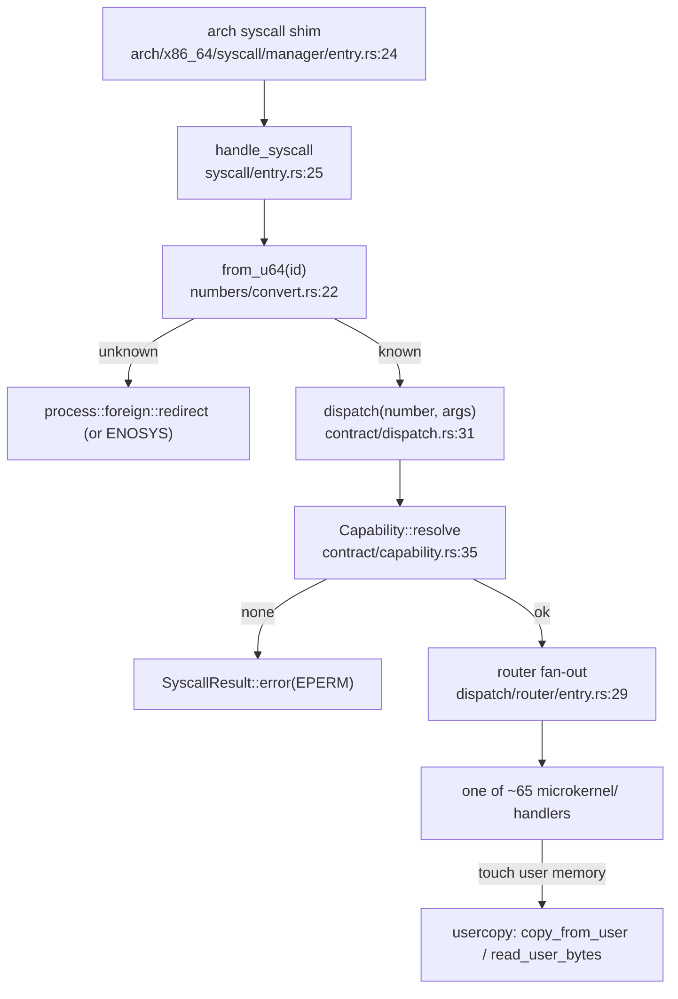

# syscall and usercopy

`src/syscall/` is the kernel's boundary with userland: it defines the syscall numbers, takes the raw register block an architecture shim hands it, resolves the caller's capability for that call (or refuses with `EPERM`), and routes to the handler. `src/usercopy/` is the one safe way those handlers touch user memory: it validates a user pointer, walks the page tables, and copies bytes across the privilege boundary with bounds and access checks.

Every syscall passes through one capability check. A call whose capability does not resolve is denied before any handler runs.

## One call, one capability check



An architecture shim (outside this module) calls `handle_syscall` with the number and the six argument registers. The number is mapped to a `SyscallNumber`; an unknown number is parked for the caller's supervisor as a foreign frame, or answered `ENOSYS`. A known number goes to `dispatch`, which resolves the caller's capability and refuses with `EPERM` if it does not resolve, then routes to one of the per-syscall handlers. Handlers that read or write user buffers do so only through `usercopy`.

## syscall subtree

```
src/syscall/
  entry.rs          handle_syscall: the shim entry, validates and accounts
  numbers/          defs.rs (SyscallNumber, 130 of them), convert.rs (from_u64)
  contract/         dispatch.rs (the single dispatch), capability.rs (resolve), args.rs
  dispatch/         router/ (fan-out), crypto/, audit/, helpers
  microkernel/      ~65 handler files: app_install, attest, dma, pci, store_*, tty, ipc/, ...
  caps/, abi/, types/, validation/
```

| Item | Where | What it does |
|---|---|---|
| `handle_syscall` | `src/syscall/entry.rs:25` | The shim entry: validate the id, account, call dispatch. |
| `dispatch` | `src/syscall/contract/dispatch.rs:31` | The single dispatch path; resolves capability or returns `EPERM` (`:32-39`). |
| `struct Capability` | `src/syscall/contract/capability.rs:30` | The per-call resolved capability. |
| `Capability::resolve` | `src/syscall/contract/capability.rs:35` | Resolve the caller's token against the syscall. |
| `struct SyscallArgs` | `src/syscall/contract/args.rs:21` | The raw six-register argument block. |
| `enum SyscallNumber` | `src/syscall/numbers/defs.rs:19` | The 130 syscall numbers (FourCC tags, `:20-149`). |
| `from_u64` | `src/syscall/numbers/convert.rs:22` | Map a raw id to a `SyscallNumber` or none. |
| `struct SyscallResult` | `src/syscall/types/result.rs:17` | The result: value, capability consumed, audit required. |
| `handle_syscall_dispatch` | `src/syscall/dispatch/router/entry.rs:29` | Fan out a resolved call to its handler. |

## usercopy

```
src/usercopy/
  copy.rs           copy_from_user / copy_to_user (slices)
  bytes.rs          read_user_bytes / write_user_bytes
  value.rs          typed read_user_value / write_user_value
  string.rs         bounded NUL-terminated string read
  validate.rs       validate_user_read / validate_user_write
  walk/             the page-table walk that backs validation
  buffer.rs, direct.rs, policy.rs, error.rs
```

| Item | Where | What it does |
|---|---|---|
| `copy_from_user` | `src/usercopy/copy.rs:27` | Copy a user slice into the kernel. |
| `copy_to_user` | `src/usercopy/copy.rs:34` | Copy a kernel slice out to user. |
| `read_user_bytes` | `src/usercopy/bytes.rs:27` | Read a user buffer into a `Vec<u8>`. |
| `read_user_value<T>` | `src/usercopy/value.rs:24` | Typed read of a `Copy` value. |
| `read_user_string` | `src/usercopy/string.rs:26` | Bounded NUL-terminated string read. |
| `validate_user_read` / `validate_user_write` | `src/usercopy/validate.rs:26` / `:30` | Check a user range is readable / writable. |
| `enum UsercopyError` | `src/usercopy/error.rs:20` | The shared failure type. |

## Wiring

- **syscall** is called by the per-architecture shim (`arch/x86_64/syscall/manager/entry.rs:24`), and calls into [capabilities](capabilities.md) (the token resolver), [ipc](ipc.md) (the IPC handlers), [usercopy](#usercopy) (every handler that touches user memory), [process](process.md) (accounting, current pid, and foreign redirect for unknown numbers), [memory](memory.md), [hardware](hardware.md) (the dma/pci/device handlers) and [security](security.md).
- **usercopy** is the shared helper every syscall handler uses to touch user memory; it calls into [memory](memory.md) for the page-table walk and [process](process.md) for the current address space. [memory](memory.md)'s own `api.rs` also calls `copy_from_user`.

## See also

- [System calls](../kernel/syscalls.md) and the [syscall ABI](../abi/syscalls.md): the behavior and the published numbers.
- [capabilities](capabilities.md): what `resolve` checks against.
- [ipc](ipc.md): the message-passing handlers dispatch routes to.
- [Capabilities](../abi/capabilities.md): the capability bits as published.
