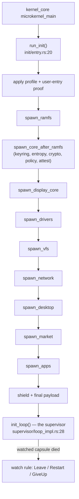

# userspace

`src/userspace/` is the microkernel runtime's top: the init bootstrap that starts every capsule in a fixed order and supervises them, plus a kernel-side mirror for each userland capsule (its signed embedded bytes, its spawn entry, its liveness state). The real capsule binaries live under `userland/<name>/`; this module is the in-kernel half that knows how to start and watch them.

`run_init` is where the running system becomes a desktop: it starts ramfs, the core services, the display, the drivers, the filesystem, the network, the desktop and the apps, in that order, and then never returns — it becomes the supervisor loop.

## The init order



The order is fixed (`init/entry.rs:20-48`): ramfs first so there is a filesystem, then the core services, the display core, the drivers, the VFS, the network, the desktop, the market and the apps, then shield and the final payload. Then `init_loop` takes over as the supervisor: when a capsule on the watch list dies, the watch rule decides whether to leave it, restart it, or give up.

## The subtree

```
src/userspace/
  mod.rs, apps.rs, network.rs
  init/
    entry.rs            run_init: the fixed-order bringup, then init_loop
    spawn_plan/         the ordered stages: ramfs, core, display, drivers, vfs, network, desktop, market, apps
    supervisor/         watch_rule (WATCHED, the 30 watched names), loop_impl (init_loop), watch, tick
    capsule_boot/, instance_spawn/ (runtime app spawn), app_choice/, linux_jobs/
  tool_capsules/        the command-line tools: spec, registry, run, embed_macro
  capsule_<name>/       ~90 kernel-side mirrors: each with mod, embed, spawn, state
```

## Key items

| Item | Where | What it does |
|---|---|---|
| `run_init` | `src/userspace/init/entry.rs:20` | The fixed-order capsule bring-up, then the supervisor loop; never returns. |
| `run_init` re-export | `src/userspace/mod.rs:77` | The entry `kernel_core` calls. |
| `spawn_ramfs` … `spawn_market` | `src/userspace/init/spawn_plan/orchestrator.rs:17-62` | The ordered bring-up stages. |
| `WATCHED` | `src/userspace/init/supervisor/watch_rule.rs:28` | The 30 capsules init restarts (drivers, apps, setup excluded). |
| `is_watched` / `next` | `src/userspace/init/supervisor/watch_rule.rs:61` / `:85` | Whether a name is watched; the Leave/Restart/GiveUp decision. |
| `init_loop` | `src/userspace/init/supervisor/loop_impl.rs:28` | The never-returning supervisor loop. |
| `request` (runtime app) | `src/userspace/init/instance_spawn/request.rs:23` | Queue a runtime app spawn. |

## Wiring

- **Reached from:** [kernel_core](kernel-core.md) `microkernel_main`, which creates the init process and calls `run_init`.
- **Calls into:** [services](services.md) (the lifecycle `CapsuleState`/`Supervised` and endpoint registration), [process](process.md) (the process table, priorities, and the `sched` yield), [elf](elf.md) (loading each capsule), [sys](support.md#sys) (`boot_log`), and [interrupts](interrupts.md) (the IRQ guard).
- **Is the top of userland bring-up:** everything a user sees — the desktop, the apps, the network — is started from here, in the order above.

## See also

- [Processes and capsule spawn](../kernel/processes-and-spawn.md) and [The capsule model](../userland/README.md): the behavior side.
- [services](services.md): the registry and restart primitives init drives.
- [kernel_core](kernel-core.md): what calls `run_init`.
- [Linux personality](../userland/linux-personality.md): the `capsule_linux` mirror started here.
