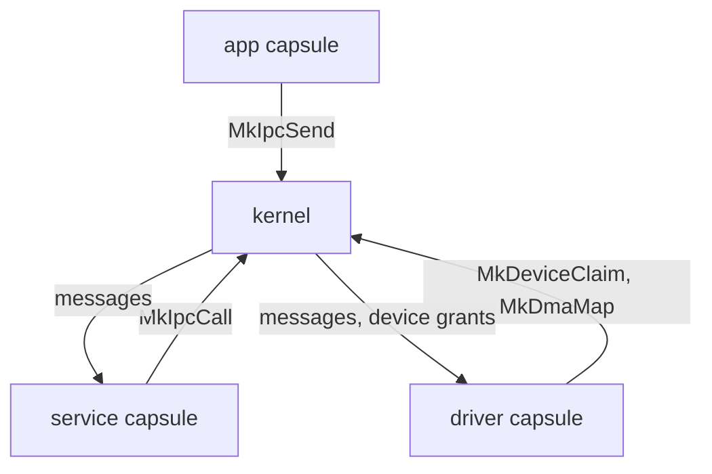

# The kernel

Start here to see what the NONOS kernel does in ring 0, what it leaves to [capsules](../overview/glossary.md#capsule) in ring 3, where each part lives in `src/`, and which page explains it.

## What ring 0 does

NONOS is a [capability](../overview/glossary.md#capability) microkernel written in Rust. The kernel is the one program that runs in ring 0, and it keeps to these jobs:

- It takes over from the bootloader at `_start`, a few lines of assembly that call `kernel_entry` with a pointer to the [boot handoff](../overview/glossary.md#boot-handoff) structure (`src/arch/x86_64/asm/start.S:10-45`, `src/nonos_main.rs:50-95`).
- It owns physical memory, page tables and every process's address space.
- It schedules processes and threads on every CPU.
- It verifies a capsule before it runs, then creates the process with the [capability word](../overview/glossary.md#capability-word) its signed [manifest](../overview/glossary.md#manifest) and its spawn site allow. The spawn site is the code that asks for the capsule: its [kernel mirror](../overview/glossary.md#kernel-mirror) for a capsule built into the image, or the caller of `MkCapsuleLoad` for one installed later ([Processes and capsule spawn](processes-and-spawn.md#where-capsules-come-from)).
- It routes IPC messages between [inboxes](../overview/glossary.md#inbox) and checks who may send to whom.
- It checks the caller's [capability token](../overview/glossary.md#capability-token) on every system call it knows.
- It hands devices to [driver capsules](../overview/glossary.md#driver-capsule) through the [hardware broker](../overview/glossary.md#hardware-broker): claims, register windows, DMA buffers, port I/O and interrupts, each revocable.
- It reads the ACPI tables, scans PCI, and brings up the [IOMMU](../overview/glossary.md#iommu) where there is one it drives.
- It keeps time, writes the kernel log, and stops the machine cleanly on a fatal error.

## What ring 0 does not do

- Device drivers run as ring 3 capsules: disks, network cards, Wi-Fi, USB, input, audio and the GPU. The kernel side of each, under `src/hardware`, is its spawn site and an IPC client. What stays in ring 0 is platform code: the PCI scan and the virtio-rng entropy probe, `virtio_rng`, in `src/drivers` (`src/drivers/mod.rs:17-27`), the [TPM](../overview/glossary.md#tpm) transport under `src/security/tpm`, the [serial console](../overview/glossary.md#serial-console) under `src/sys/serial`, and the interrupt controllers, clocks and ACPI power button under `src/arch`.
- Services run as capsules too: the network stack, the file system service, crypto, the keyring. `src/services` keeps only capability bits in `caps`, liveness state in `lifecycle` and the [endpoint](../overview/glossary.md#endpoint) registry (`src/services/mod.rs:17-26`). The kernel is often a client of those services: the hash, cipher, HMAC, HKDF and X25519 system calls are sent on to the `crypto` capsule over IPC by `round_trip` (`src/security/crypto_capsule/client/transport.rs:38-54`). One store stays in ring 0: the encrypted [data volume](../overview/glossary.md#data-volume), in `src/fs`, as [Architecture](../overview/architecture.md#kernel-in-ring-0) says.
- The kernel does not speak the Linux system call ABI. A Linux program's calls reach a supervising capsule, which answers them; unknown numbers from any other process get `ENOSYS` from `syscall_handler` (`src/arch/x86_64/syscall/manager/entry.rs:38-53`).
- Only x86_64 is a release target. A build for any other architecture, aarch64 and riscv64 included, stops at `compile_error` unless it turns on the `nonos-arch-preview` feature (`src/lib.rs:28-35`).

An app capsule reaches a service capsule, and a service reaches a driver capsule, only through the kernel's IPC. A device is held by the one driver capsule that claimed it. The pages below describe each part.

## Kernel pages

Read them in order for the whole story, from the bootloader's jump to a fatal stop, or go straight to the part you need.

### Boot and memory

- [Boot handoff](boot-handoff.md): what the bootloader passes, what the kernel checks, and the order it starts in.
- [Memory and paging](memory-and-paging.md): address spaces, page tables, hardware protections and copies to and from user memory.
- [Frame allocator](frame-allocator.md): which physical memory the kernel uses and how it hands out frames.

### Running processes

- [Scheduler and SMP](scheduler-and-smp.md): the one shared run queue, priorities and starting every other CPU.
- [Timers](timers.md): clocks, the scheduler tick and the time calls.
- [Futex](futex.md): sleeping until a word in user memory changes.
- [System calls](syscalls.md): the entry path, the dispatch and how many calls there are.
- [Capabilities](capabilities.md): the bits, the token and the check on every NONOS system call.
- [IPC](ipc.md): inboxes, endpoints, limits and who may send to whom.
- [Processes and capsule spawn](processes-and-spawn.md): the [spawn gate](../overview/glossary.md#spawn-gate), the ELF loader, exit and reaping.

### Devices

- [PCI and ACPI](pci-and-acpi.md): the firmware tables and the PCI scans.
- [Hardware broker](hardware-broker.md): claims, MMIO, DMA, port I/O, PCI configuration and interrupts.
- [IOMMU](iommu.md): VT-d, AMD-Vi and what DMA is confined.

### When something goes wrong

- [Logging](logging.md): the kernel log, its tags, and how to read it with or without a serial port.
- [Panic and boot stop](panic-and-boot-stop.md): what the kernel does on a fatal error and what you can do next.

## A map of src

`src/` holds 27 folders and two files. `src/lib.rs` declares 26 of the folders as modules, from `arch` to `userspace` (`src/lib.rs:58-83`); `src/nonos_time` is not declared, so it is not compiled. `src/nonos_main.rs` holds `kernel_entry`. The file and line counts are of the `.rs` files in each folder at this commit.

| Folder | Files | Lines | What it holds |
|---|---:|---:|---|
| `src/arch` | 1567 | 77576 | Architecture code: x86_64, the aarch64 preview and a riscv64 backend that does not build into a kernel. Syscall entry, ACPI, VT-d and AMD-Vi units, interrupt controllers, paging. |
| `src/boot` | 61 | 3235 | The handoff from the bootloader, early init order, boot stop and panic screens. |
| `src/bus` | 19 | 1153 | The first PCI scan, BAR assignment for unassigned endpoints, AER reports. |
| `src/capabilities` | 72 | 3754 | The capability list, the bit helpers and the capability token. |
| `src/context` | 5 | 304 | Execution context records, used by `src/usercopy`. |
| `src/crypto` | 318 | 23569 | Hashes, ciphers, signatures, post-quantum code and the random source. |
| `src/drivers` | 118 | 8833 | The full PCI scan and config access, VMD, driver safety helpers, the virtio-rng probe. |
| `src/elf` | 289 | 11424 | ELF parsing and loading, relocation, ASLR. |
| `src/entry` | 4 | 178 | The out of memory handler, the VGA fallback and the security status line. |
| `src/fs` | 309 | 20237 | Ramfs, the VFS, block and encrypted file systems, procfs, file descriptors. |
| `src/hardware` | 464 | 21127 | The hardware broker, and the kernel side of each driver capsule. |
| `src/interrupts` | 112 | 5325 | The IDT, APIC and PIC handling, interrupt service routines, the timer interrupt. |
| `src/ipc` | 26 | 2132 | Inboxes, the message envelope and the router, plus a pipe module that nothing calls to create a pipe. |
| `src/kernel_core` | 125 | 5972 | The boot sequence, capsule spawn and the graphics surface registry. |
| `src/log` | 19 | 985 | The kernel log and its backends. |
| `src/memory` | 642 | 29095 | Physical and virtual memory, paging, the heap, DMA allocators, [IOMMU domains](../overview/glossary.md#iommu-domain), the boot nonce, the KASLR slide code that nothing calls, memory encryption. |
| `src/nonos_time` | 7 | 420 | Not compiled. |
| `src/process` | 259 | 16535 | The process table, address spaces, the scheduler, exit, signals, Linux guests. |
| `src/sched` | 2 | 93 | A re-export layer over `src/process/scheduler`. |
| `src/security` | 419 | 23531 | Capsule attestation, manifest checks, the trust anchor, the boot session, the TPM transport. |
| `src/services` | 28 | 1438 | The service endpoint registry, [peer lists](../overview/glossary.md#peer-list) and capsule liveness. |
| `src/smp` | 65 | 4176 | Starting the other CPUs, IPIs and per CPU data. |
| `src/sys` | 156 | 6843 | The serial console, GDT and IDT setup, APIC helpers, clock, diagnostics, boot benchmarks. |
| `src/syscall` | 286 | 14644 | The syscall ABI registry, the capability contract, the dispatch and the handlers. |
| `src/time` | 4 | 197 | Elapsed time since boot from the CPU counter. |
| `src/usercopy` | 19 | 896 | Checked copies between user and kernel memory. |
| `src/userspace` | 364 | 16457 | The kernel side of every capsule the boot spawns: embedded bytes, spawn entry and liveness. |

The note at the top of `src/userspace` states the rule for that folder: no protocol logic lives in the kernel, only what spawning a capsule needs, with the applications declared in `apps` (`src/userspace/mod.rs:16-29`).

## See also

- [Architecture](../overview/architecture.md): the whole system in one diagram.
- [The capsule model](../userland/README.md): what runs in ring 3.
- [Driver model](../drivers/README.md): drivers as capsules.
- [Security](../security/README.md): the boot chain and what the kernel protects.
- [ABI](../abi/README.md): the system calls, errors and capabilities as published.
- [x86_64](../architectures/x86_64.md): the release architecture.
