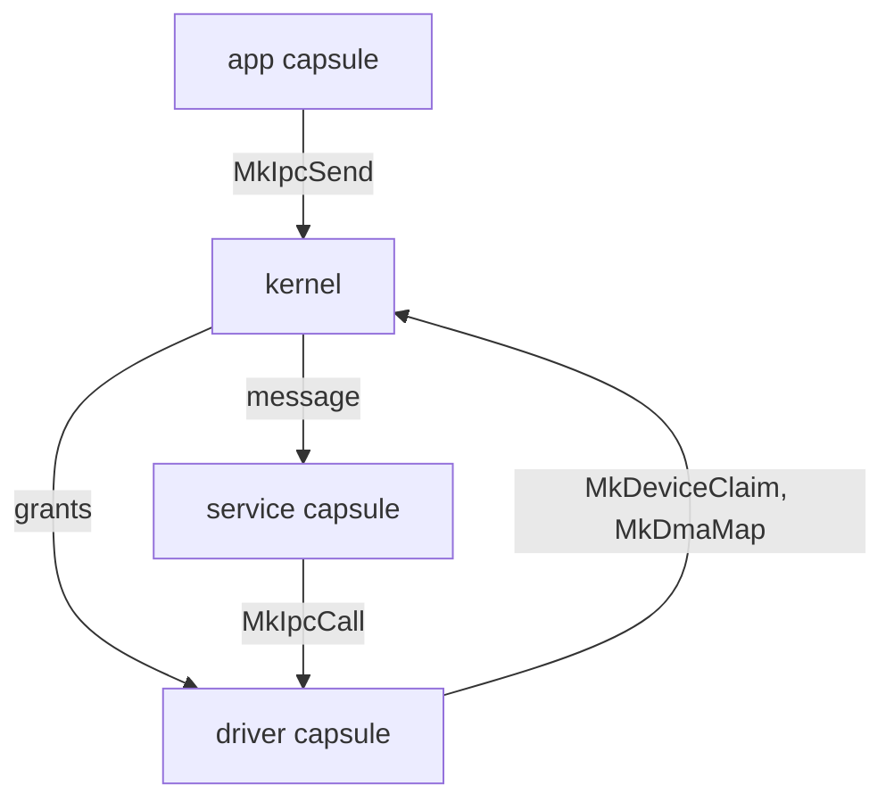

# The kernel

Start here to see what the NONOS kernel does in ring 0, what it leaves to [capsules](../overview/glossary.md#capsule) in ring 3, where each part lives in `src/`, and which page explains it.

## What ring 0 does

NONOS is a [capability](../overview/glossary.md#capability) microkernel written in Rust. The kernel is the one program that runs in ring 0, and it keeps to these jobs:

- It takes over from the bootloader at `kernel_entry`, with a pointer to the handoff structure (`src/nonos_main.rs:50-95`).
- It owns physical memory, page tables and every process's address space.
- It schedules processes and threads on every CPU.
- It verifies a capsule before it runs, then creates the process with the capabilities its signed [manifest](../overview/glossary.md#manifest) declares.
- It routes IPC messages between [inboxes](../overview/glossary.md#inbox) and checks who may send to whom.
- It checks the caller's [capability token](../overview/glossary.md#capability-token) on every system call.
- It hands devices to driver capsules through the [hardware broker](../overview/glossary.md#hardware-broker): claims, register windows, DMA buffers, port I/O and interrupts, each revocable.
- It reads the ACPI tables, scans PCI, and brings up the IOMMU where there is one it drives.
- It keeps time, writes the kernel log, and stops the machine cleanly on a fatal error.

## What ring 0 does not do

- Device drivers run as ring 3 capsules: disks, network cards, Wi-Fi, USB, input, audio and the GPU. The kernel side of each, under `src/hardware`, is its spawn site and an IPC client. The drivers that stay in ring 0 are platform pieces: the virtio-rng entropy probe, `virtio_rng`, beside the PCI code in `src/drivers` (`src/drivers/mod.rs:17-27`), the TPM transport under `src/security/tpm`, and the serial console under `src/sys/serial`.
- Services run as capsules too: the network stack, the file system service, crypto, the keyring. `src/services` keeps only capability bits in `caps`, liveness state in `lifecycle` and the [endpoint](../overview/glossary.md#endpoint) registry (`src/services/mod.rs:17-22`).
- The kernel does not speak the Linux system call ABI. A Linux program's calls reach a supervising capsule, which answers them; unknown numbers from any other process get `ENOSYS` from `syscall_handler` (`src/arch/x86_64/syscall/manager/entry.rs:38-53`).
- Only x86_64 is a release target. A build for any other architecture, aarch64 and riscv64 included, stops at `compile_error` unless it turns on the `nonos-arch-preview` feature (`src/lib.rs:28-35`).

An app capsule reaches a service capsule, and a service reaches a driver capsule, only through the kernel's IPC, and a device is held by the one driver capsule that claimed it. The pages below describe each part.

## Kernel pages

- [Boot handoff](boot-handoff.md): what the bootloader passes and how the kernel takes over.
- [Memory and paging](memory-and-paging.md): address spaces, page tables and the kernel map.
- [Frame allocator](frame-allocator.md): physical memory.
- [Scheduler and SMP](scheduler-and-smp.md): run queues, priorities and the other CPUs.
- [Futex](futex.md): sleeping until a word in user memory changes.
- [IPC](ipc.md): inboxes, endpoints, limits and who may send to whom.
- [Capabilities](capabilities.md): the bits, the token and the check on every system call.
- [System calls](syscalls.md): the entry path, the dispatch and how many calls there are.
- [Processes and capsule spawn](processes-and-spawn.md): the spawn gate, the ELF loader, exit and reaping.
- [IOMMU](iommu.md): VT-d, AMD-Vi and what DMA is confined.
- [Hardware broker](hardware-broker.md): claims, MMIO, DMA, port I/O, PCI configuration and interrupts.
- [PCI and ACPI](pci-and-acpi.md): the firmware tables and the PCI scans.
- [Timers](timers.md): clocks and the timer interrupt.
- [Logging](logging.md): the kernel log and the serial console.
- [Panic and boot stop](panic-and-boot-stop.md): what happens on a fatal error.
