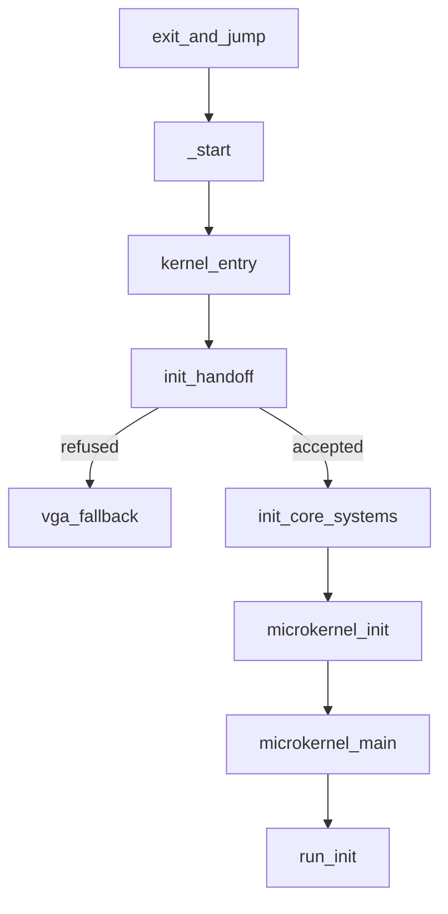

# Boot handoff and kernel init

How control passes from the NONOS bootloader to the x86_64 kernel, what the kernel checks before it trusts what it was given, and the order it brings itself up in until the first [capsule](../overview/glossary.md#capsule) runs.

## The last steps of the bootloader

The loader's `exit_and_jump` does the transfer. While UEFI boot services can still hand out page-table frames, it builds the kernel's page tables with `build_kernel_pml4` (`nonos-bootloader/src/handoff/exit/orchestrate.rs:72`). Those tables hold an identity map of low physical memory and of the framebuffer, a linear map of physical memory at `PML4[256]` (the [directmap](../overview/glossary.md#directmap)), and the kernel image in the upper half, in the order `build_kernel_pml4` adds them (`nonos-bootloader/src/paging/build.rs:45-62`). The identity window is `IDENTITY_LOW_BYTES`, 64 GiB (`nonos-bootloader/src/paging/constants.rs:43`).

The boot stack and the handoff structure are passed as directmap addresses, not physical ones, through `phys_to_directmap_virt` (`nonos-bootloader/src/handoff/exit/orchestrate.rs:86-93`). The kernel later removes the identity window, and a directmap address stays valid on both sides of that change.

The loader then calls `exit_boot_services`, copies the final UEFI memory map with `copy_memory_map` and records it in the handoff (`nonos-bootloader/src/handoff/exit/orchestrate.rs:102-106`). It loads the new page tables with `switch_to_kernel_pml4` (`nonos-bootloader/src/handoff/exit/orchestrate.rs:115`). Before the jump, `validate_and_jump` checks the entry, stack and handoff addresses (`nonos-bootloader/src/handoff/exit/validate.rs:28-46`). `validate_handoff_address` refuses one that is zero, below 1 MiB, not 8-byte aligned or not canonical (`nonos-bootloader/src/handoff/jump/validate.rs:47-55`), and the loader then halts with code `0xE3` instead of jumping (`nonos-bootloader/src/handoff/exit/validate.rs:38-41`).

The jump itself is `nonos_arch_handoff_jump` (`nonos-bootloader/src/arch/x86_64/asm/handoff_jump.S:33-53`). It masks interrupts, loads the stack pointer, moves the handoff address into `rdi` and the entry address into `rax`, clears every other general register and jumps through `rax`. There is no way back to the loader.

## The handoff structure

The [boot handoff](../overview/glossary.md#boot-handoff) is one `#[repr(C)]` structure, `BootHandoffV1`, defined identically on both sides (`src/boot/handoff/types/handoff.rs:28-46`, `nonos-bootloader/src/handoff/types/handoff.rs:28-47`). Its first fields are `magic`, `version` and `size`. The constants file holds the magic value `0x4E4F4E4F`, the layout version 2 and `MAX_CMDLINE_LEN` (`src/boot/handoff/types/constants.rs:17-19`).

| Field | What it carries |
|---|---|
| `magic`, `version`, `size` | the layout's identity; the kernel compares all three |
| `flags` | the bits in the next table |
| `entry_point` | the kernel entry address the loader jumped to |
| `fb` | the UEFI GOP framebuffer: base, size, width, height, stride in bytes, pixel format, panel size in millimetres |
| `mmap` | pointer, entry size and count of the UEFI memory map copy |
| `acpi`, `smbios` | the ACPI RSDP and the SMBIOS entry point |
| `modules` | pointer and count of loaded modules |
| `timing` | the loader's TSC rate estimate and the UEFI time in Unix milliseconds |
| `meas`, `zk`, `policy` | the boot measurements and verification results the loader recorded |
| `rng` | a 32-byte seed for the kernel random generator |
| `firmware` | device firmware blobs read from the boot medium |
| `cmdline_ptr` | an optional kernel command line |

The `flags` word uses these bits, as listed in the `flags` module (`src/boot/handoff/types/constants.rs:33-54`):

| Bit | Name | Meaning |
|---|---|---|
| 0, 1 | `WX`, `NXE` | always set by the loader |
| 2 to 4 | `SMEP`, `SMAP`, `UMIP` | the CPU has this protection, as the loader detected it |
| 5 | `IDMAP_PRESERVED` | always set: the low identity map is present at entry |
| 6 | `FB_AVAILABLE` | `fb` is valid |
| 7 | `ACPI_AVAILABLE` | `acpi` is valid |
| 8 | `TPM_MEASURED` | the loader found [TPM](../overview/glossary.md#tpm) measured boot active; a failed [PCR](../overview/glossary.md#pcr) 9 extend does not clear it |
| 9 | `SECURE_BOOT` | the loader reports UEFI [Secure Boot](../overview/glossary.md#secure-boot) as on |
| 10 | `ZK_ATTESTED` | the loader reports the [attestation](../overview/glossary.md#attestation) proof as verified |
| 11 | `INSTALL_REQUESTED` | the person chose the boot menu's install entry |
| 12 to 15 | `PROFILE_HARDENED`, `PROFILE_SAFE`, `PROFILE_AIR_GAPPED`, `PROFILE_RECOVERY` | the [boot profile](../overview/glossary.md#boot-profile); Standard sets none |

The loader's `build_handoff_flags` sets the framebuffer, ACPI, Secure Boot, attestation, TPM, SMEP, SMAP and UMIP bits from what it found, and sets `WX`, `NXE` and `IDMAP_PRESERVED` on every boot (`nonos-bootloader/src/handoff/prepare/flags.rs:20-57`). The install bit and the profile bits come from the boot menu: `handoff_flag` adds `INSTALL_REQUESTED` (`nonos-bootloader/src/handoff/types/install.rs:45-46`), and the chosen mode adds its `PROFILE_*` bit (`nonos-bootloader/src/menu/types/mode.rs:61-64`).

A few sizes are fixed by the code:

- Each memory map entry is a `MemoryMapEntry`: type, padding, physical start, virtual start, page count and attributes, 40 bytes in all (`src/boot/handoff/types/memory.rs:42-49`). Only entries of type `CONVENTIONAL`, 7, count as usable RAM (`src/boot/handoff/types/memory.rs:25`).
- The `AttestPolicy` block is asserted at build time to be 176 bytes (`nonos-bootloader/src/handoff/types/security.rs:68`).
- The firmware table holds at most `MAX_FIRMWARE_ENTRIES`, 64 (`src/boot/handoff/types/firmware.rs:17`).
- The command line is read up to `MAX_CMDLINE_LEN`, 4096 bytes (`src/boot/handoff/types/constants.rs:19`). The `cmdline` reader returns nothing for a pointer above 48 bits or for a control byte other than tab, line feed or carriage return (`src/boot/handoff/types/handoff.rs:79-112`).

## What the kernel checks

`init_handoff` accepts the handoff once and checks it in this order (`src/boot/handoff/api/init.rs:40-72`):

1. The pointer is non-zero, 8-byte aligned and canonical.
2. `magic`, `version` and `size` match this kernel's `BootHandoffV1` exactly.
3. Three pointers fit in 48 bits, the `MAX_PHYS_PTR` limit (`src/boot/handoff/api/init.rs:28`): the framebuffer when `FB_AVAILABLE` is set, the memory map, and the RSDP when `ACPI_AVAILABLE` is set. Otherwise the result is `InvalidData` (`src/boot/handoff/api/init.rs:74-85`).
4. `validate_security` runs four checks (`src/boot/handoff/api/security/orchestrator.rs:21-27`). The random seed must not be all zero, or the result is `WeakEntropy` (`src/boot/handoff/api/security/entropy.rs:20-25`). When a memory map is present, its entry size must equal the kernel's own, or the result is `MemoryMapEntrySize` (`src/boot/handoff/api/security/memory_map.rs:26-28`). When `FB_AVAILABLE` is set, the framebuffer needs a non-zero width, height and stride, a stride of at least one row of pixels, and a frame that fits its size, or the result is `FramebufferGeometry` (`src/boot/handoff/api/security/framebuffer.rs:20-47`). The entry point must lie inside the 256 MiB `KERNEL_IMAGE_WINDOW` above `KERNEL_BASE`, or in the low half above 1 MiB (`src/boot/handoff/api/security/entry_point.rs:24-36`).
5. A second call fails with `AlreadyInitialized`.

Each failure is one `HandoffError` with a fixed text, such as `Invalid handoff magic value` or `Bootloader entropy seed is all zero` (`src/boot/handoff/api/error/handoff_error.rs:20-47`). A version or size mismatch is a refusal, so a loader and a kernel built for different handoff versions do not boot together.

On failure `kernel_entry` prints `[NONOS] Handoff FAIL` and `[NONOS] Handoff ERR:` with the error text on the [serial console](../overview/glossary.md#serial-console), then calls `vga_fallback` (`src/nonos_main.rs:79-88`). `vga_fallback` writes `NONOS <version> <channel> - No framebuffer available` into the legacy VGA text buffer at `0xB8000` and halts (`src/entry/fallback.rs:14-43`). The panic handler's comment says the VGA text buffer is invisible on UEFI machines, which is why the handler also calls `panic_screen` (`src/boot/panic/handler.rs:54-57`). A refused handoff has no such step: its only mark on the framebuffer is the breadcrumb segment described below. What a given panel shows here was not tested on hardware in this release. See [panic and boot stop](panic-and-boot-stop.md).

## Kernel entry

The kernel image is entered at `_start` (`src/arch/x86_64/asm/start.S:10-45`). It masks interrupts, writes `NX64` to the COM1 port `0x3F8`, resets the x87 unit, sets CR0 and CR4 for SSE, aligns the stack and calls `kernel_entry`.

`kernel_entry` (`src/nonos_main.rs:52-95`) paints the first breadcrumb, writes `R` to COM1, starts the serial console, validates the handoff, runs `init_core_systems`, prints the security status and enters the microkernel.

The breadcrumbs are a strip of segments along the top of the framebuffer, each 180 pixels wide and 10 pixels tall with 20 pixels between them, written by `paint` straight to the framebuffer through the loader's mapping (`src/boot/entry_marker.rs:25-35`). The module's header says what `paint` is for: a machine with no serial console, where the strip records how far the kernel got before any other output exists (`src/boot/entry_marker.rs:17-35`). `paint` checks every geometry field first, since it may be handed the raw, unchecked handoff (`src/boot/entry_marker.rs:37-47`).

| Segment | Value written | When |
|---|---|---|
| 0 | `0xFFFF8000` | first instruction path of `kernel_entry` |
| 0 | `0xFFFF0000` | the handoff was refused |
| 0 | `0xFF00FFFF` | the handoff was accepted |
| 1 | `0xFFFFD000` | `init_core_systems` returned and the security status was printed |

`paint` writes the value as it is, without converting it to the panel's pixel format, so the colour seen depends on that format. Read the segment's position, then its colour.

After `init_core_systems`, `log_security_status` prints whether the kernel signature was verified and whether Secure Boot is on. It feeds the 32-byte seed to the kernel random generator through `seed_from_bootloader`, then `wipe_boot_seed` overwrites the seed in the handoff page (`src/entry/security.rs:37-47`, `src/boot/handoff/api/cleanup.rs:31-45`). The seed itself is never printed. The measurements stay readable for the life of the system; only the seed is secret.

## Core systems

`init_core_systems` runs on the boot CPU with interrupts masked until its fifth step (`src/boot/main/core_init/init_core_systems.rs:24-70`):

1. The serial console, the boot timestamp and the clock anchor. See [timers](timers.md).
2. `init_cpu_tables`: the GDT, the SYSCALL registers, an early IDT, the 64 MiB bootstrap heap and the full IDT (`src/boot/main/core_init/cpu_tables.rs:26-48`).
3. `init_acpi_tables`: the RSDP from the handoff, the ACPI parse, the power button, and a TSC calibration against the ACPI PM timer when no rate is known yet (`src/boot/main/core_init/acpi_tables.rs:19-33`). The tables are on [PCI and ACPI](pci-and-acpi.md).
4. The local APIC, the idle-timer fix and the 100 Hz preemption timer. A failure in `install_on_bsp` stops the boot (`src/boot/main/core_init/init_core_systems.rs:42-44`).
5. `sti`, memory encryption detection, the PCI scan, and `init_platform_baseline`: BAR assignment, the device broker, the entropy source, the boot session nonce and the [capability token](../overview/glossary.md#capability-token) signing key (`src/kernel_core/init/platform/baseline.rs:35-61`).

## Microkernel init

`microkernel_init` is an ordered list of stages, each in its own file with the reason for its place (`src/kernel_core/init/entry/microkernel_init.rs:33-89`):

| Stage | What it does |
|---|---|
| `init_boot_entropy` (`src/kernel_core/init/entry/microkernel_init.rs:38`) | draws the per-boot nonce; [memory and paging](memory-and-paging.md) says what reads it |
| `init_arch_memory_and_framebuffer` (`src/kernel_core/init/entry/microkernel_init.rs:39`) | builds the physical allocator from the memory map; see [frame allocator](frame-allocator.md) |
| `init_arch_firmware` (`src/kernel_core/init/entry/microkernel_init.rs:44`) | takes the firmware blob table from the handoff |
| `init_core_services` (`src/kernel_core/init/entry/microkernel_init.rs:45`) | speculation mitigations, the random generator, the [IPC](ipc.md) secret, the boot CPU's SMP record, the scheduler and the clocks |
| `init_vm_and_protection` (`src/kernel_core/init/entry/microkernel_init.rs:46`) | the paging manager, removal of the low identity map, SMEP, SMAP, UMIP, NX, write protect and stack guards; see [memory and paging](memory-and-paging.md) |
| `init_extended_state` (`src/kernel_core/init/entry/microkernel_init.rs:47`) | CPUID, and the SSE and AVX state the kernel owns from here on |
| `init_dma_protection` (`src/kernel_core/init/entry/microkernel_init.rs:52`) | the IOMMU, in kernels built with `nonos-arch-iommu`; see [IOMMU](iommu.md) |
| `run_selftest` (`src/kernel_core/init/entry/microkernel_init.rs:58`) | checks SHA3-256, BLAKE3, ChaCha20-Poly1305 and Ed25519 against known answers |
| `init_platform_baseline` (`src/kernel_core/init/entry/microkernel_init.rs:64`) | already done on x86_64, so it returns at once |
| `init_arch_framebuffer` (`src/kernel_core/init/entry/microkernel_init.rs:74`) | maps the framebuffer now that the paging manager exists |
| `init_device_routing`, `init_process_runtime` (`src/kernel_core/init/entry/microkernel_init.rs:76-77`) | device interrupt routing, then the process tables and the ELF loader |
| `start_secondary_cpus` (`src/kernel_core/init/entry/microkernel_init.rs:85`) | starts every other CPU; see [scheduler and SMP](scheduler-and-smp.md) |

Not every stage stops the boot. `init_core_services`, `init_vm_and_protection` and `init_extended_state` stop it on failure through `fatal`, which calls `boot::stop` for a [boot stop](../overview/glossary.md#boot-stop) (`src/kernel_core/init/entry/fatal.rs:19-22`). A missing boot nonce, an unarmed stack guard and a failed device routing step each print a warning and the boot goes on. A failed self test prints `[CRYPTO-POST] FAIL` with the primitive's name and the boot also goes on: `run_selftest` returns whether all four passed (`src/crypto/application/certification/selftest.rs:43-62`), and `microkernel_init` discards that answer (`src/kernel_core/init/entry/microkernel_init.rs:58`). The full list of steps that stop the boot is on [panic and boot stop](panic-and-boot-stop.md).

## From init to the first capsule

`microkernel_main` runs two refusals first (`src/kernel_core/init/entry/microkernel_main.rs:22-61`). If the person asked to install and the image has no installer, the boot stops with a notice. If the kernel's check of the bootloader refused it or had nothing to check, the boot stops with a notice. Both are on [panic and boot stop](panic-and-boot-stop.md).

It then waits 2500 ms by `uptime_ms` so the boot log can be read (`src/kernel_core/init/entry/microkernel_main.rs:34`), creates the `init` process at `High` priority, gives it an address space and a kernel stack, and calls `run_init`.

`run_init` applies the boot profile and spawns the capsules in a fixed order: the RAM file system, the core services that need it, the display core, the drivers, the virtual file system, the network, the desktop, the marketplace and the apps (`src/userspace/init/entry.rs:20-48`). Afterwards `init` lowers itself to `Low` priority and stays as the supervisor. Spawning is described on [processes and spawn](processes-and-spawn.md).

The boot profile changes what starts. `network` is true only for Standard and Hardened, `minimal` only for Safe Mode, which then starts no audio driver and no optional app, and `skips_setup` only for Recovery (`src/boot/handoff/api/profile.rs:44-57`). The profiles themselves are on [boot modes](../install/boot-modes.md).

## Limits

- The handoff is x86_64 and UEFI only. The aarch64 `kernel_entry` takes a device tree pointer instead (`src/arch/aarch64/boot/entry.rs:31-32`); see [aarch64](../architectures/aarch64.md).
- The CPU count in the kernel's own summary of the handoff is fixed at one by `cpus` (`src/boot/handoff/kernel_handoff/x86_64/builders.rs:43-45`). The real count comes from the ACPI MADT during SMP bring-up.
- The checks above are about structure. Whether the kernel image was signed and attested is decided by the loader, which also measures it into PCR 9 when it finds a TPM measuring; the kernel's later check covers the loader, not the kernel. See [boot chain and signatures](../security/boot-chain-and-signatures.md).

## See also

- [Memory and paging](memory-and-paging.md)
- [Frame allocator](frame-allocator.md)
- [Scheduler and SMP](scheduler-and-smp.md)
- [Timers](timers.md)
- [Logging](logging.md)
- [Panic and boot stop](panic-and-boot-stop.md)
- [PCI and ACPI](pci-and-acpi.md)
- [Boot modes](../install/boot-modes.md)
- [Boot chain and signatures](../security/boot-chain-and-signatures.md)
- [x86_64](../architectures/x86_64.md)
