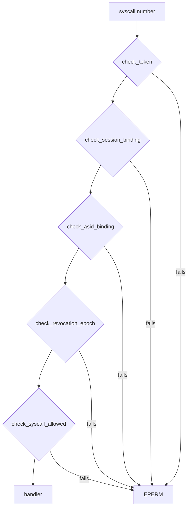

# Capabilities

How the NONOS kernel decides what a process may ask of it: the [capability](../overview/glossary.md#capability) bits, the token each process holds, the check on every system call, and how bits are granted and taken back.

## One definition

The kernel names every capability once, in the `capability_table` list, with the bit it occupies (`src/capabilities/types/defs.rs:17-83`). There are 36, on bits 0 to 35, and `count` is derived from the list so it cannot drift from it (`src/capabilities/types/table.rs:39-43`).

[abi/caps.toml](../../abi/caps.toml) publishes the same bits for toolchains and [capsule](../overview/glossary.md#capsule) authors. Its `[bits]` table, starting at `CORE_EXEC`, is generated from the kernel list by `scripts/gen_caps_abi.py` (`abi/caps.toml:3-6`). The kernel never reads the file; `scripts/check_caps_abi.py` compares the two:

```
$ python3 scripts/check_caps_abi.py
caps-abi: 36 published bits agree with the kernel
```

## The capability word

A [capability word](../overview/glossary.md#capability-word) is a `u64` with one bit per capability. `caps_to_bits` and `bits_to_caps` convert between the word and a list (`src/capabilities/bits.rs:63-71`). The word is what a [manifest](../overview/glossary.md#manifest) declares, what an [endpoint](../overview/glossary.md#endpoint) requires, and what `MkCapGrant` and `MkCapRevoke` take.

Each process control block holds its [capability token](../overview/glossary.md#capability-token) as the source of truth and `caps_bits` as a cached copy of the word (`src/process/caps.rs:17-22`). `has` asks whether a pid holds every bit of a mask and answers no for an unknown pid (`src/process/caps.rs:82-86`).

## What each bit admits

The gates below are read from the cap table: `check` for the microkernel calls (`src/syscall/contract/cap_table/mk.rs:20-224`), and the crypto, admin and graphics tables beside it. `Admin` also passes the gates of `Driver`, `Mmio`, `Irq`, `Dma`, `Pio`, `InputSource`, `SpawnWindow`, `ProcessControl` and `RegisterService`, and of `MkDeviceList`, for example in `can_driver` (`src/capabilities/token/types/authority_broker.rs:24-26`).

| Bit | Kernel name | What it admits |
|---:|---|---|
| 0 | `CoreExec` | `MkGetPid`, `MkArgs`; with `IPC` and `Memory`, `MkCapsuleLoad` and `MkCapsuleVerify`. |
| 1 | `IO` | Nothing. The kernel list marks it as enforcing nothing. |
| 2 | `Network` | Reaching the network services. Removed on offline boots. A holder is refused `MkAttestDoc`. |
| 3 | `IPC` | The eight IPC calls, `MkThreadSpawn`, `MkWait`, `MkKill`, `MkProcOutput`, `MkProcInput`, `MkStdinRead`, `MkStdoutWrite`, `MkPrivateWrite`, `MkToolRun`, `MkTtySet`. |
| 4 | `Memory` | `MkMmap`, `MkMunmap`. |
| 5 | `Crypto` | The 12 crypto calls, `CRND` to `CMKY`. |
| 6 | `FileSystem` | `MkDataStat`, `MkDataRead`; with `StoreWrite`, `MkDataImport` and `MkDataPassphrase`. |
| 7 | `Hardware` | Nothing. The kernel list marks it as enforcing nothing. |
| 8 | `Debug` | `MkDebug`. |
| 9 | `Admin` | `AdminReboot`, `AdminShutdown`, `AdminPolicyPush`, `MkCapGrant`, `MkCapRevoke`, and the stand in role above. |
| 10 | `RegisterService` | Claiming one of the run time service names. |
| 11 | `GraphicsDisplayQuery` | `GraphicsDisplayDimensions`, `MkDisplayVsyncWait`. |
| 12 | `GraphicsSurfaceCreate` | `MkSurfaceRegister`, `MkSurfaceShare`, `MkSurfaceRelease`. |
| 13 | `GraphicsSurfaceMap` | `MkSurfaceAttach`. |
| 14 | `GraphicsPresent` | `MkSurfacePresent`. |
| 15 | `DeviceEnum` | `MkDeviceList`, `MkInstallSource`. |
| 16 | `Driver` | `MkDeviceClaim`, `MkDeviceRelease`, `MkPciConfigRead`, `MkPciConfigWrite`. |
| 17 | `Mmio` | `MkMmioMap`, `MkMmioUnmap`. |
| 18 | `Irq` | `MkIrqBind`, `MkIrqUnbind`, `MkIrqAck`, `MkIrqPoll`, `MkIrqWait`, and posting input with `MkInputEventPost`. |
| 19 | `Dma` | `MkDmaMap`, `MkDmaUnmap`. |
| 20 | `Pio` | `MkPioGrant`, `MkPioRead`, `MkPioWrite`, `MkPioRelease`. |
| 21 | `InputSource` | `MkInputEventPost`, `MkInputEventDrain`, `MkInputEventWait`. |
| 22 | `TimeSet` | `MkTimeAdjust`. `Admin` does not stand in for it. |
| 23 | `SpawnBroker` | Naming another live pid as the parent of a capsule load. |
| 24 | `SpawnWindow` | `MkSpawnInstance`. |
| 25 | `ProcessControl` | `MkKill` on a process the caller does not parent, and every field of other processes in `MkProcStat`. |
| 26 | `StoreWrite` | `MkStoreWrite`, `MkStoreRead`; with `FileSystem`, the data import calls. |
| 27 | `EnrolDevRoot` | `MkDevRootRequest`, `MkDevRootConfirm`, `MkDevRootLocal`, `MkLocalConsent`, `MkLocalRestore`. `Admin` does not imply it. |
| 28 | `Keyring` | Reaching the keyring capsule; the kernel side checks it in `gate_caller` (`src/security/keyring_capsule/capability.rs:26-34`). |
| 29 | `Entropy` | Drawing from the entropy capsule; the kernel side checks it in `gate_read` (`src/security/entropy_capsule/capability.rs:23-32`). |
| 30 | `AppInstall` | `MkAppInstall`, `MkAppLaunch`, `MkAppInstallStatus`, `MkAppUninstall`. |
| 31 | `AttestRead` | `MkAttestEntries`, `MkLogTail`, every field of other processes in `MkProcStat`; `MkAttestDoc` only without `Network`. |
| 32 | `ForeignExec` | The 15 `MkForeign` and `MkPeer` calls that host a Linux guest, and `MkLocalVerify`. |
| 33 | `LocalSign` | `MkLocalSign`. |
| 34 | `StreamImport` | `MkDataFeedBegin`, `MkDataFeed`, `MkDataRemove`. |
| 35 | `DeviceSecret` | `MkDeviceSecret`, `MkBootSlots`, `MkEnroll`. |

Some calls need only a valid token: `MkExit`, `MkPidAlive`, `MkYield`, the futex and time reads, `MkBatteryStatus`, `MkProcStat`, `MkAttestStatus`, `MkAttestPolicy`, `MkBootAttest` and `MkCapCheck`, listed together under `is_valid` (`src/syscall/contract/cap_table/mk.rs:22-35`). A valid token is one that has not expired and grants at least one capability, as `is_valid` reads (`src/capabilities/token/types/query.rs:44-47`). `MkSetTls` needs the same, since it changes nothing outside the caller (`src/syscall/contract/cap_table/mk.rs:98-102`). `MkTtyQuery` admits every caller whose token passed the resolver (`src/syscall/contract/cap_table/mk.rs:220`). `MkProcStat` shows a caller without `AttestRead` or `ProcessControl` only the identity and state of other processes, as `sees_all` decides (`src/syscall/microkernel/procstat_redact.rs:29-34`).

Two refusals are written into the predicates themselves. `can_attest_doc` refuses a caller that holds `Network`, because a TPM quote names the machine for good (`src/syscall/caps/checks/system.rs:42-47`). `can_input_consumer` leaves out `Irq`, so a device driver may post input but not read the keystroke stream (`src/capabilities/token/types/authority_broker.rs:64-73`).

## The token

Each process holds one `CapabilityToken`: the owning module id, the list of capabilities, an optional expiry, a nonce, a 64 byte signature, and the authority fields token id, subject pid, subject ASID, measurement, boot session nonce, revocation epoch and delegation depth (`src/capabilities/token/types/defs.rs:22-39`).

`new_token` mints a process token with no expiry, bound to the pid, its address space id, the boot session nonce and the process's current revocation epoch, and signs it (`src/process/caps.rs:38-59`). The mint fails closed: `new_token` returns `None` until the boot session nonce exists, so no token is bound to a zero nonce (`src/process/caps.rs:24-26`).

The token's `signature` field is a message authentication code, not a public key signature: `mac64` over the 128 byte `token_material`, two keyed BLAKE3 hashes, one of the material and one of the material followed by `CAP2` (`src/capabilities/token/material.rs:41-52`). Only the kernel holds the key, so only the kernel can make or check one. The key is 32 bytes drawn from the random source at boot by `init_token_signing_key`, which halts the boot if the draw fails (`src/kernel_core/init/platform/token_signing_key.rs:19-31`); `set_signing_key` refuses a second key (`src/capabilities/token/signing_key.rs:21-33`).

The `[token]` and `[mac]` tables of `abi/caps.toml` describe a different design, a SHA3-256 MAC under the context `NONOS_CAP_V1` (`abi/caps.toml:58-70`). Nothing under `src/` uses that context; the kernel token is the keyed BLAKE3 one above.

## The check on every system call



Every architecture's syscall entry calls the same `dispatch`, which runs `Capability::resolve` and returns `EPERM` when it fails (`src/syscall/contract/dispatch.rs:25-40`). A refusal is also logged as a `[CAP-DENY]` line with the pid and the call, from `log_deny` (`src/syscall/contract/dispatch.rs:42-46`).

`resolve` reads the calling process's token and builds the context from its address space id, the boot session nonce and its revocation epoch (`src/syscall/contract/capability.rs:35-46`). It then runs five checks, in the order `resolve` lists them (`src/syscall/contract/resolver/resolve.rs:31-43`):

1. `check_token`: the signature verifies, the token has not expired, and its module id and nonce are not on the revocation list (`src/syscall/contract/resolver/check_token.rs:21-32`).
2. `check_session_binding`: the boot session nonce is set and equals the token's, compared in constant time (`src/syscall/contract/resolver/check_session.rs:23-32`).
3. `check_asid_binding`: the token names the address space the caller runs in (`src/syscall/contract/resolver/check_asid.rs:22-30`).
4. `check_revocation_epoch`: the token is not older than the process's revocation epoch (`src/syscall/contract/resolver/check_epoch.rs:22-30`).
5. `check_syscall_allowed`: the cap table admits this call for this token (`src/syscall/contract/resolver/check_syscall.rs:23-31`).

The cap table is total. `is_allowed` asks the crypto, admin, microkernel and graphics tables in turn and refuses any call none of them claims (`src/syscall/contract/cap_table/mod.rs:27-34`). Only `resolve` can build the witness type `Capability` (`src/syscall/contract/capability.rs:23-32`), and `dispatch` calls the handler only once it holds one; it does not pass the witness on to the handler at this commit (`src/syscall/contract/dispatch.rs:31-40`).

Some handlers check again. `sys_cap_grant` asks for `Admin` once more and for every bit it hands on (`src/syscall/microkernel/capability/handlers.rs:42-47`).

## Granting and revoking

- At spawn, `install_spawn` installs the mask from the verified manifest, once; a second call is refused (`src/process/caps.rs:110-122`). The mask never comes from the spawn site's `requested_caps`, which is only an upper bound for optional bits (`src/kernel_core/process_spawn/capsule_spawn/runner/verified.rs:25-27`). The word is every required bit plus the optional bits the spawn site asked for, as `install_caps` computes, and both sets must lie under the `allowed_caps_ceiling` of the publisher's identity certificate, which `within_ceiling` checks (`src/security/capsule_manifest/verify/caps_bits.rs:26-47`). A spawn site that asks for a bit the manifest does not declare is refused with `GrantOutsideManifest` (`src/security/capsule_manifest/verify/caps.rs:31-39`).
- The [boot profile](../overview/glossary.md#boot-profile) trims that mask first: `caps` removes `Network` when the profile runs no network (`src/kernel_core/process_spawn/capsule_spawn/runner/profile_gate.rs:48-55`).
- Every new process first inherits its parent's bits limited to `AMBIENT_CAPS`, which is `CoreExec`, `IPC` and `Memory` (`src/process/core/table/inherit.rs:47-48`); a verified capsule then gets its manifest's mask, and a Linux guest an empty one. A compile time assertion keeps hardware, `Admin`, `Debug`, graphics, `SpawnBroker` and `DeviceSecret` out of that set (`src/process/core/table/inherit.rs:53-71`).
- `MkCapGrant(pid, mask)` needs `Admin`, and the caller must hold every bit it grants (`src/syscall/microkernel/capability/handlers.rs:33-52`); `grant` then mints a new token with the bits added (`src/process/caps.rs:89-97`).
- `MkCapRevoke(pid, mask)` needs `Admin`. `revoke` raises the target's revocation epoch and mints a token without the bits, so any copy of the old token fails `check_revocation_epoch` (`src/process/caps.rs:99-108`).
- `MkCapCheck(pid, mask)`, served by `sys_cap_check`, returns 1 when that pid holds every bit of the mask and 0 otherwise; it needs only a valid token, so any capsule may ask about any pid (`src/syscall/microkernel/capability/handlers.rs:68-74`).

## Groups and delegation in the ABI file

`abi/caps.toml` also names four groups, `BASIC`, `SERVICE`, `OPER` and `GRAPHICS_SERVICE`, which the file describes as the masks real capsules in this tree are spawned with (`abi/caps.toml:43-56`), and a `[delegation]` table of what one group may hand to another, such as `OPER_to_SERVICE` (`abi/caps.toml:72-78`). These are published policy. The kernel does not read them, and the syscall check calls only the five checks above.

## What capabilities do not cover

A capability says what kind of call a process may make, not whom it may talk to. The held endpoints and the [peer list](../overview/glossary.md#peer-list) on [IPC](ipc.md) add that. `IO` and `Hardware` gate nothing at this commit. A capability check is only as good as the process isolation under it; [Capsule isolation](../security/capsule-isolation.md) covers that side.
