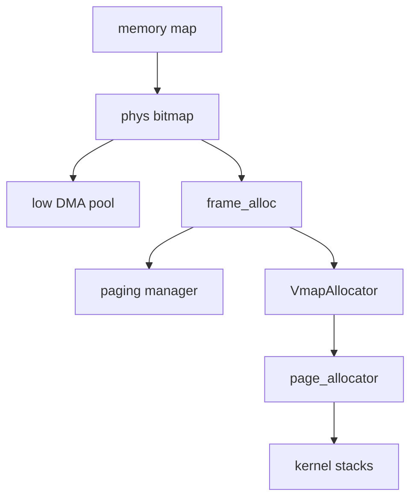

# Frame allocator

How the NONOS kernel learns which physical memory it may use, hands out 4 KiB frames, and turns frames into kernel virtual ranges such as process kernel stacks.

## The pieces



- The UEFI memory map from the [boot handoff](../overview/glossary.md#boot-handoff) says which RAM is usable.
- `phys` is a bitmap with one bit per 4 KiB frame. It alone hands out physical memory.
- `frame_alloc` is the entry point the rest of the kernel calls. It draws from `phys` and from nothing else. The paging manager takes every new page-table frame from its `allocate_frame` (`src/memory/paging/manager/mapping/tables.rs:32`).
- `VmapAllocator` is a buddy allocator over a kernel virtual window. `page_allocator` wraps it and backs each page with a frame.
- A low DMA pool below 4 GiB is carved out of the bitmap at boot for devices that can only address 32 bits.

## From the memory map to the bitmap

`init_memory` runs in the first stages of kernel init (`src/kernel_core/init/memory/setup.rs:25-75`). It takes the span from the lowest usable frame at or above 1 MiB to the highest usable frame. If the map gives no usable span of at least 1 MiB it uses 1 MiB to 2 GiB instead, and the end is capped at `MAX_PHYSICAL_MEMORY`, 64 GiB (`src/kernel_core/init/memory/setup.rs:44-48`, `src/memory/phys/constants/bitmap.rs:19`).

`phys_init` allocates the bitmap for that span from the kernel heap (`src/memory/phys/allocator/api.rs:37-44`). Only map entries of type `CONVENTIONAL` count as usable, through `usable_regions` (`src/boot/handoff/types/memory.rs:75-82`). `phys_keep_usable` then marks every frame of the span that no usable region covers as taken: holes, device windows, firmware and the loader's own data (`src/memory/phys/allocator/reserve.rs:56-65`). The walk over the sorted regions is `walk_usable` (`src/memory/phys/usable_span.rs:31-54`). The same file is compiled into the `kernel_proofs` [proof crate](../overview/glossary.md#proof-crate) as its `usable_span` module, which is tested on the host (`userland/kernel_proofs/src/memory/phys/mod.rs:21-22`) and passes on this commit.

The result is one line on the [serial console](../overview/glossary.md#serial-console) from `say_managed` (`src/kernel_core/init/memory/span.rs:35-45`):

```text
[MEM] 3967 MiB free to allocate, in a span of 0x100000..0x180000000
```

The numbers depend on the machine; the example is the one in the code's own comment. If the bitmap cannot be set up, `init_fallback` tries fixed spans of 1 MiB to 2 GiB, 1 MiB to 1 GiB and 2 MiB to 256 MiB in turn and prints `[MEM] fallback OK` when one works (`src/kernel_core/init/memory/fallback.rs:20-32`).

Last, `find_low_dma_region` picks usable memory between `DMA_POOL_MIN_BASE`, 16 MiB, and `DMA_CEILING_32BIT`, 4 GiB, for the 32-bit DMA pool, and those frames are reserved so the bitmap never hands them out (`src/kernel_core/init/memory/low_dma.rs:19-23`, `src/kernel_core/init/memory/setup.rs:69-74`). The pool itself belongs to the [hardware broker](hardware-broker.md).
