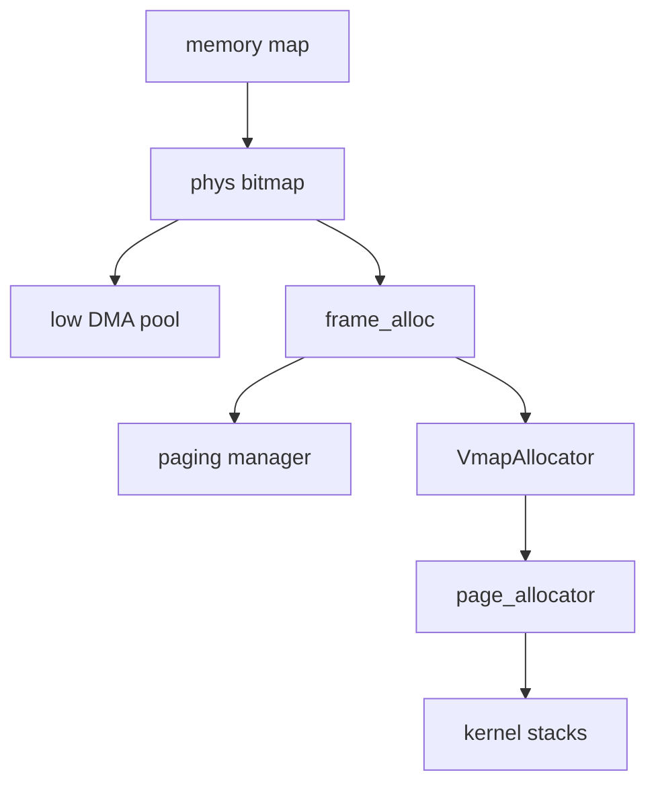

# Frame allocator

How the NONOS kernel learns which physical memory it may use, hands out 4 KiB frames, and turns frames into kernel virtual ranges such as process kernel stacks.

## The pieces

- The UEFI memory map from the [boot handoff](../overview/glossary.md#boot-handoff) says which RAM is usable.
- `phys` is a bitmap with one bit per 4 KiB frame. It alone hands out physical memory.
- `frame_alloc` is the entry point the rest of the kernel calls. It draws from `phys` and from nothing else. The paging manager takes every new page-table frame from its `allocate_frame` (`src/memory/paging/manager/mapping/tables.rs:32`).
- `VmapAllocator` is a buddy allocator over a kernel virtual window. `page_allocator` wraps it and backs each page with a frame.
- A low DMA pool below 4 GiB is carved out of the bitmap at boot for devices that can only address 32 bits.
