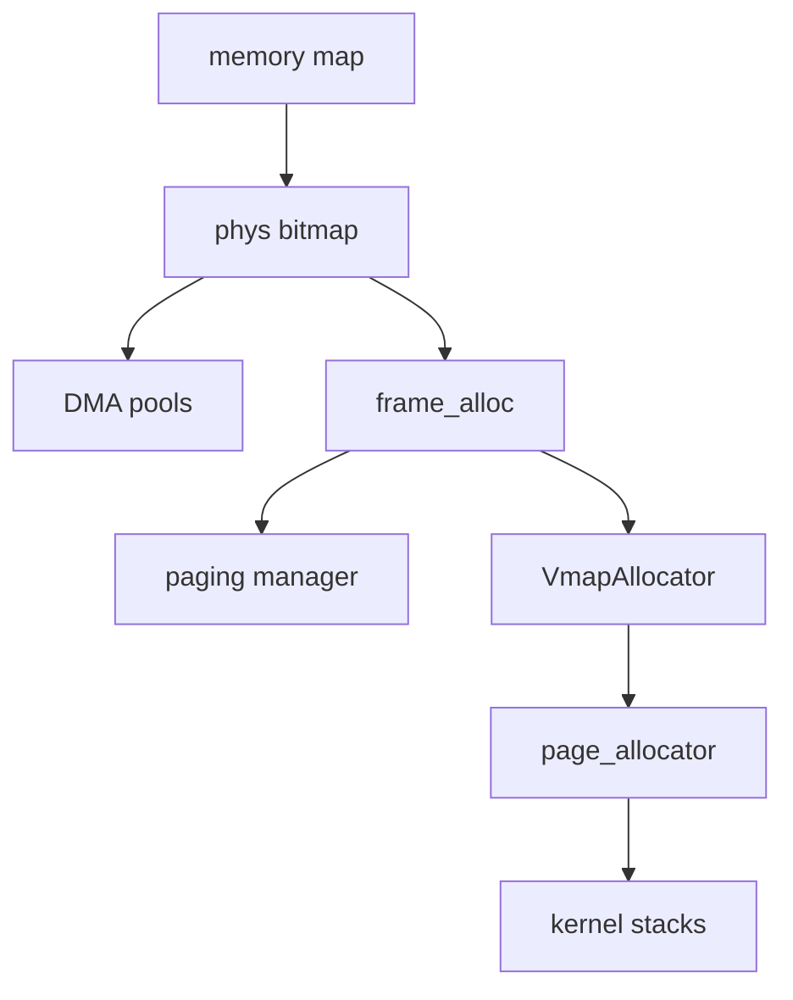

# Frame allocator

How the NONOS kernel learns which physical memory it may use, hands out 4 KiB frames, and turns frames into kernel virtual ranges such as process kernel stacks.

## The pieces



- The UEFI memory map from the [boot handoff](../overview/glossary.md#boot-handoff) says which RAM is usable.
- `phys` is a bitmap with one bit per 4 KiB frame. It alone hands out physical memory.
- `frame_alloc` is the entry point the rest of the kernel calls. It draws from `phys` and from nothing else. The paging manager takes every new page-table frame from its `allocate_frame` (`src/memory/paging/manager/mapping/tables.rs:32`).
- `VmapAllocator` is a buddy allocator over a kernel virtual window. `page_allocator` wraps it and backs each page with a frame.
- Two [DMA pools](../overview/glossary.md#dma-pool) are carved out of the bitmap at boot: a low one below 4 GiB for devices that can only address 32 bits, and a high one for display surfaces.

## From the memory map to the bitmap

`init_memory` runs in the first stages of kernel init (`src/kernel_core/init/memory/setup.rs:25-75`). It takes the span from the lowest usable frame at or above 1 MiB to the highest usable frame. If the map gives no usable span of at least 1 MiB it uses 1 MiB to 2 GiB instead, and the end is capped at `MAX_PHYSICAL_MEMORY`, 64 GiB (`src/kernel_core/init/memory/setup.rs:44-48`, `src/memory/phys/constants/bitmap.rs:19`).

`phys_init` allocates the bitmap for that span from the kernel heap (`src/memory/phys/allocator/api.rs:37-44`). Only map entries of type `CONVENTIONAL` count as usable, through `usable_regions` (`src/boot/handoff/types/memory.rs:75-82`). `phys_keep_usable` then marks every frame of the span that no usable region covers as taken: holes, device windows, firmware and the loader's own data (`src/memory/phys/allocator/reserve.rs:56-65`). The walk over the sorted regions is `walk_usable` (`src/memory/phys/usable_span.rs:31-54`). The same file is compiled into the `kernel_proofs` [proof crate](../overview/glossary.md#proof-crate) as its `usable_span` module, which is tested on the host (`userland/kernel_proofs/src/memory/phys/mod.rs:21-22`) and passes on this commit.

The result is one line on the [serial console](../overview/glossary.md#serial-console) from `say_managed` (`src/kernel_core/init/memory/span.rs:35-45`):

```text
[MEM] 3967 MiB free to allocate, in a span of 0x100000..0x180000000
```

The numbers depend on the machine; the example is the one in the code's own comment. If the bitmap cannot be set up, `init_fallback` tries fixed spans of 1 MiB to 2 GiB, 1 MiB to 1 GiB and 2 MiB to 256 MiB in turn and prints `[MEM] fallback OK` when one works (`src/kernel_core/init/memory/fallback.rs:20-32`).

Last, `find_low_dma_region` picks usable memory between `DMA_POOL_MIN_BASE`, 16 MiB, and `DMA_CEILING_32BIT`, 4 GiB, for the 32-bit DMA pool, and those frames are reserved so the bitmap never hands them out (`src/kernel_core/init/memory/low_dma.rs:19-23`, `src/kernel_core/init/memory/setup.rs:69-74`). The display pool is one high contiguous run that `init_display_pool` takes from the bitmap with `HIGH` (`src/hardware/broker/dma/pool/display.rs:37-55`). Both pools belong to the [hardware broker](hardware-broker.md).

## Allocating and freeing frames

`allocate_frame` in `phys` is a next-fit scan: it starts at a hint just past the last frame it gave out and wraps around the bitmap (`src/memory/phys/allocator/alloc.rs:20-53`). With the `HIGH` flag it scans down from the top instead. With `ZERO` it clears the frame through the [directmap](../overview/glossary.md#directmap) before returning it.

`deallocate_frame` refuses a frame below or above the span, a misaligned address, and a frame that is already free, which it reports as `DoubleFree` (`src/memory/phys/allocator/alloc.rs:55-76`).

`allocate_contiguous` finds a run of free frames, from the bottom or with `HIGH` from the top. With `DMA32` it refuses a run that would end above 4 GiB, before claiming anything (`src/memory/phys/allocator/contiguous.rs:24-66`). The flags are defined in `AllocFlags` (`src/memory/phys/types/flags.rs:19-28`).

Kernel code outside the memory subsystem goes through `frame_alloc`. Its `alloc` draws only from `phys`, and an exhausted bitmap returns nothing (`src/memory/frame_alloc/types/ops.rs:23-41`). There is no fallback pool: the comment in `alloc` records why a second range over 16 MiB to 512 MiB was taken out. `deallocate_frame` zeroes the frame before it frees it (`src/memory/frame_alloc/manager/alloc.rs:33-37`). Page-table builders from the `x86_64` crate draw frames through `X86FrameAllocator`, implemented on the same allocator (`src/memory/frame_alloc/types/x86_shim.rs:29-33`).

## Kernel virtual ranges

`VmapAllocator` is a buddy allocator over the 256 MiB vmap window, with block orders from `MIN_ORDER`, 12, to `MAX_ORDER`, 20, that is 4 KiB to 1 MiB (`src/memory/buddy_alloc/allocator/core.rs:22-60`, `src/memory/buddy_alloc/constants/orders.rs:17-19`). A request larger than 1 MiB fails with `AllocationTooLarge` (`src/memory/buddy_alloc/allocator/alloc.rs:33-37`).

`allocate_pages` takes a range from it, backs each page with a frame from `frame_alloc`, maps it and zeroes it (`src/memory/buddy_alloc/allocator/api/alloc.rs:25-41`). `release` gives pages back in a fixed order: unmap up to 32 pages under one [TLB shootdown](../overview/glossary.md#tlb-shootdown), free the frames, then free the range (`src/memory/buddy_alloc/allocator/api/release.rs:43-66`). Freeing a frame while another CPU might still translate to it would let that CPU reach memory that now belongs to someone else.

`page_allocator` is started by `init_unified_vm` once paging is up (`src/memory/unified/init/run.rs:79-84`). Its main user is `allocate_kernel_stack`, which gives every process a kernel-only stack of `KERNEL_STACK_SIZE`, 32 KiB (`src/kernel_core/process_spawn/kernel_stack.rs:39-56`, `src/process/userspace/constants.rs:31`).

## Modules that are present but not on the boot path

Three pieces exist in the tree and are not used to boot in this release:

- `boot_memory` describes itself as an early boot-time allocator, but nothing outside the module calls its `init` (`src/memory/boot_memory/manager/api.rs:27`).
- `page_info` keeps per-page records with reference counts, but nothing calls `add_page` (`src/memory/page_info/manager/api.rs:30`). Only its `PageFlags` type is used elsewhere (`src/fs/mapping.rs:17`).
- `init_all_memory_subsystems` would start every memory module from a fixed 1 MiB to 1 GiB span, but the boot path does not call it (`src/memory/unified/system.rs:24-35`).

## Limits

- Physical memory at addresses above 64 GiB is not managed: `init_memory` caps the span at `MAX_PHYSICAL_MEMORY` (`src/kernel_core/init/memory/setup.rs:48`). RAM there is never handed out.
- The fallback spans are not checked against the memory map. `init_fallback` only sets up the bitmap (`src/kernel_core/init/memory/fallback.rs:20-32`), so every frame of the span it picks starts out free, firmware and device memory inside it included.
- The bitmap has one lock, `ALLOCATOR` (`src/memory/phys/allocator/api.rs:26`), and `frame_alloc` has its own, `GLOBAL_ALLOCATOR` (`src/memory/frame_alloc/manager/global.rs:21`). A frame taken through `frame_alloc` takes both.
- The scan is linear. On a nearly full machine one allocation can walk the whole bitmap.
- Every range `page_allocator` hands out comes from the one 256 MiB vmap window. At 32 KiB each, at most 8192 process kernel stacks fit, fewer when other users hold part of the window.
- Allocation order is not randomised. `init` stores a `random_seed` drawn from the boot nonce, but the scan never reads it and starts from frame 0 (`src/memory/phys/allocator/init.rs:52-53`).

## See also

- [Memory and paging](memory-and-paging.md)
- [Boot handoff](boot-handoff.md)
- [Hardware broker](hardware-broker.md)
- [Processes and spawn](processes-and-spawn.md)
- [Scheduler and SMP](scheduler-and-smp.md)
