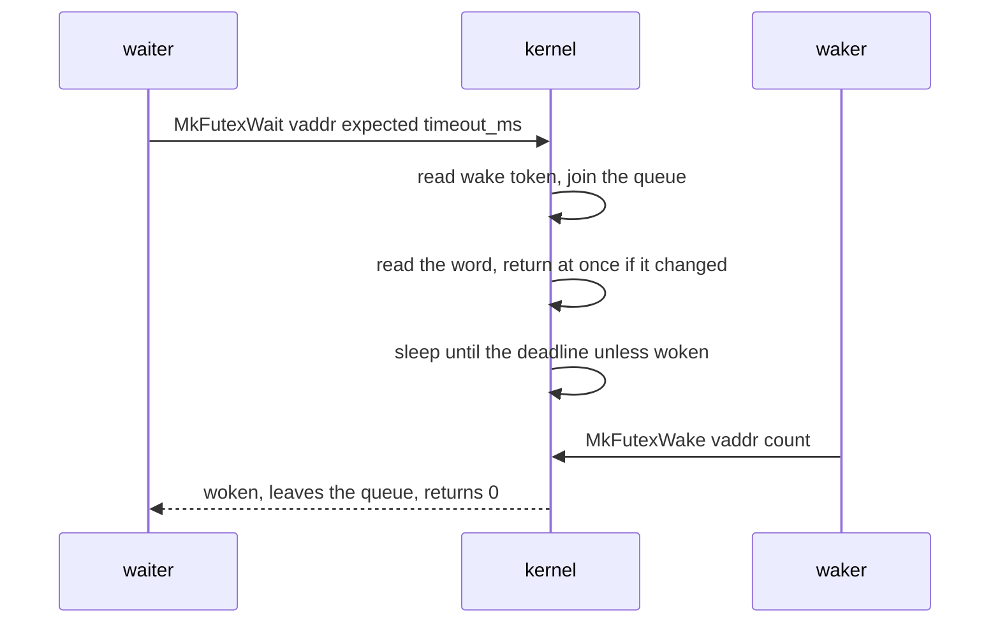

# Futex

The two NONOS system calls that let the threads of a [capsule](../overview/glossary.md#capsule) sleep on a 32-bit word in their own memory and wake each other, what they promise, and how Linux programs get their `futex` instead.

## The two calls

| Call | Number | Arguments | Returns |
|---|---|---|---|
| `MkFutexWait` | `0x5754464D`, the tag `MFTW` | `vaddr`, `expected`, `timeout_ms` | 0, or a negative error |
| `MkFutexWake` | `0x4B54464D`, the tag `MFTK` | `vaddr`, `count` | how many waiters were woken |

The numbers are four-letter [syscall tags](../overview/glossary.md#syscall-tag), `SYS_FUTEX_WAIT` and `SYS_FUTEX_WAKE` (`src/syscall/microkernel/numbers.rs:42-43`), dispatched to `sys_futex_wait` and `sys_futex_wake` (`src/syscall/microkernel/dispatch/process.rs:78-79`). Their entries in the ABI file are `desc.MFTK` and `desc.MFTW` (`abi/syscalls.toml:548-557`).

Both need only a valid [capability token](../overview/glossary.md#capability-token): `MkFutexWait` and `MkFutexWake` sit with exit, yield and the clock calls that any process may make (`src/syscall/contract/cap_table/mk.rs:20-35`). The check itself is on [capabilities](capabilities.md).

| Error | Value | When |
|---|---|---|
| `ERRNO_PERM` | -1 | no current process |
| `ERRNO_INVAL` | -22 | wait only: `vaddr` is zero or not 4-byte aligned |
| `ERRNO_FAULT` | -14 | wait only: the word cannot be read from user memory |

The values are the constants from `ERRNO_PERM` on in `src/syscall/microkernel/errnos.rs:22-35`.

## Who shares a futex

The wait queue is keyed on the pair of thread group and address, `Key` (`src/syscall/microkernel/futex/waiters.rs:23-24`). The threads of one capsule share a thread group, so they meet on the same word. Another capsule that waits at the same numeric address has a different key and never sees their wakes. The queue is one map, `FUTEX_QUEUE`, under one lock, and `tgid_of` finds the caller's group (`src/syscall/microkernel/futex/queue.rs:27-35`).

## Waiting

`sys_futex_wait` works in this order (`src/syscall/microkernel/futex/wait.rs:26-73`):

1. It reads the caller's wake token from the scheduler.
2. It joins the queue with `join`, before reading the word, the way Linux reads the word with the waiter's bucket held (`src/syscall/microkernel/futex/wait.rs:39-46`).
3. It reads the word with `copy_from_user`. If the read fails it returns `ERRNO_FAULT`. If the word no longer holds `expected`, it leaves the queue with `leave_early` and returns 0 at once.
4. It sleeps until a deadline unless a wake arrived after step 1, then yields, then leaves the queue if no waker took it off already.

The deadline depends on `timeout_ms` (`src/syscall/microkernel/futex/wait.rs:60-67`):

- A timeout of 0 means no deadline, and the kernel caps the sleep at `SAFETY_MS`, 20 ms, then returns 0.
- Any other timeout sleeps that long, up to `MAX_TIMED_MS`, 60 000 ms per call (`src/syscall/microkernel/futex/queue.rs:23-25`).

The call returns 0 when woken, when the word had changed, and when the deadline passed. It does not say which. The caller rechecks its word after every return and waits again if needed, so an early return costs a loop and never a lost wake.

If a waker already took this waiter off the list while it was returning early, `leave_early` passes that wake on to the next waiter, so the wake is not spent on a thread that was leaving anyway (`src/syscall/microkernel/futex/waiters.rs:41-58`). The waiter list code is pure so it can be tested on the host; see the last section.

## Waking

`sys_futex_wake` takes up to `count` waiters from the front of the list for that key, where a `count` of 0 means all of them, releases the queue lock, and only then wakes each one through the scheduler (`src/syscall/microkernel/futex/wake.rs:25-52`). Waiters are woken in the order they joined. It returns how many it woke; a wake on a word nobody waits on returns 0.

The sleep and the wake both go through the scheduler's sleep table and wake tokens; see [scheduler and SMP](scheduler-and-smp.md).

## In Rust programs

The NONOS standard library port builds `Mutex`, `Condvar`, `RwLock`, `Once` and thread parking on these two calls, so a contended lock sleeps instead of spinning (`toolchain/nonos-std/sys/pal/nonos/futex.rs:1-6`). Its `futex_wait` loops: it checks the word, computes what is left of the caller's timeout from the kernel's millisecond clock, and calls `MkFutexWait` again until the word changes or the time is up (`toolchain/nonos-std/sys/pal/nonos/futex.rs:81-106`). A timeout shorter than one millisecond is rounded up to one. `futex_wake` wakes one waiter and `futex_wake_all` wakes all of them (`toolchain/nonos-std/sys/pal/nonos/futex.rs:108-120`).

`nonos_libc`, the Rust crate most capsules call the kernel through ([libc and the Rust runtimes](../userland/libc.md)), carries only the wait number, `N_MK_FUTEX_WAIT` (`userland/libc/src/syscall/numbers/core.rs:38`). Its `mk_idle_ms` uses it as a timed sleep: it waits on a private word on its own stack that nothing else knows, so only the timeout ends the wait (`userland/libc/src/unistd/idle.rs:32-37`).

## Linux programs

A Linux program's futex call never reaches these calls. The [Linux personality](../overview/glossary.md#linux-personality) capsule serves `futex` entirely itself: a waiting guest thread is parked inside its trap, so the wait is the absence of a reply and the wake is the reply (`userland/capsule_linux/src/linux/call/futex.rs:17-22`). It accepts `FUTEX_WAIT`, `FUTEX_WAKE`, `FUTEX_REQUEUE`, `FUTEX_CMP_REQUEUE`, `FUTEX_WAIT_BITSET` and `FUTEX_WAKE_BITSET`, with the private flag (`userland/capsule_linux/src/linux/call/futex_op.rs:24-31`). `decode` refuses every other operation, and `FUTEX_CLOCK_REALTIME` on anything but `FUTEX_WAIT_BITSET`, with `ENOSYS`, and a zero bitset or a misaligned word with `EINVAL` (`userland/capsule_linux/src/linux/call/futex_op.rs:46-75`). Priority-inheritance futexes are among the refused operations. See [Linux personality](../userland/linux-personality.md).

## Tests

- The kernel's own waiter list, the `waiters` module, is compiled into the `kernel_proofs` [proof crate](../overview/glossary.md#proof-crate), which runs the order a wait takes its steps in against every interleaving with one waker (`userland/kernel_proofs/src/futex_waiters/mod.rs:17-26`). That crate passes on this commit.
- The Linux futex decoding is tested in the `capsule_linux_proofs` proof crate (`userland/capsule_linux_proofs/src/tests/futex_tests.rs`), which also passes on this commit.

## Limits

- The word is 32 bits and must be 4-byte aligned.
- There is no requeue, no bitset and no priority inheritance in the kernel calls.
- A futex is private to one thread group. Two capsules cannot share one through shared memory.
- Timeouts are in whole milliseconds, at most 60 seconds per call.
- An untimed wait wakes every 20 ms to let the caller look again, which costs a little CPU on a long wait.
- All futexes share one queue lock.

## See also

- [Scheduler and SMP](scheduler-and-smp.md)
- [Timers](timers.md)
- [System calls](syscalls.md)
- [ABI: system calls](../abi/syscalls.md)
- [Linux personality](../userland/linux-personality.md)
- [libc](../userland/libc.md)
