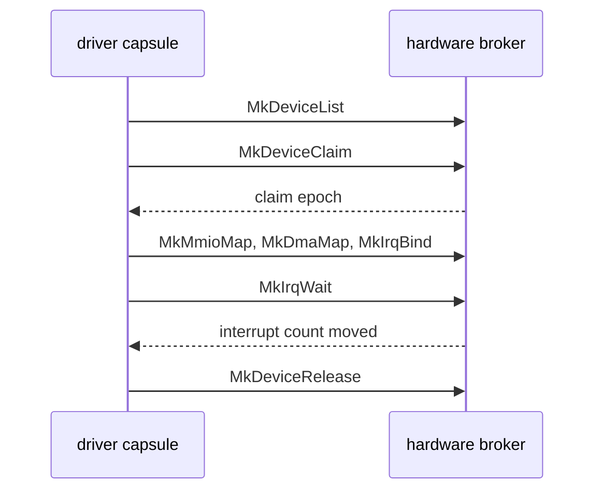

# The hardware broker

How a driver [capsule](../overview/glossary.md#capsule) gets a device from the NONOS kernel: the device table, claims, register windows, DMA buffers, port I/O, PCI configuration, interrupts, and how all of it is taken back.

Drivers run in ring 3. The [hardware broker](../overview/glossary.md#hardware-broker) is the ring 0 code under `src/hardware/broker` that hands a driver exactly the parts of a device it claimed, each as a [grant](../overview/glossary.md#grant) the kernel can revoke. The call layouts are on [Broker ABI](../abi/broker.md); a worked driver is on [Writing a driver](../drivers/writing-a-driver.md).

## The device table

At boot `seed_hardware_broker` fills the table from the PCI scan, then adds the legacy platform devices and, on x86_64, the I2C and GPIO controllers the ACPI tables describe (`src/kernel_core/init/platform/hardware_broker.rs:19-40`). [PCI and ACPI](pci-and-acpi.md) describes the scan.

Each entry is a `DeviceRecord` of 176 bytes: the device id, the bus kind, the PCI class, subclass and programming interface, the broker class, vendor and device ids, flags, the interrupt line, pin and source, a BAR count and up to six BARs (`src/hardware/broker/device/record.rs:19-61`). A PCI device's id is its index in the scan, as `init_from_pci` numbers it (`src/hardware/broker/table/init.rs:28-43`); a platform device is numbered after the last one by `register_platform_device` (`src/hardware/broker/table/init.rs:45-51`).

| Class | Id | PCI class:subclass matched, or platform source |
|---|---|---|
| `RNG` | `0x0001` | none; no entry gets this class at this commit |
| `BLOCK` | `0x0010` | 01 any, and 08:05 SD host |
| `NETWORK` | `0x0020` | 02 any |
| `DISPLAY` | `0x0030` | 03 any |
| `INPUT` | `0x0040` | 09 any, and the PS/2 keyboard and aux port records |
| `I2C_HID` | `0x0041` | none, from ACPI |
| `AUDIO` | `0x0050` | 04:01 and 04:03 |
| `SERIAL` | `0x0060` | 07:00, and the I2C controllers from ACPI |
| `USB_HOST` | `0x0070` | 0C:03 other than xHCI |
| `USB_HOST_XHCI` | `0x0071` | 0C:03 with programming interface 0x30 |
| `GPIO_CTRL` | `0x0080` | none, from ACPI |
| `OTHER` | `0xFFFF` | everything else |

The ids are in `ids` (`src/hardware/broker/class.rs:21-44`) and the PCI mapping in `classify_pci` (`src/hardware/broker/class.rs:57-84`). The PS/2 records come from `register_legacy`, which adds them on every machine and leaves the driver to find out whether an i8042 answers (`src/hardware/broker/platform.rs:31-40`).

`MkDeviceList(class, buf, count)` needs `DeviceEnum`. With a count of 0 `sys_device_list` returns how many devices of that class exist; otherwise it copies up to `count` records (`src/syscall/microkernel/device.rs:40-65`).

## Claims

`MkDeviceClaim(device_id)` needs `Driver`. A device has one holder at a time; `claim` refuses a second with `EBUSY` and returns a fresh [claim epoch](../overview/glossary.md#claim-epoch) to the first (`src/hardware/broker/claim/claim.rs:23-45`). In the same call the broker moves the device into the capsule's [IOMMU domain](../overview/glossary.md#iommu-domain), powers it to D0 with `power_on_device` and turns off no-snoop requests, before the driver can enable bus mastering (`src/hardware/broker/claim/claim.rs:33-43`). When an IOMMU is in service and will not take the device, the claim fails with `ClaimError::Unconfined`, which the caller sees as `EPERM` (`src/syscall/microkernel/device.rs:75-81`); [IOMMU](iommu.md) explains when that happens.

Epochs come from one counter that starts at 1, in `next_epoch` (`src/hardware/broker/claim/state.rs:24-29`). Every MMIO, DMA, IRQ and PIO request carries the epoch, and one that does not match the live claim is refused as `StaleEpoch`, which the caller sees as `ESTALE`, -116, as `validate` does for DMA (`src/hardware/broker/dma/map/validate.rs:46-52`). A grant from an earlier claim cannot be reused after a release and a new claim.

## MMIO windows

`MkMmioMap` needs `Mmio`. `map_for_caller` resolves the claim and its epoch, finds the BAR, checks that the request lies inside it, maps the pages and records the grant (`src/hardware/broker/mmio/map.rs:49-112`).

- The pages are user, read and write, strong uncacheable and never executable, as `map_user_mmio` sets them (`src/memory/paging/manager/api/mapping/map_user_mmio.rs:23-44`).
- Every device's MSI-X table and pending bit array are kept out of capsule memory: `protected_regions` lists them and a mapping stops short of the first one or is refused (`src/hardware/broker/mmio/msix_exclusion.rs:39-50`). The kernel programs those tables itself.
- Grants live in the window from `USER_MMIO_BASE` to `USER_MMIO_END`, `0x80_0000_0000` to `0x90_0000_0000`, with an unmapped page between two grants (`src/hardware/broker/windows.rs:31-32`), placed by `reserve_user_va` (`src/hardware/broker/grant.rs:140-153`).
- `MkMmap` at a fixed address and `MkMunmap` refuse any range that touches the MMIO or DMA window, which `touches_device_window` checks (`src/hardware/broker/windows.rs:36-45`), so a device page can only be given back through the broker.

## DMA buffers

`MkDmaMap` needs `Dma`. `map_for_caller` runs one transaction: validate, allocate and zero the frames, map them into the capsule, give the device an address, record the grant, and undo every earlier step if a later one fails (`src/hardware/broker/dma/map/transaction.rs:23-66`).

| Flag | Value | Meaning |
|---|---:|---|
| `DMA_MAP_HIGH` | 1 | Frames from the display pool or high memory. |
| `DMA_MAP_DMA32` | 2 | Frames below 4 GiB, for a device with 32 bit addresses. |
| `DMA_MAP_COHERENT` | 4 | Mapped uncached, for rings both sides write. |
| `DMA_MAP_WC` | 8 | Mapped write combining where the PAT allows, else uncached. |

The flags are in `flags.rs`, starting at `DMA_MAP_HIGH` (`src/hardware/broker/dma/flags.rs:19-30`). `validate` refuses `HIGH` with `DMA32`, `COHERENT` with `WC`, a length that is not a whole number of 4 KiB pages, and a length above the device class's ceiling (`src/hardware/broker/dma/map/validate.rs:31-58`).

The ceilings, in pages, are set by `dma_page_limit_for_class`: `RNG`, `INPUT` and `SERIAL` 1, `AUDIO` 16, `NETWORK` 64, the USB hosts 256, `BLOCK` 1024, `DISPLAY` 8192 and every other class 16 (`src/hardware/broker/dma/limits.rs:27-47`).

Where the frames come from is decided in `take` (`src/hardware/broker/dma/map/alloc.rs:27-58`). A `DMA32` request takes the low pool, then any memory below 4 GiB, and fails with `ENOMEM` rather than use higher frames. A request without flags also prefers low memory, so a device with no IOMMU in front of it gets low addresses when there are some. The low pool is one page in 128 of the usable memory below 4 GiB, never under 2048 pages nor over 8192, and half of it is kept for `DMA32` requests, as `low32_target_pages` and `low32_floor` compute (`src/hardware/broker/dma/pool/sizing.rs:17-62`). These are the [DMA pools](../overview/glossary.md#dma-pool).

The device address depends on the IOMMU. When a remapping unit confines the device, `map` in the confine module maps the buffer into the capsule's own domain and returns an I/O virtual address; otherwise it returns the physical address (`src/hardware/broker/confine/map.rs:22-50`). I/O virtual addresses start at `IOVA_BASE`, 1 MiB, stay below 4 GiB, and step over the interrupt window `0xFEE0_0000` to `0xFEF0_0000`, where a device write would be taken as an interrupt (`src/hardware/broker/confine/iova_space.rs:29-74`). A grant made without a confining domain is counted by `note_unconfined` and shows in the IOMMU posture line (`src/hardware/broker/dma/map/record.rs:45-51`). A `DMA32` request whose device address would not fit 32 bits fails as `Above4G`, which the caller sees as `ERANGE`, -34 (`src/hardware/broker/dma/map/transaction.rs:53-62`).

The user mapping of a buffer lives in the window from `USER_DMA_BASE`, `0xA0_0000_0000`, to `USER_DMA_END`, `0xB0_0000_0000` (`src/hardware/broker/windows.rs:33-34`).

## Port I/O

On x86_64 a driver holding `Pio` can ask for a grant on an I/O port BAR of a claimed device. It never runs `in` or `out` itself: `MkPioRead` and `MkPioWrite` are carried out by the kernel, at widths 1, 2 and 4 bytes, against the grant table (`src/hardware/broker/pio/types.rs:17-58`). Other architectures have no port I/O and the calls return `ENOSYS`; `pio_absent` stands in there (`src/hardware/broker/mod.rs:39-45`).

## PCI configuration

`MkPciConfigRead` needs `Driver` and the claim. `read` accepts widths 1, 2 and 4, aligned, inside the first 256 bytes (`src/hardware/broker/pci/read.rs:22-48`).

`MkPciConfigWrite` accepts few changes. In the Command register only Bus Master, Memory Space and Interrupt Disable may change, as `COMMAND_WRITABLE` says (`src/hardware/broker/pci/command.rs:22-33`). In MSI-X Message Control only Enable and Function Mask may change, and otherwise only a few vendor bits for HD Audio controllers and the PCI Express completion timeout of a network controller, listed in `writable` (`src/hardware/broker/pci/quirk_bits.rs:49-61`). Any other offset, BARs, the interrupt line, the IDs and the capability pointers among them, `validate` refuses before the write reaches the bus (`src/hardware/broker/pci/allowlist.rs:37-60`).
