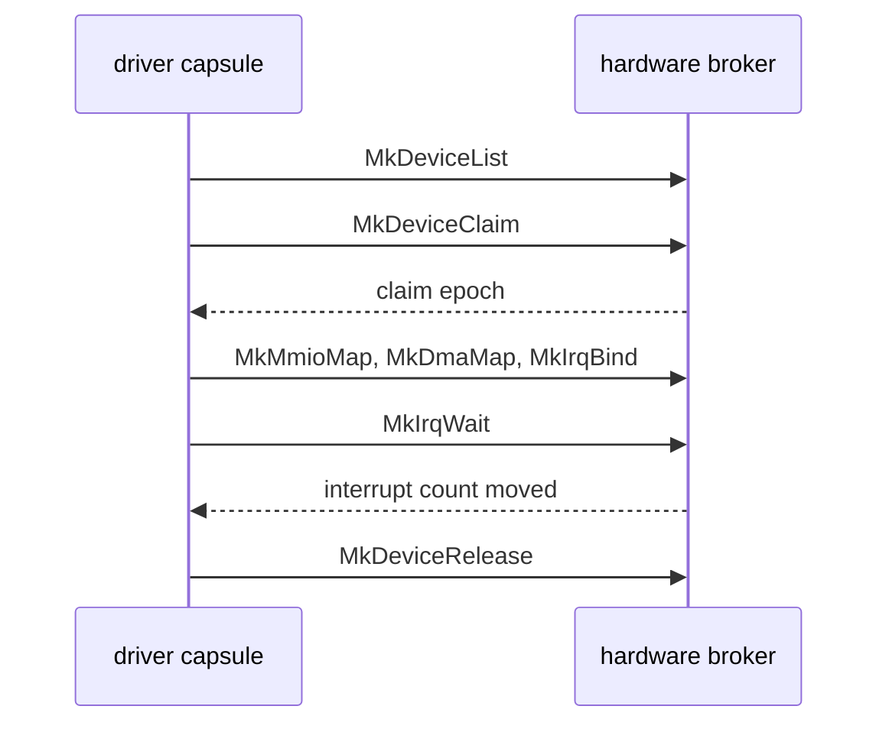

# The hardware broker

How a driver [capsule](../overview/glossary.md#capsule) gets a device from the NONOS kernel: the device table, claims, register windows, DMA buffers, port I/O, PCI configuration, interrupts, and how all of it is taken back.

Drivers run in ring 3. The [hardware broker](../overview/glossary.md#hardware-broker) is the ring 0 code under `src/hardware/broker` that hands a driver exactly the parts of a device it claimed, each as a [grant](../overview/glossary.md#grant) the kernel can revoke. The call layouts are on [Broker ABI](../abi/broker.md); a worked driver is on [Writing a driver](../drivers/writing-a-driver.md).

## The device table

At boot `seed_hardware_broker` fills the table from the PCI scan, then adds the legacy platform devices and, on x86_64, the I2C and GPIO controllers the ACPI tables describe (`src/kernel_core/init/platform/hardware_broker.rs:19-40`). [PCI and ACPI](pci-and-acpi.md) describes the scan.

Each entry is a `DeviceRecord` of 176 bytes: the device id, the bus kind, the PCI class, subclass and programming interface, the broker class, vendor and device ids, flags, the interrupt line, pin and source, a BAR count and up to six BARs (`src/hardware/broker/device/record.rs:19-61`). A PCI device's id is its index in the scan, as `init_from_pci` numbers it (`src/hardware/broker/table/init.rs:28-43`); a platform device is numbered after the last one by `register_platform_device` (`src/hardware/broker/table/init.rs:45-51`).

| Class | Id | PCI class:subclass matched, or platform source |
|---|---|---|
| `RNG` | `0x0001` | none; no entry gets this class at this commit |
| `BLOCK` | `0x0010` | 01 any, and 08:05 SD host |
| `NETWORK` | `0x0020` | 02 any |
| `DISPLAY` | `0x0030` | 03 any |
| `INPUT` | `0x0040` | 09 any, and the PS/2 keyboard and aux port records |
| `I2C_HID` | `0x0041` | none, from ACPI |
| `AUDIO` | `0x0050` | 04:01 and 04:03 |
| `SERIAL` | `0x0060` | 07:00, and the I2C controllers from ACPI |
| `USB_HOST` | `0x0070` | 0C:03 other than xHCI |
| `USB_HOST_XHCI` | `0x0071` | 0C:03 with programming interface 0x30 |
| `GPIO_CTRL` | `0x0080` | none, from ACPI |
| `OTHER` | `0xFFFF` | everything else |

The ids are in `ids` (`src/hardware/broker/class.rs:21-44`) and the PCI mapping in `classify_pci` (`src/hardware/broker/class.rs:57-84`). The PS/2 records come from `register_legacy`, which adds them on every machine and leaves the driver to find out whether an i8042 answers (`src/hardware/broker/platform.rs:31-40`).

`MkDeviceList(class, buf, count)` needs `DeviceEnum`. With a count of 0 `sys_device_list` returns how many devices of that class exist; otherwise it copies up to `count` records (`src/syscall/microkernel/device.rs:40-65`).
