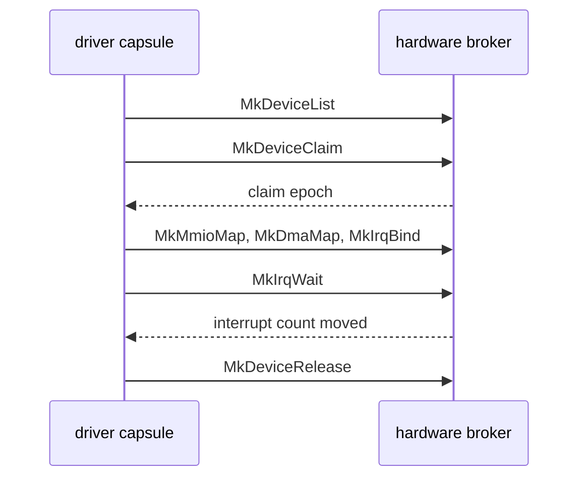

# The hardware broker

How a driver [capsule](../overview/glossary.md#capsule) gets a device from the NONOS kernel: the device table, claims, register windows, DMA buffers, port I/O, PCI configuration, interrupts, and how all of it is taken back.

Drivers run in ring 3. The [hardware broker](../overview/glossary.md#hardware-broker) is the ring 0 code under `src/hardware/broker` that hands a driver exactly the parts of a device it claimed, each as a [grant](../overview/glossary.md#grant) the kernel can revoke. The call layouts are on [Broker ABI](../abi/broker.md); a worked driver is on [Writing a driver](../drivers/writing-a-driver.md).

