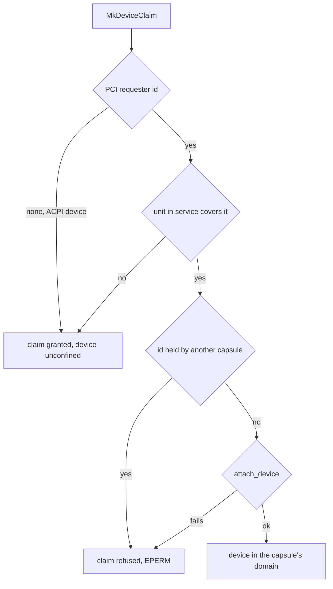

# IOMMU

What the NONOS kernel does with DMA remapping hardware, the [IOMMU](../overview/glossary.md#iommu), on Intel VT-d and AMD-Vi machines: which devices it confines, when remapping is in service, and what happens when it is not.

## What the kernel does

- With an Intel VT-d unit that the firmware described and left off, the kernel turns translation on at boot. Every device found by the PCI scan starts in an identity mapped domain, and anything the scan did not find is denied.
- When a [driver capsule](../overview/glossary.md#driver-capsule) claims a device behind a unit in service, the device moves into that capsule's own [IOMMU domain](../overview/glossary.md#iommu-domain), which maps only the DMA buffers the capsule was granted.
- AMD-Vi units are taken back from firmware but not driven by any image profile this tree defines, so DMA behind an AMD-Vi unit is unrestricted.
- With no unit, or a unit that did not come up, DMA is unrestricted, and the kernel says so on the [serial console](../overview/glossary.md#serial-console).

Everything here is read from the code. No hardware report for this release covers whether a given machine's units come into service; the build provides the QEMU boot described below.

## Which IOMMU

The vendor is chosen from the ACPI tables, never from CPUID: a DMAR table with at least one remapping unit means VT-d, an IVRS table without one means AMD-Vi, and neither means none, the three values of `IommuVendor` (`src/memory/iommu/vendor.rs:19-31`). `detect` makes that choice once; when both tables exist VT-d wins, because it is the one this kernel drives, and the AMD units are named as unconfined (`src/arch/x86_64/iommu/backend/select.rs:37-66`).

The x86_64 backend is compiled with `nonos-arch-iommu`; any other build, and any other architecture, uses the stand in `backend_unsupported`, which selects nothing and refuses every domain call (`src/memory/iommu/backend.rs:17-27`). An ARM board has no SMMU driver yet, so a mapping request there is refused rather than ignored, as the note above `iommu` says (`src/memory/mod.rs:43-46`).

## When VT-d comes into service

`init_dma_protection` runs right after paging is up, because reaching a unit means mapping its register window (`src/kernel_core/init/entry/microkernel_init.rs:49-52`). `init_dma_protection` selects the vendor, brings VT-d up where DMAR described a unit, and prints the posture line last (`src/kernel_core/init/entry/init_dma_protection.rs:43-61`).

Bring-up runs only in a kernel built with `nonos-iommu-enforce`; without it `init` prints that enforcement is not built in and leaves the hardware alone (`src/arch/x86_64/iommu/unit/bringup/init.rs:27-34`). `microkernel-core` in [Cargo.toml](../../Cargo.toml) includes that feature, and the kernel feature lists of every image profile in `tools/nix/config.nix` build on `microkernel-core`.

`bring_up` then does the work in an order chosen so the disk and network keep working (`src/arch/x86_64/iommu/unit/bringup/run.rs:26-67`):

1. It refuses to start if firmware left any unit translating, with `FirmwareOwnsUnit`, rather than take over tables nobody reasons about (`src/arch/x86_64/iommu/unit/bringup/run.rs:38-43`).
2. It builds one root table that every unit shares, and an [identity domain](../overview/glossary.md#identity-domain) with `identity_domain` (`src/arch/x86_64/iommu/unit/bringup/run.rs:46-50`).
3. The identity domain maps physical memory one to one up to the top of the managed range rounded up to 1 GiB, and never less than 4 GiB, as `identity_limit` computes (`src/arch/x86_64/iommu/unit/bringup/limit.rs:17-35`).
4. `assign_enumerated` gives every function the PCI scan found a context entry in that domain (`src/arch/x86_64/iommu/unit/bringup/assign.rs:22-45`).
5. Each unit is brought into service with `bring_into_service`, and only after all of them does `set_enforcing` record that DMA is remapped (`src/arch/x86_64/iommu/unit/bringup/run.rs:56-66`).

The identity domain does not confine a device that was found; what it buys is that a device absent from the scan, such as a card added later, has no context entry and is denied. The success lines say exactly that, from `enabled` (`src/arch/x86_64/iommu/unit/bringup/verdict.rs:38-49`):

```
[VT-D] translation enabled, levels=<hex> devices=<hex>
[VT-D] enumerated devices identity mapped; others denied
[VT-D] units programmed=<hex>
```

Only units on PCI segment 0 are programmed. DMAR units on other segments are counted by `foreign_segment_units` and named in a warning, and the devices behind them are unrestricted (`src/arch/x86_64/acpi/parser/other/dmar.rs:44-48`). The kernel records at most `MAX_REMAP_UNITS`, 8, segment 0 units, and reads only the DRHD structures of the table (`src/arch/x86_64/acpi/parser/other/dmar.rs:26-27`).

Interrupt remapping is a separate feature, `nonos-iommu-intremap`. No feature list in [Cargo.toml](../../Cargo.toml) turns it on, and without it bring-up prints that interrupt remapping is not built in, in `init` (`src/arch/x86_64/iommu/unit/bringup/init.rs:38-43`).

## Per capsule domains

The [hardware broker](hardware-broker.md) gives each driver capsule one domain, which maps nothing until `MkDmaMap` grants the capsule a buffer (`src/hardware/broker/confine/mod.rs:17-21`). `attach` runs inside `MkDeviceClaim` and decides what the device can reach; when it refuses, the claim fails with `EPERM`.



- If `translates` says no unit in service covers the device, the device stays on physical addresses, and the claim goes ahead with a serial line saying it reaches all memory (`src/hardware/broker/confine/attach.rs:34-48`). `translates` decides coverage: a unit must be enforcing and its scope must hold the device (`src/arch/x86_64/iommu/backend/device.rs:47-54`).
- If a unit does cover it, the device leaves the identity domain and `attach_device` puts it in the capsule's domain (`src/hardware/broker/confine/attach.rs:88-100`).
- If a unit in service would not take the device, the claim is refused rather than granted unconfined; `unconfined_allowed` lets a claim through only when no unit is in service at all (`src/hardware/broker/confine/posture.rs:30-50`).
- Drives behind one VMD share a requester id; one capsule may hold several of them, and a second capsule is refused the shared id with `Refused` (`src/hardware/broker/confine/attach.rs:72-82`).
- A device with no PCI requester id, such as a controller found through ACPI, is not confined at all: `pci_address` returns nothing for it and `attach` lets the claim through without a domain (`src/hardware/broker/confine/table.rs:35-43`). Its DMA grants carry physical addresses and are counted as unconfined.

A DMA [grant](../overview/glossary.md#grant) in a confined domain is mapped with `IommuProtection::READ_WRITE` at an I/O virtual address from the capsule's own range (`src/hardware/broker/confine/map.rs:22-50`). When the capsule releases the device, `detach` puts it back to denied, not to the identity domain, and the domain goes with the capsule's last device (`src/hardware/broker/confine/detach.rs:21-46`).

## When remapping is not in service

Every call that claims to confine a device asks first whether a unit is translating. `require` refuses with `NotInitialized` before bring-up has succeeded, so the kernel never writes entries into tables no hardware walks, and never hands a device an I/O virtual address it would take as physical (`src/arch/x86_64/iommu/backend/enforced.rs:17-36`). On an AMD-Vi machine the calls are refused with `AmdViNotDriven`, and with no IOMMU with `NoIommu`, each with a serial line from `amd_vi` or `absent` (`src/arch/x86_64/iommu/backend/refuse.rs:22-38`).

The device then reaches all of memory, and the kernel counts it instead of hiding it. Each DMA grant made without a confining domain adds one to the count through `note_unconfined`, and its release takes one off (`src/memory/iommu/unconfined.rs:35-51`). The kernel's own virtio-rng entropy driver counts its buffers the same way, with `note_unconfined` (`src/drivers/virtio_rng/device/core.rs:44-45`).

## The posture line

`report_posture` prints the state once DMA protection has been set up, right after paging, and prints the first line again whenever the count changes (`src/memory/iommu/posture.rs:38-79`):

```
[IOMMU] <none|intel-vt-d|amd-vi> present, enforcing=<0|1>, unconfined grants=<n>
[IOMMU] capabilities aw=<bits> ir=<0|1> snoop=<0|1> pages=<mask> domains=<n>
```

`enforcing=1` together with `unconfined grants=0` means that every DMA buffer the broker has granted is confined, because `unconfined_grants` counts every grant made without a domain (`src/memory/iommu/posture.rs:17-28`). It does not mean every device is confined: a device found at boot that no capsule has claimed stays in the identity domain and can still reach all memory. On a machine with no remapping hardware the boot prints `[IOMMU] no DMAR remapping unit and no IVRS table; IOMMU domains refused; DMA is unrestricted` and selects `IommuVendor::Absent` (`src/arch/x86_64/iommu/backend/select.rs:62-65`).

## AMD-Vi

`init` for AMD-Vi first takes every unit back from firmware, because a unit left enabled would translate every device through tables built for firmware's own drivers (`src/arch/x86_64/amd_vi/init.rs:24-45`). A kernel built with `nonos-iommu-amdvi` would then drive the units through `bringup`, with one shared device table and per capsule domains (`src/arch/x86_64/amd_vi/mod.rs:17-25`). No feature list in [Cargo.toml](../../Cargo.toml) turns that feature on, so on such a machine the boot prints `[AMD-VI] IOMMU driver not built in; DMA is unrestricted`.

## Trying it in QEMU

The build has a boot with an emulated Intel IOMMU. `nonos-mk-run-iommu-serial-log` builds the desktop image and runs QEMU under TCG, without hardware acceleration, so it is slow; it writes the serial log to `QEMU_IOMMU_SERIAL_LOG`, the path it prints (`mk/40-run.mk:489-501`):

```
make nonos-mk-run-iommu-serial-log
```

No run of this target is recorded for this release, so no log from it is quoted here.

## Tests

The [proof crate](../overview/glossary.md#proof-crate) `userland/kernel_proofs` compiles the DMAR scope parser (`userland/kernel_proofs/src/dmar_scope/mod.rs`), the IVRS walk (`userland/kernel_proofs/src/firmware_iommu/mod.rs`), the confinement posture (`userland/kernel_proofs/src/confine_posture/mod.rs`) and several VT-d register and queue helpers from the kernel sources. It passed, 388 tests, in the flake check run on this commit. `userland/mechanism_proofs` holds the VT-d page table entry and context entry encodings (`userland/mechanism_proofs/src/iommu/mod.rs`); it passed, 56 tests, in the same run.

## See also

- [Hardware broker](hardware-broker.md): claims and DMA grants.
- [PCI and ACPI](pci-and-acpi.md): the DMAR and IVRS tables and the PCI scan.
- [Platform drivers](../drivers/platform.md): VT-d and AMD-Vi from the driver section.
- [Protections and limits](../security/protections-and-limits.md): what DMA protection does and does not cover.
- [Threat model](../overview/threat-model.md): DMA attacks in context.
